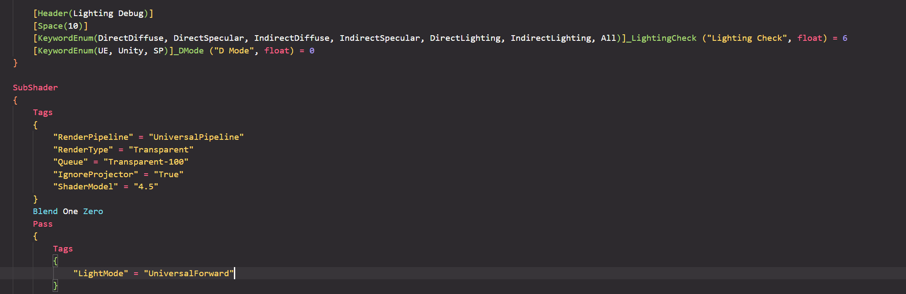
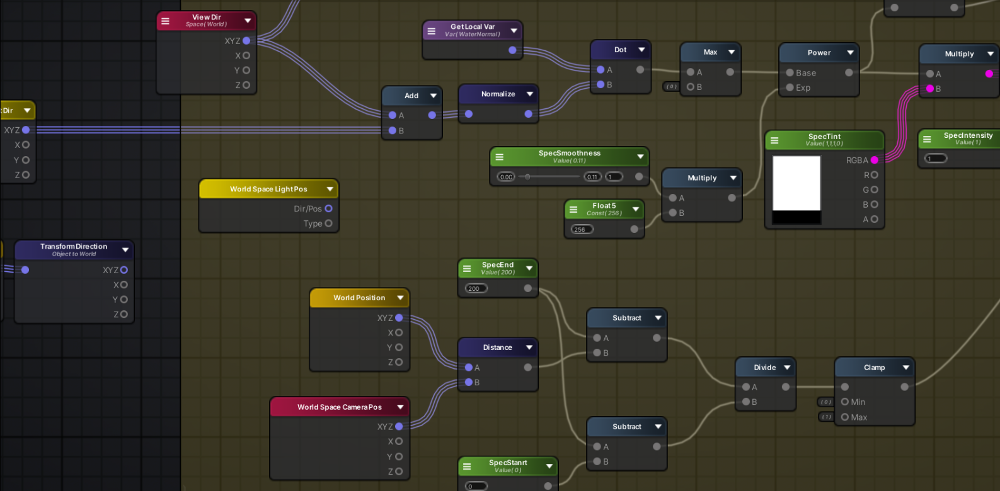

# 概述

[TOC]

------

## 一、初识 Unity Shader

### 1.1、什么是 Shader

中文将“Shader”翻译为着色器。着色器是“GPU 流水线”上的一些可高度编程阶段，其编译出的最终代码将在“GPU”上运行。而“Unity Shader”则是“Unity”对底层 API“OpenGL / DirectX”以及“HLSL / Cg”的再封装，并且具备一些特定的着色器类型，比如“顶点着色器”、“片元着色器”等。

依靠着色器，开发者通常可以控制“GPU 流水线”中的渲染细节，例如使用“顶点着色器”进行顶点变换以及“片元着色器”进行逐像素渲染等操作。

### 1.2、Shader 的几种形式

#### 1.2.1、Fixed-Function Shader

固定函数的流水线（Fixed-Function Pipeline），也简称为固定管线。通常是指在较旧的“GPU”上实现的渲染流水线。这种流水线只给开发者提供一些配置操作，但开发者没有对流水线阶段的完全控制权。它通常提供了一系列接口，这些接口包含一个函数入口点（Function Entry Points） 集合，这些函数入口点会匹配“GPU”上的一个特定的逻辑功能。开发者们通过这些接口来控制渲染流水线。

而目前，固定管线已被淘汰，不建议浪费时间去研究，只需要知道有这个玩意就行。

#### 1.2.2、Surface Shader

“表面”着色器（Surface Shader）是“Unity”自己创造的一种着色器代码类型，它需要的代码量很少，因为“Unity”在背后做了很多工作，但它在本质上与“顶点 / 片元”着色器是一样的。也就是说，当给“Unity”提供一个表面着色器的时候，它在背后仍旧把它转换成对应的“顶点 / 片元”着色器，渲染的代价比较大。

简单代码示例：

```glsl
Shader "Custom/Simple Surface Shader"
{
    SubShader
    {
        Tags
        {
            "RenderType" = "Opaque"
        }

        CGPROGRAM
        #pragma surface surf Lambert

        struct Input
        {
            float4 color : COLOR;
        };

        void surf(Input IN, inout SurfaceOutput o)
        {
            o.Albedo = 1;
        }
        ENDCG
    }
    Fallback "Diffuse"
}
```

#### 1.2.3、Vertex / Fragment Shader

在“Unity”中可以使用“HLSL / Cg”语言来编写“顶点 / 片元”着色器（Vertex / Fragment Shader）。 它们更加复杂，但灵活性也更高。

简单代码示例：

```glsl
Shader "Custom/Simple VertexFragment Shader"
{
    SubShader
    {
        Pass
        {
            CGPROGRAM
            #pragma vertex vert
            #pragma fragment frag
            
            float4 vert(float4 v : POSITION) : SV_POSITION
            {
                return mul(UNITY_MATRIX_MVP, v);
            }
            
            fixed4 frag() : SV_Target
            {
                return fixed4(1.0, 0.0, 0.0, 1.0);
            }
            ENDCG
        }
    }
}
```

与“表面”着色器类似，“顶点 / 片元”着色器的代码也需要定义在“CGPROGRAM”与“ENDCG”之间。

但不同的是，“顶点 / 片元”着色器是写在“Pass{}”语义块内，而非“表面”着色器内。因为“顶点 / 片元”着色器需要自己定义每个“Pass”需要使用的代码。虽然可能需要编写更多代码，但带来的好处是灵活性很高。更重要的是可以控制渲染的实现细节。

### 1.3、Unity 中的 ShaderLab

> "ShaderLab is a friend you can afford." — 尼古拉斯 · 弗朗西斯（Nicholas Francis，Unity 前首席运营官（COO）与联合创始人之一）

是由“Unity”提供用于编写“Unity Shader”的一种说明性语言。它使用了一些嵌套在花括号内部的语义（syntax）来描述一个“Unity Shader”文件的结构。这些结构包含了许多渲染所需的数据，例如“Properties{}”语句块中定义了着色器所需的各种属性，这些属性将会出现在材质面板中。

从设计上来说，“ShaderLab”类似于“CgFX”或“Direct3D Effects（.FX）”语言。它们都定义了需要显示一个材质所需的所有内容，而不仅仅只是着色器代码。

### 1.4、如何编写 Shader

#### 1.4.1、代码编辑器

指按照约定俗成的编码规范，在某些代码编程软件中编写 Shader 代码，如下图所示：



使用代码编写 Shader 具有以下优缺点：

（1）优点：功能全面且自由灵活，性能可控。

（2）缺点：上手难度高且学习曲线陡，做效果验证时调试效率低。

**编写 Shader 代码的三种语言：**

- C for Graphic（Cg）

> 为“GPU 编程”设计的高级绘制语言，由“NVIDIA”与“Microsoft”合作开发。

极力保留“C 语言”的大部分语义，并让开发者从硬件细节中解脱出来。同时也有，如：代码的易重用性、高可读性，编译器代码优化等好处。

主要参照“ANSI C”建模，但也从“C++”与“Java”以及早期的绘制语言如“RenderMan and the Stanford shading language”中吸取了一些思想。同时考虑了“GPU”的体系结构，如：可编程多处理器单元（顶点处理器、像素处理器、外加不可编程单元）。这些部分和应用都是通过数据流连接起来，允许分别为“顶点”与“像素”编写程序。

“Cg”的“API”引入了“Profiles”的概念以处理顶点和像素编程所缺乏的通用性。一个“Cg Profile”就定义了一套整个“Cg 语言”的子集以适应不同的硬件平台与“API”。可以根据运行时的需要或者事先编译成“GPU 汇编”代码。这样能够很容易地将像素程序与手写的顶点程序结合起来，或者甚至采用不可编程的“OpenGL”与“DirectX”顶点流水线，反之亦然。

------

- High-Level Shading Language（HLSL）

> 由“Microsoft”拥有及开发的一种着色器语言，是“GLSL”的先辈，与“Cg”非常相似。

最初的开发是为了辅助“Direct3D 9”的着色器汇编语言，后成为“Direct3D 10”以来统一着色器模型所必须的语言。只能供微软的“Direct3D”以及“XNA”使用，同时不能与“OpenGL”标准兼容。

主要作用是将一些复杂的图像处理，快速而又有效率地在“显卡（GPU）”上完成。同时，与组合式或低阶着色语言相比能降低在编写复杂特殊效果时所发生编程错误的机率。

------

- OpenGL Shading Language（GLSL）

> 由“OpenGL Architecture Review Board（OpenGL ARB）”开发，以“C 语言”为基础的高级着色器语言。为开发者提供了对渲染管线更多的直接控制，而无需使用汇编语言或硬件规格语言的功能。

在“OpenGL”中进行着色编程的语言，即开发人员编写的短小的自定义程序，是在“GPU”上执行的。代替了固定渲染管线的一部分，使其不同层次具有可编程性。比如：视图转换、投影转换等。

代码通常分为“Vertex Shader”与“Fragment Shader”两个部分，有时还会有“Geometry Shader”。

#### 1.4.2、图形编辑器

指在可视化的图形画布中，使用封装好的代码功能节点以连线的方式进行 Shader 编写，如下图所示：



使用代码编写 Shader 具有以下优缺点：

（1）优点：不需要编写代码，对美术同学很友好且做效果验证时调试效率极高。

（2）缺点：功能被编辑器本身所限制。编辑器没提供的功能，不会写代码的话就无法使用。

## 二、编程环境

### 2.1、什么是 IDE

“集成开发环境（Intergrated Development Environment，简称IDE）”，指用于提供程序开发环境的应用程序。一般包括代码编辑器、编译器、调试器与图形用户界面的工具。

### 2.2、代码编辑器

以下是一些常用的 IDE 搭配推荐：

**（1）Visual Studio 2022 + ShaderlabVS Pro：**

​	[下载 Visual Studio Tools - 免费安装 Windows、Mac、Linux (microsoft.com)](https://visualstudio.microsoft.com/zh-hans/downloads/)

​	https://assetstore.unity.com/packages/tools/utilities/shaderlabvs-pro-186176

**（2）Visual Studio Code + ShaderlabVSCode：**

​	[Visual Studio Code - Code Editing. Redefined](https://code.visualstudio.com/)

​	[ShaderlabVSCode | 实用工具 工具 | Unity Asset Store](https://assetstore.unity.com/packages/tools/utilities/shaderlabvscode-94653)

**（3）JetBrains Rider：**

​	[Rider: The Cross-Platform .NET IDE from JetBrains](https://www.jetbrains.com/rider/)

**（4）Sublime Text：**

​	[Sublime Text - Text Editing, Done Right](https://www.sublimetext.com/)

​	[noct/sublime-shaders: GLSL/HLSL/Cg syntax highlighting for Sublime Text 2 & 3 (github.com)](https://github.com/noct/sublime-shaders)

### 2.3、可视化图形编辑器

#### 2.3.1、Amplify Shader Editor

由第三方个人团队“Amplify Creations”制作的 Shader 图形编辑器，因其功能健壮且丰富，所以强烈推荐学习使用。

下载地址：[Amplify Shader Editor | 可视化脚本 | Unity Asset Store](https://assetstore.unity.com/packages/tools/visual-scripting/amplify-shader-editor-68570)

#### 2.3.2、Shader Graph

由“Unity”官方制作与维护更新，URP 默认包含。虽然不如“Amplify Shader Editor”好用，但毕竟官方在迭代，所以也推荐学习与使用。

官方手册地址：https://docs.unity3d.com/cn/2021.2/Manual/shader-graph.html

#### 2.3.3、Shader Forge

比较早期的 Shader 图形编辑器，不过早已不更新且只支持内置管线，建议弃用。

官方地址：[Shader Forge (acegikmo.com)](https://acegikmo.com/shaderforge/)

