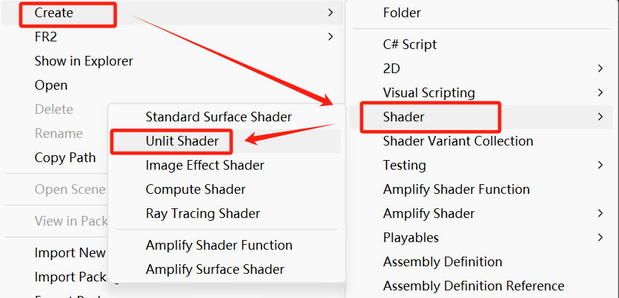
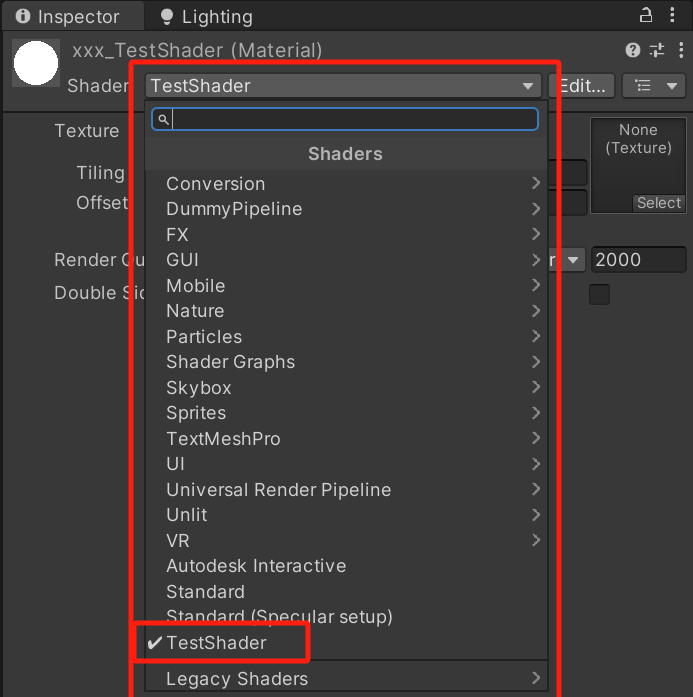
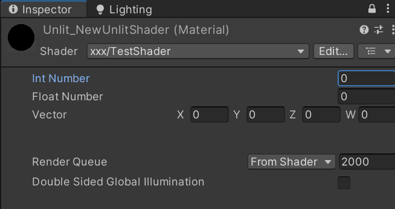
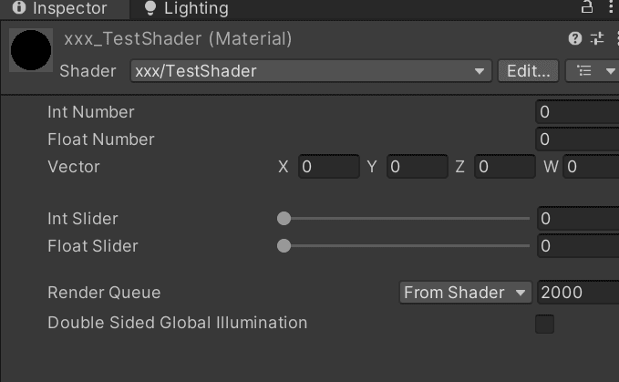
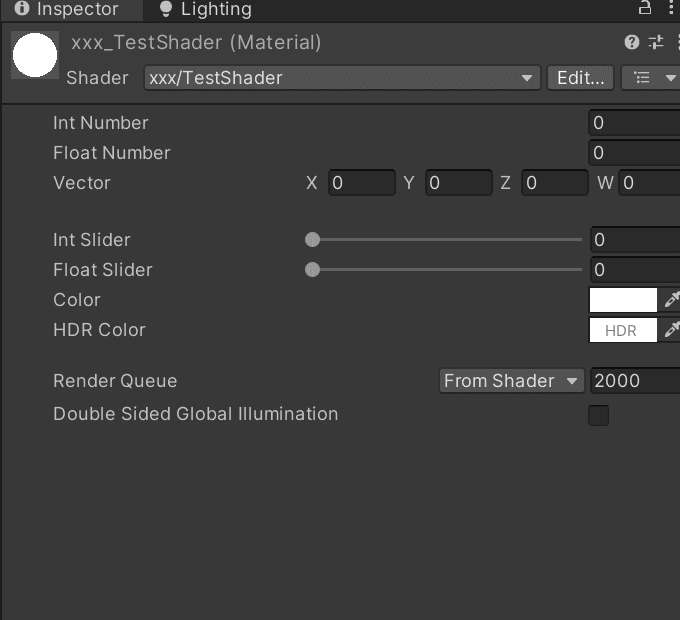
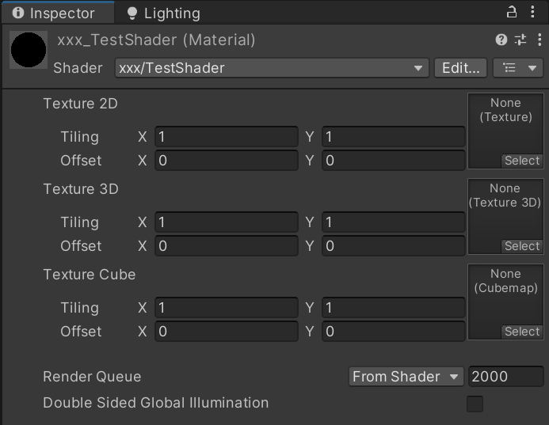
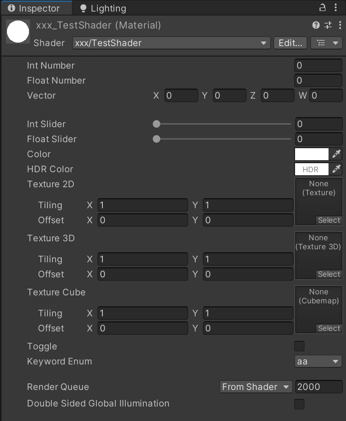

# 代码框架解析

[TOC]

------

## 一、内置 Shader 概览



如上图所示，为了方便示意，以下是使用内置“Unlit Shader”模板创建的一个 Shader 文件（精简后）代码示例：

```glsl
Shader "Unlit/NewUnlitShader"
{
    Properties
    {
        _MainTex ("Texture", 2D) = "white" { }
    }
    SubShader
    {
        Tags { "RenderType" = "Opaque" }
        Pass
        {
            CGPROGRAM
            #pragma vertex vert
            #pragma fragment frag
            #include "UnityCG.cginc"

            struct appdata
            {
                float4 vertex : POSITION;
                float2 uv : TEXCOORD0;
            };

            struct v2f
            {
                float2 uv : TEXCOORD0;
                float4 vertex : SV_POSITION;
            };

            sampler2D _MainTex;
            float4 _MainTex_ST;

            v2f vert(appdata v)
            {
                v2f o;
                o.vertex = UnityObjectToClipPos(v.vertex);
                o.uv = TRANSFORM_TEX(v.uv, _MainTex);
                return o;
            }

            fixed4 frag(v2f i) : SV_Target
            {
                fixed4 col = tex2D(_MainTex, i.uv);
                return col;
            }
            ENDCG
        }
    }
}
```

如上代码文件可以发现，整个 Shader 代码分为两大块结构，分别是“Properties{}”与“SubShader{}”。

其中“Properties{}”代码块中的内容主要是用于将参数属性暴露在外部的“Inspector”面板中方便调试，而“SubShader{}”代码块中包含一个“Pass{}”代码块用于编写渲染细节的代码。

下文将从头至尾具体解析。

## 二、名称与路径

一个 Shader 文件的命名通常可以被自定义，结构如下所示：

```glsl
Shader "TestShader"
{
    
}
```

上述示例代码中绿色的“TestShader”就是此 Shader 文件的名称，在引擎中显示的名称如下所示：



如果想要为此 Shader 文件添加路径，请仿照如下示例代码进行编写：

```glsl
Shader "xxx/TestShader" 
{
    
}
```

此时就可以从名为“xxx”的路径下找到此 Shader 文件了，如下图所示：


## 三、参数模块

为了将参数暴露在“Inspector”面板上便于调节，可在 Shader 的参数模块部分进行定义：

```glsl
Shader "xxx/TestShader" 
{
	Properties
	{
		// 在此处定义需要暴露的参数
	}
}
```

如上述示例代码所示，想要暴露参数可以在“Properties{}”代码块中进行定义。

“//”后面的为注释内容，不参与代码编译，通常标注一些方便阅读的描述短文或关键词。

### 3.1、语法解析

```glsl
Shader "xxx/TestShader" 
{
	Properties
	{
		// 在此处定义需要暴露的参数
        [ Attribute ] _Name ( "Display Name",  Type) = Default Value
	}
}
```

想要暴露参数需要按照上述示例代码中的规范进行编写，其中每一个“单词”都代表一个含义：

（1）Attribute：参数在“Inspector”面板上暴露时的绘制特性标记，可通过“C#”脚本进行自定义。

（2）_Name：参数在 Shader 代码中使用的变量名称，需注意上下文保持命名一致（包括大小写）。

（3）Display Name：参数在“Inspector”面板上显示的名称。

（4）Type：参数类型，常见的类型包有“Int”、“Float”、“Vector”、“Color”、“2D”、“3D”、“Cube”。

（5）Default Value：参数的初始值。

### 3.2、数值（向量）与滑块

- 数值（向量）

​	（1）整型数值（_intNumber）：表示整数，参数只会进行“0，1，2，3...”这样的整数变化，同样也支持负数。

​	（2）浮点型数值（_floatNumber）：表示浮点数（就是带小数，也算是一维向量），参数会进行“0.0，0.1...，1.0”这样带小数的数值变化，同样也支持负数。

​	（3）向量（_vector）：表示四维向量（Unity 默认面板 GUI 仅支持一维向量与四维向量），参数包含“X、Y、Z、W”四个浮点型数值分量。

​	最终暴露在“Inspector”面板上的样式如下所示：



​	注意观察左上角的球体：

​	（1）整型数值变化时，只有数值到达整数后才会从黑色条变成白色，而没有小数的变化过渡。

​	（2）浮点型数值变化时，具有小数的变化过渡。

​	（3）四维向量分为“X、Y、Z、W”四个分量进行调整，同样也是由四个浮点值构成的。

​	以下为代码示例：

```glsl
Shader "xxx/TestShader" 
{
	Properties
	{
        // 整型数值
        _intNumber ("Int Number", integer) = 0
        // 浮点型数值
        _floatNumber ("Float Number", float) = 0.0
        // 向量
        _vector ("Vector", vector) = (0.0, 0.0, 0.0, 0.0)
	}
}
```

------

- 滑块

​	（1）整型滑块（_intSlider）：表示整数，前缀使用“ [IntRange] ”特性标签将参数标记为整型数值区间，再使用“Range(min，max)”限制参数的最小值与最大值，参数会在规定的值域内进行整数变化。

​	（2）浮点型滑块（_floatSlider）：表示浮点数，仅使用“Range(min，max)”就能对参数的值域进行最小值与最大值的限制，参数会在规定的值域内进行带小数的数值变化。

​	最终暴露在“Inspector”面板上的样式如下所示：



​	注意观察左上角的球体：

​	（1）会在规定的值阈范围内进行整型数值变化，只有数值到达整数后才会从黑色条变成白色，而没有小数的变化过渡。

​	（2）会在规定的值阈范围内进行浮点型数值变化，具有小数的变化过渡。

​	以下为代码示例：

```glsl
Shader "xxx/TestShader" 
{
	Properties
	{
        // 整数滑条
        [IntRange]_intSlider ("Int Slider", Range(0, 3)) = 0
        // 浮点数滑条
        _floatSlider ("Float Slider", Range(0.0, 1.0)) = 0.0
	}
}
```

### 3.3、颜色与纹理

- 颜色

​	（1）颜色值（_color）：表示颜色，参数包含“R，G，B，A”四个浮点型数值（等价于“X、Y、Z、W”），且值域为 [0.0，1.0]。

​	（2）高动态范围颜色值（_hdrColor）：通常表示自发光颜色，前缀使用“[HDR]”特性标签将参数标记为高动态范围数值。参数包含“R，G，B，A”四个浮点型数值，且最大值可以超过1.0。

​	最终暴露在“Inspector”面板上的样式如下所示：



​	注意观察左上角的球体：

​	（1）颜色值作为浮点类型的四维向量具有小数的变化过渡。

​	（2）高动态范围颜色值与颜色值一样可以由变化过度，通常配合“Bloom”后处理作用。

​	以下为代码示例：

```glsl
Shader "xxx/TestShader" 
{
	Properties
	{
        // 颜色值
        _color ("Color", Color) = (1.0, 1.0, 1.0, 1.0)
        // 高动态范围颜色值
        [HDR]_hdrColor ("HDR Color", Color) = (1.0, 1.0, 1.0, 1.0)
	}
}
```

------

- 纹理

​	（1）2D 纹理（_texture2D）：表示二维坐标系纹理，通常使用 2D 贴图，比如模型纹理、2D 遮罩、2D 噪声等。

​	（2）3D 纹理（_texture3D）：表示三维坐标系纹理，通常使用 2D 贴图，比如噪声等等。

​	（3）立方体纹理（_textureCube）：表示三维坐标系立方体纹理，通常用来采样环境反射贴图。

​	最终暴露在“Inspector”面板上的样式如下所示：



​	以下为代码示例：

```glsl
Shader "xxx/TestShader" 
{
	Properties
	{
        // 2D 纹理
        _texture2D ("Texture 2D", 2D) = "white" { }
        // 3D 纹理
        _texture3D ("Texture 3D", 3D) = "gray" { }
        // 立方体纹理
        _textureCube ("Texture Cube", Cube) = "black" { }
	}
}
```

### 3.4、按钮与枚举菜单

​	（1）按钮（_toggle）：表示按钮点击切换，本质是一个“bool”值。前缀使用“[Toggle(xx)]”特性标签将参数绘制为按钮样式，其中“xx”代表 Shader 代码中的变体或数值参数。

​	（2）关键字枚举【_keywordEnum】：表示下拉菜单，前缀使用“[KeywordEnum(aa, bb, cc)]”特性标签将参数绘制为下拉菜单样式，其中“aa, bb, cc”分别代表 Shader 代码中的变体或数值参数以及“Inspector”面板中下拉菜单中的选项。

​	最终暴露在“Inspector”面板上的样式如下所示：


​	以下为代码示例：

```glsl
Shader "xxx/TestShader" 
{
	Properties
	{
        // 按钮
        [Toggle(xx)]_toggle ("Toggle", float) = 0
        // 枚举菜单
        [KeywordEnum(aa, bb, cc)]_keywordEnum ("Keyword Enum", float) = 0
	}
}
```

### 3.5、常用绘制特性

常用的“Inspector”面板绘制特性可以帮助更好的分类参数，如下所示：

|       特性        |                             注释                             |
| :---------------: | :----------------------------------------------------------: |
|      [Gama]       | 浮点数或矢量属性使用“sRGB”值，这意味着如果项目中的色彩空间需要与其他“sRGB”值一起转换。 |
|       [HDR]       | 纹理或颜色属性使用高动态范围值。对于纹理属性，如果分配了“LDR”纹理，“Unity”会显示警告。对于颜色属性，“Unity”使用 HDR 颜色选取器来编辑此值。 |
| [HideInInspector] |               在“Inspector”面板中隐藏此属性。                |
|   [MainTexture]   | 设置为材质的主纹理，可使用“Material.mainTexture”来访问该纹理。 |
|    [MainColor]    | 设置为材质的主颜色，可使用“Material.mainColor”来访问该颜色。 |
|  [NoScaleOffset]  |  纹理专用，在“Inspector”面板中隐藏该纹理的平铺和偏移功能。   |
|     [Normal]      |              纹理专用，将该纹理标记为法线贴图。              |
| [PerRendererData] | 纹理属性将以“MaterialPropertyBlock”的形式来自于每个渲染数据。同时，在“Inspector”面板中将显示为只读模式。 |

### 3.6、总结

上述所有常用参数在“Inspector”面板上的样式如下所示：



以下为代码示例：

```glsl
Shader "xxx/TestShader" 
{
	Properties
	{
        // 整型数值
        _intNumber ("Int Number", int) = 0
        // 浮点型数值
        _floatNumber ("Float Number", float) = 0.0
        // 向量
        _vector ("Vector", vector) = (0.0, 0.0, 0.0, 0.0)

        // 整数滑条
        [IntRange]_intSlider ("Int Slider", Range(0, 3)) = 0
        // 浮点数滑条
        _floatSlider ("Float Slider", Range(0.0, 1.0)) = 0.0

        // 颜色值
        _color ("Color", Color) = (1.0, 1.0, 1.0, 1.0)
        // 高动态范围颜色值
        [HDR]_hdrColor ("HDR Color", Color) = (1.0, 1.0, 1.0, 1.0)

        // 2D 纹理
        _texture2D ("Texture 2D", 2D) = "white" { }
        // 3D 纹理
        _texture3D ("Texture 3D", 3D) = "gray" { }
        // 立方体纹理
        _textureCube ("Texture Cube", Cube) = "black" { }

        // 按钮
        [Toggle(xx)]_toggle ("Toggle", float) = 0
        // 枚举菜单
        [KeywordEnum(aa, bb, cc)]_keywordEnum ("Keyword Enum", float) = 0
	}
}
```

## 四、子着色器

### 4.1、SubShader

#### 4.1.1、SubShader 的作用与定义

一个 Shader 中可以包含多个“SubShader{}”代码块，但最少需要有一个。

通常定义多个“SubShader{}”代码块的原因是需要匹配不同的显卡，有的显卡较为老旧，所以只支持一定数量的操作指令，而一部分更高级的显卡则可以具备数量更多的指令数。

当需要根据显卡能力高低自动分配不同复杂程度的代码时，多个“SubShader{}”代码块就起到了关键性的作用。开发者可以根据不同平台的硬件性能去自定义不同计算复杂程度的“SubShader”，以做到性能适配的最优化。

如果想要区分不同“SubShader”，需要在“SubShader{}”代码块较为开头的部分添加“ LOD 100”样式的语句。其中的数字“100”就是用于区分不同平台的数值标记，通常可以将不同的性能配置目标平台粗略地分为“高”、“中”、“低”三个分段来进行配置。同样，它们所对应的数值标记则对应为“100”、“200”、“300”，数值越大所代表的平台越低端，反之亦然。

以下是一个简单的多个“SubShader”代码示例：

```glsl
Shader "Unlit/NewUnlitShader"
{
    Properties
    {
        ...
    }
    
    // 子着色器1 用于适配高端平台
    SubShader
    {
        Tags { "RenderType" = "Opaque" }
        // [RenderSetup]
        LOD 100
        Pass { ... }
    }
    
    // 子着色器2 用于适配中端平台
    SubShader
    {
        Tags { "RenderType" = "Opaque" }
        // [RenderSetup]
        LOD 200
        Pass { ... }
    }
    
    // 子着色器3 用于适配低端平台
    SubShader
    {
        Tags { "RenderType" = "Opaque" }
        // [RenderSetup]
        LOD 300
        Pass { ... }
    }
}
```

#### 4.1.2、渲染状态设置

```glsl
SubShader
{
    Tags { "RenderType" = "Opaque" }
    // [RenderSetup]
    LOD 100
    Pass { ... }
}
```

在上述的代码示例中可以看到，每一个“SubShader{}”代码块中都有一个`// [RenderSetup]`。其中“//”是代表注释的意思，可以忽略。而“[RenderSetup]”则代表了渲染状态设置。“ShaderLab”提供了一系列可以设置渲染状态的指令用于设置显卡的各种状态，以下是常用渲染状态设置选项：

| 状态名称 |                           设置指令                           |             注释             |
| :------: | :----------------------------------------------------------: | :--------------------------: |
|   Cull   |                     Back \| Front \| Off                     |         设置剔除模式         |
|  ZTest   | Less \| LEqual  \| Equal \| Not Equal \| Greater \| GEqual \| Always | 设置深度测试时使用的比较函数 |
|  ZWrite  |                          On \| Off                           |         设置深度写入         |
|  Blend   |                    SrcFactor \| DstFactor                    |         设置混合模式         |

当在“SubShader{}”代码块中设置了以上渲染状态后，将会应用到这个“SubShader”的所有“Pass”中。若想要单独设置每一个“Pass”的渲染状态，则将上述的渲染设置挪到“Pass{}”代码块中单独设置。

以下为简单示例代码：

```glsl
SubShader
{
    Tags { "RenderType" = "Opaque" }
    
    Cull Back
    ZWrite Off
    ZTest LEqual
    Blend SrcAlpha OneMinusSrcAlpha
    
    LOD 100
    Pass { ... }
}
```

#### 4.1.3、标签

“SubShader”中的标签（Tags）通常是一个键值对（Key / Value Pair），它的“键”与“值”都是字符串类型（string），这些标签被用来告诉 Unity 该如何渲染一个对象。

标签的结构通常都是这样的：

```glsl
Tags
{
    "TagName1" = "Value1"
    "TagName2" = "Value2"
    "TagName3" = "Value3"
}
```

常用渲染标签类型如下所示：

|       标签类型       |                         说明                         |
| :------------------: | :--------------------------------------------------: |
|        Queue         |   控制物体的渲染顺序，指定物体属于被指定的渲染队列   |
|      RenderType      |     对 Shader 进行分类，比如不透明或透明 Shader      |
|   DisableBatching    |            是否对该 SubShader 使用批处理             |
| ForceNoShadowCasting |      控制使用该 SubShader  的物体是否会投射阴影      |
|   IgnoreProjector    |     控制该 SubShader 是否会受到 Projector 的影响     |
|  CanUseSpriteAtlas   | 当该 SubShader 适用于 Sprites 时将该标签设置为 False |
|     PreviewType      |                控制材质面板将如何预览                |

以下为简单示例代码：

```glsl
Tags
{
    "Queue" = "Geometry"
    "RenderType" = "Opaque"
    "DisableBatching" = "False"
    "ForceNoShadowCasting" = "False"
    "IgnoreProjector" = "True"
    "CanUseSpriteAtlas" = "False"
    "PreviewType" = "Sphere"
}
```

需要注意的是，上述标签仅可以在“SubShader”中声明，而不可以在“Pass”中声明。

### 4.2、Pass

#### 4.2.1、Pass 的作用与定义

与“SubShader{}”代码块一样的是，“Pass”也可以存在多个，但最少需要有一个。通常来说，一个“Pass”就代表了一个完整的渲染顺序，这期间发生了很多事情。从获取模型网格的各种信息，再到“顶点”着色器中的相关顶点变换，最后才在“片元”着色器中计算像素着色并输出。

如下是简单多个“Pass”的示例代码：

```glsl
SubShader
{
    Pass
    {
        ...
    }
    Pass
    {
        ...
    }
}
```

#### 4.2.2、Pass 的结构

```glsl
SubShader
{
    Pass
    {
        // Pass Name
        // Tags
        // RenderSetup
        // Other codes
    }
}
```

如上示例代码所示，一个“Pass”应该包含以下几部分内容：

- Pass Name

​	定义当前“Pass”的名称，此名称可自定义，例如：

```glsl
Pass
{
    Name "TESTPASS"
}
```

​	这里使用全部大写的原因是，当此“Pass”需要被调用时就可以使用“ShaderLab”中的“UsePass”命令来直接使用。

​	这样做的好处是可以提高代码的复用性，但需要注意的是，由于 Unity 内部会把所有“Pass”的名称转换为大写字母表示，所以建议直接使用全大写字母来定义“Pass’的名称。例如：

```glsl
UsePass "xxx/TESTPASS"
```

​	其中的“xxx”代表的是当前 Shader 的路径与名称，可以使用小写，但后面的“Pass Name”需要使用大写。

------

- Tags

​	与“SubShader”一样，“Pass”也可以为其设置标签。常用的标签类型如下所示：

|    标签类型    |                             说明                             |
| :------------: | :----------------------------------------------------------: |
|   LightMode    |         定义该 Pass 在 Unity 中的渲染流水线中的角色          |
| RequireOptions | 用于指定当满足某些条件时才会渲染的 Pass，它的值是一个由空格分隔的字符串 |

------

- RenderSetup

​	上文“SubShader”中使用的渲染状态类型同样适用于“Pass”，故不再赘述。

------

- Other codes

​	但完成上述步骤后，就可以编写具体的渲染细节代码了，这部分将在下文分析。

#### 4.2.3、CG 代码块

一个“Pass”的渲染流程都是被嵌套在“CGPROGRAM”与“ENDCG”语句之间的（也称作“CG 代码块”），如下所示：

```
Pass
{
    // Other codes
    CGPROGRAM
    ...
    ENDCG
}
```

那么第一步就是需要分别定义“顶点”与“片元”着色器：

```glsl
CGPROGRAM

// 声明一个名叫 “vert” 的顶点着色器
#pragma vertex vert
// 声明一个名叫 “frag” 的片元着色器
#pragma fragment frag

ENDCG
```

然后再引入一个头文件，名叫“UnityCG.cginc”：

```glsl
CGPROGRAM

// 声明一个名叫 “vert” 的顶点着色器
#pragma vertex vert
// 声明一个名叫 “frag” 的片元着色器
#pragma fragment frag

// 引入头文件
#include "UnityCG.cginc"

ENDCG
```

这么做的原因是，引入此文件后可以更便捷的去编写着色器代码。其中包含了众多 Unity 已经封装好的各种功能函数，开发者只需要对其进行正确调用即可，非常方便。

> 这也是一个提醒：在日常工作中，可以使用此方式不断地积累各种修改、自定义的方法函数，以便提升日后的工作效率。

**接下来就是几部分重要内容了：**

- 网格数据输入

​	在渲染开始前，需要根据渲染效果的需求去获取模型网格体本身的各种数据，如“顶点坐标”、“顶点法线”、“顶点 UV”、“顶点切线”等等。

​	通常会将这些数据定义在一个名为“appdata”的“顶点输入结构体（struct）”中（个人习惯将其改为“VertexInput”），如下所示：

```glsl
CGPROGRAM

// 声明一个名叫 “vert” 的顶点着色器
#pragma vertex vert
// 声明一个名叫 “frag” 的片元着色器
#pragma fragment frag

// 引入头文件
#include "UnityCG.cginc"

// 顶点输入结构体
struct VertexInput
{
    float4 vertex : POSITION;
};
    
ENDCG
```

​	其中的`float4 vertex : POSITION;`则代表获取模型本地空间下的顶点坐标位置信息，顶点坐标位置是一个四维浮点数值。

------

- 网格数据输出

​	完成以上步骤即获取了渲染所需要的相关数据，下一步就是定义“顶点”着色器所需要的输出数据结构体，同样将其命名为“VertexOutput（默认为“v2f”）”：

```glsl
CGPROGRAM

// 声明一个名叫 “vert” 的顶点着色器
#pragma vertex vert
// 声明一个名叫 “frag” 的片元着色器
#pragma fragment frag

// 引入头文件
#include "UnityCG.cginc"

// 顶点输入结构体
struct VertexInput
{
    float4 vertex : POSITION;
};
// 顶点输出结构体
struct VertexOutput
{
    float4 pos_clip : SV_POSITION;
};
    
ENDCG
```

​	其中的`float4 pos_clip : SV_POSITION;`则代表需要转换且输出的裁剪空间下的顶点坐标位置信息，是一个四维浮点数值。

------

- 顶点着色器

​	“顶点”着色器（Vertex Shader），顾名思义它处理的是顶点，同时也是流水线的第一个阶段，它的信息输入来自于 CPU。“顶点”着色器本身不可以创建或销毁任何顶点，也无法得到顶点之间的关系。但它有着重要的工作，那就是逐顶点的坐标变换与光照。当然，除了这两个主要任务之外，它还可以输出后续阶段（也就是“片元”着色器）所需的数据。

> 顶点变换：是指“顶点”着色器将顶点坐标从模型本地空间转换至齐次裁剪空间的操作。

​	完成上文中数据的输入与输出后，就轮到“顶点”着色器发挥作用了。从此时开始，则需要注意“命名”的问题。

​	在上文的示例代码中，开头的部分声明了一个名叫“vert”的“顶点”着色器。这个名字使用不能出错，否则会报错：

```glsl
CGPROGRAM

// 声明一个名叫 “vert” 的顶点着色器
#pragma vertex vert
// 声明一个名叫 “frag” 的片元着色器
#pragma fragment frag

// 引入头文件
#include "UnityCG.cginc"

// 顶点输入结构体
struct VertexInput
{
    float4 vertex : POSITION;
};
// 顶点输出结构体
struct VertexOutput
{
    float4 pos_clip : SV_POSITION;
};
// 顶点着色器方法函数
VertexOutput vert(VertexInput v)
{
    VertexOutput o;
    o.pos_clip = UnityObjectToClipPos(v.vertex);
    return o;
}

ENDCG
```

​	如上示例代码可以看到，“顶点”着色器是一个类型为“VertexOutput”，名为“vert”的方法函数。其输入参数为“VertexInput”，并命名为“v（代表 vertex）”，刚好与上述的所有部分名称所对应。

​	其中：

​	（1）`VertexOutput o;`：代表声明一个名为“o”的“顶点”着色器，同时也是对“顶点”着色器的初始化。

​	（2）`o.pos_clip = UnityObjectToClipPos(v.vertex);`：代表计算后被输出的齐次裁剪空间下的顶点坐标位置信息（顶点变换），也就是顶点在屏幕中的位置信息。

​	（3）`return o;`：代表最终返回的“顶点”着色器数据，具体的输出内容就是上述被声明的语句的计算结果。

------

- 片元着色器

​	“片元”着色器（Fragment Shader），在 DirectX 中被称作“像素”着色器（Pixel Shader），是另一个非常重要的可编程阶段。它的主要输入数据来自于“顶点”着色器输出数据插值得到的结果，而它的输出则是一个或多个颜色值。在这一阶段中可以完成很多重要的渲染技术，比如“纹理采样”。

​	等到“顶点”着色器完成工作后，最后一步就是通过“片元”着色器对顶点进行着色。与“顶点”着色器相同，需要注意“命名”的问题。

​	在以下示例代码中，开头的部分声明了一个名叫“frag”的“片元”着色器。这个名字使用同样不能出错，否则会报错：

```glsl
CGPROGRAM

// 声明一个名叫 “vert” 的顶点着色器
#pragma vertex vert
// 声明一个名叫 “frag” 的片元着色器
#pragma fragment frag

// 引入头文件
#include "UnityCG.cginc"

// 顶点输入结构体
struct VertexInput
{
    float4 vertex : POSITION;
};
// 顶点输出结构体
struct VertexOutput
{
    float4 pos_clip : SV_POSITION;
};
// 顶点着色器方法函数
VertexOutput vert(VertexInput v)
{
    VertexOutput o;
    o.pos_clip = UnityObjectToClipPos(v.vertex);
    return o;
}

float4 frag(VertexOutput i) : SV_Target
{
    return float4(1.0, 1.0, 1.0, 1.0);
}

ENDCG
```

如上示例代码可以看到，“片元”着色器是一个类型为“float4”，名为“frag”的方法函数。其输入参数为“VertexOutput”，并命名为“i（代表 input）”，刚好与上述的所有部分名称所对应。

其中的`return float4(1.0, 1.0, 1.0, 1.0);`则是最终输出一个白色，也就意味着当前“片元”着色器为每一个顶点上了一个白色，所以最终模型也会呈现出纯白色。

### 4.3、Fallback

出现在“SubShader”最后的部分便是一个“Fallback”指令，它被用于告诉 Unity，如果上面所有的“SubShader”在显卡上都不能运行，那就使用“Fallback”所代表的最低级 Shader。算是一条后路，当然也可以选择不使用“Fallback”功能。

以下为示例代码：

```glsl
SubShader
{
    ...
}
Fallback "VertexLit"
```

当然也可以选择关闭“Fallback”：

```glsl
SubShader
{
    ...
}
Fallback Off
```

需要注意的是，“Fallback”会影响阴影的投射。在渲染阴影时，通常需要在当前 Shader 中实现一个专门用于投射阴影的“Pass”。这时候可以选择单独实现一个阴影“Pass”，也可以选择使用“Fallback”功能去包含一个自带阴影“Pass”的内置文件。因此，若要使用“Fallback”去实现阴影投射，正确设置“Fallback”是非常重要的。

## 五、总结

最后附上一个完整的“Unlit Shader”注释版本案例：

```glsl
Shader "Unlit/NewUnlitShader"                           // Shader路径与名称
{
  Properties                                            // 暴露在Inspector面板的参数
  {
    _MainTex ("Texture", 2D) = "white" {}               // 定义一张2D纹理，默认值为纯白色
  }

  SubShader                                             // 第一个子着色器，可以有多个
  {
    Tags { "RenderType"="Opaque" }                      // 定义标签

    Pass                                                // 第一个Pass，可以有多个
    {
      CGPROGRAM                                         // 开始CG代码
      #pragma vertex vert                               // 声明一个名叫 “vert” 的顶点着色器
      #pragma fragment frag                             // 声明一个名叫 “frag” 的片元着色器
      #include "UnityCG.cginc"                          // 引入头文件

      struct VertexInput                                // 顶点输入结构体
      {
        float4 vertex    : POSITION;                    // 获取模型空间顶点坐标信息
        float2 uv        : TEXCOORD0;                   // 获取模型顶点uv坐标信息
      };

      struct VertexOutput                               // 顶点输出结构体
      {
        float2 uv        : TEXCOORD0;                   // 输出模型uv坐标信息
        float4 vertex    : SV_POSITION;                 // 输出模型空间顶点坐标信息
      };

      sampler2D _MainTex;                               // 声明主纹理
      float4 _MainTex_ST;                               // 声明主纹理采样信息

      VertexOutput vert (VertexInput v)                 // 顶点Shader
      {
        VertexOutput o;                                 // 声明一个顶点Shader“o”
        o.vertex = UnityObjectToClipPos(v.vertex);      // 将模型顶点坐标转从本地空间换至齐次裁剪空间
        o.uv = TRANSFORM_TEX(v.uv, _MainTex);           // 将模型uv与主纹理进行坐标映射
        return o;                                       // 返回“o”
      }

      half4 frag (VertexOutput i) : SV_Target           // 片元Shader
      {
        half4 finalcolor = tex2D(_MainTex, i.uv);       // 采样一张主纹理
        return finalcolor;                              // 返回最终颜色
      }
      ENDCG                                             // 结束CG代码
    }
  }
}
```

以上，一个完整的简易 Shader 代码框架就全部解析完了。

认真反思后可以发现，在编写 Shader 代码时的顺序是“由上至下的正序”，而若要去阅读且理解一个 Shader 时却又是“从下至上的倒序”。这也提醒了开发者需要注意保持一个良好的编码习惯，不仅是方便自己也方便他人。漂亮的代码结构总归是让人舒心的，也方便维护。

当然，一个项目中真正的 Shader 肯定要比文章中的复杂得多，甚至会出现各种千奇百怪的结构。所以，建议大家平时多敲、多练代码编写，也要经常阅读引擎的源码。通过引擎的源码编码方式来接触更多的编码习惯，也能体会到其他作者的创作思维，这是一件长久且有趣的事！
