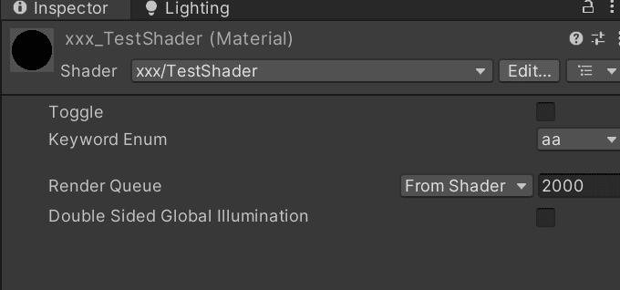

# 代码框架解析

## 一、名称与路径

一个 Shader 文件的命名通常可以被自定义，结构如下所示：

```glsl
Shader "TestShader"
{
    
}
```

上述示例代码中绿色的“TestShader”就是此 Shader 文件的名称，在引擎中显示的名称如下所示：


如果想要为此 Shader 文件添加路径，请仿照如下示例代码进行编写：

```glsl
Shader "xxx/TestShader" 
{
    
}
```

此时就可以从名为“xxx”的路径下找到此 Shader 文件了，如下图所示：


## 二、参数模块

为了将参数暴露在“Inspector”面板上便于调节，可在 Shader 的参数模块部分进行定义：

```glsl
Shader "xxx/TestShader" 
{
	Properties
	{
		// 在此处定义需要暴露的参数
	}
}
```

如上述示例代码所示，想要暴露参数可以在“Properties{}”代码块中进行定义。

“//”后面的为注释内容，不参与代码编译，通常标注一些方便阅读的描述短文。

### 2.1、语法解析

```glsl
Shader "xxx/TestShader" 
{
	Properties
	{
		// 在此处定义需要暴露的参数
        [ Attribute ] _Name ( "Display Name",  Type) = Default Value
	}
}
```

想要暴露参数需要按照上述示例代码中的规范进行编写，其中每一个“单词”都代表一个含义：

（1）Attribute：参数在“Inspector”面板上暴露时的绘制特性标记，可通过“C#”脚本进行自定义。

（2）_Name：参数在 Shader 代码中使用的变量名称，需注意上下文保持命名一致（包括大小写）。

（3）Display Name：参数在“Inspector”面板上显示的名称。

（4）Type：参数类型，常见的类型包有“Int”、“Float”、“Vector”、“Color”、“2D”、“3D”、“Cube”。

（5）Default Value：参数的初始值。

### 2.2、数值（向量）与滑块

- 数值（向量）

​	（1）整型数值（_intNumber）：表示整数，参数只会进行“0，1，2，3...”这样的整数变化，同样也支持负数。

​	（2）浮点型数值（_floatNumber）：表示浮点数（就是带小数，也算是一维向量），参数会进行“0.0，0.1...，1.0”这样带小数的数值变化，同样也支持负数。

​	（3）向量（_vector）：表示四维向量（Unity 默认面板 GUI 仅支持一维向量与四维向量），参数包含“X、Y、Z、W”四个浮点型数值分量。

​	最终暴露在“Inspector”面板上的样式如下所示：


​	注意观察左上角的球体：

​	（1）整型数值变化时，只有数值到达整数后才会从黑色条变成白色，而没有小数的变化过渡。面板中的数值没有进行整数变化是因为 Unity 默认不支持，可以通过自定义面板实现（当然，不一定有必要）。

​	（2）浮点型数值变化时，具有小数的变化过渡。

​	（3）四维向量分为“X、Y、Z、W”四个分量进行调整，同样也是由四个浮点值构成的。

​	以下为代码示例：

```glsl
Shader "xxx/TestShader" 
{
	Properties
	{
        // 整型数值
        _intNumber ("Int Number", int) = 0
        // 浮点型数值
        _floatNumber ("Float Number", float) = 0.0
        // 向量
        _vector ("Vector", vector) = (0.0, 0.0, 0.0, 0.0)
	}
}
```

------

- 滑块

​	（1）整型滑块（_intSlider）：表示整数，前缀使用“ [IntRange] ”特性标签将参数标记为整型数值区间，再使用“Range(min，max)”限制参数的最小值与最大值，参数会在规定的值域内进行整数变化。

​	（2）浮点型滑块（_floatSlider）：表示浮点数，仅使用“Range(min，max)”就能对参数的值域进行最小值与最大值的限制，参数会在规定的值域内进行带小数的数值变化。

​	最终暴露在“Inspector”面板上的样式如下所示：


​	注意观察左上角的球体：

​	（1）会在规定的值阈范围内进行整型数值变化，只有数值到达整数后才会从黑色条变成白色，而没有小数的变化过渡。

​	（2）会在规定的值阈范围内进行浮点型数值变化，具有小数的变化过渡。

​	以下为代码示例：

```glsl
Shader "xxx/TestShader" 
{
	Properties
	{
        // 整数滑条
        [IntRange]_intSlider ("Int Slider", Range(0, 3)) = 0
        // 浮点数滑条
        _floatSlider ("Float Slider", Range(0.0, 1.0)) = 0.0
	}
}
```

### 2.3、颜色与纹理

- 颜色

​	（1）颜色值（_color）：表示颜色，参数包含“R，G，B，A”四个浮点型数值（等价于“X、Y、Z、W”），且值域为 [0.0，1.0]。

​	（2）高动态范围颜色值（_hdrColor）：通常表示自发光颜色，前缀使用“[HDR]”特性标签将参数标记为高动态范围数值。参数包含“R，G，B，A”四个浮点型数值，且最大值可以超过1.0。

​	最终暴露在“Inspector”面板上的样式如下所示：


​	注意观察左上角的球体：

​	（1）颜色值作为浮点类型的四维向量具有小数的变化过渡。

​	（2）高动态范围颜色值与颜色值一样可以由变化过度，通常配合“Bloom”后处理作用。

​	以下为代码示例：

```glsl
Shader "xxx/TestShader" 
{
	Properties
	{
        // 颜色值
        _color ("Color", Color) = (1.0, 1.0, 1.0, 1.0)
        // 高动态范围颜色值
        [HDR]_hdrColor ("HDR Color", Color) = (1.0, 1.0, 1.0, 1.0)
	}
}
```

------

- 纹理

​	（1）2D 纹理（_texture2D）：表示二维坐标系纹理，通常使用 2D 贴图，比如模型纹理、2D 遮罩、2D 噪声等。

​	（2）3D 纹理（_texture3D）：表示三维坐标系纹理，通常使用 2D 贴图，比如噪声等等。

​	（3）立方体纹理（_textureCube）：表示三维坐标系立方体纹理，通常用来采样环境反射贴图。

​	最终暴露在“Inspector”面板上的样式如下所示：


​	以下为代码示例：

```glsl
Shader "xxx/TestShader" 
{
	Properties
	{
        // 2D 纹理
        _texture2D ("Texture 2D", 2D) = "white" { }
        // 3D 纹理
        _texture3D ("Texture 3D", 3D) = "gray" { }
        // 立方体纹理
        _textureCube ("Texture Cube", Cube) = "black" { }
	}
}
```

### 2.4、按钮与枚举菜单

​	（1）按钮（_toggle）：表示按钮点击切换，本质是一个“bool”值。前缀使用“[Toggle(xx)]”特性标签将参数绘制为按钮样式，其中“xx”代表 Shader 代码中的变体或数值参数。

​	（2）关键字枚举【_keywordEnum】：表示下拉菜单，前缀使用“[KeywordEnum(aa, bb, cc)]”特性标签将参数绘制为下拉菜单样式，其中“aa, bb, cc”分别代表 Shader 代码中的变体或数值参数以及“Inspector”面板中下拉菜单中的选项。

​	最终暴露在“Inspector”面板上的样式如下所示：



​	以下为代码示例：

```glsl
Shader "xxx/TestShader" 
{
	Properties
	{
        // 按钮
        [Toggle(xx)]_toggle ("Toggle", float) = 0
        // 枚举菜单
        [KeywordEnum(aa, bb, cc)]_keywordEnum ("Keyword Enum", float) = 0
	}
}
```

### 2.5、总结

上述所有参数在“Inspector”面板上的样式如下所示：


以下为代码示例：

```glsl
Shader "xxx/TestShader" 
{
	Properties
	{
        // 整型数值
        _intNumber ("Int Number", int) = 0
        // 浮点型数值
        _floatNumber ("Float Number", float) = 0.0
        // 向量
        _vector ("Vector", vector) = (0.0, 0.0, 0.0, 0.0)

        // 整数滑条
        [IntRange]_intSlider ("Int Slider", Range(0, 3)) = 0
        // 浮点数滑条
        _floatSlider ("Float Slider", Range(0.0, 1.0)) = 0.0

        // 颜色值
        _color ("Color", Color) = (1.0, 1.0, 1.0, 1.0)
        // 高动态范围颜色值
        [HDR]_hdrColor ("HDR Color", Color) = (1.0, 1.0, 1.0, 1.0)

        // 2D 纹理
        _texture2D ("Texture 2D", 2D) = "white" { }
        // 3D 纹理
        _texture3D ("Texture 3D", 3D) = "gray" { }
        // 立方体纹理
        _textureCube ("Texture Cube", Cube) = "black" { }

        // 按钮
        [Toggle(xx)]_toggle ("Toggle", float) = 0
        // 枚举菜单
        [KeywordEnum(aa, bb, cc)]_keywordEnum ("Keyword Enum", float) = 0
	}
}
```

## 三、子着色器

### 3.1、SubShader 与 Fallback

### 3.2、渲染通道【Pass】

### 3.3、自定义风格的材质面板【Custom Shader GUI】

