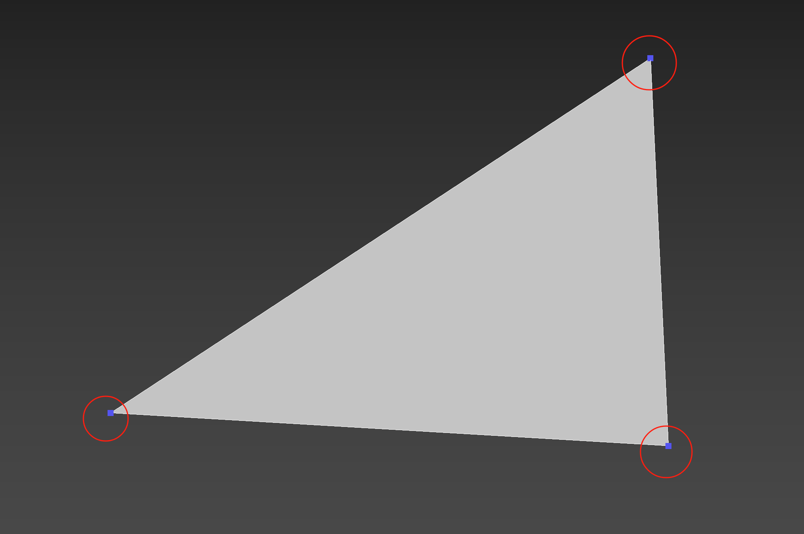
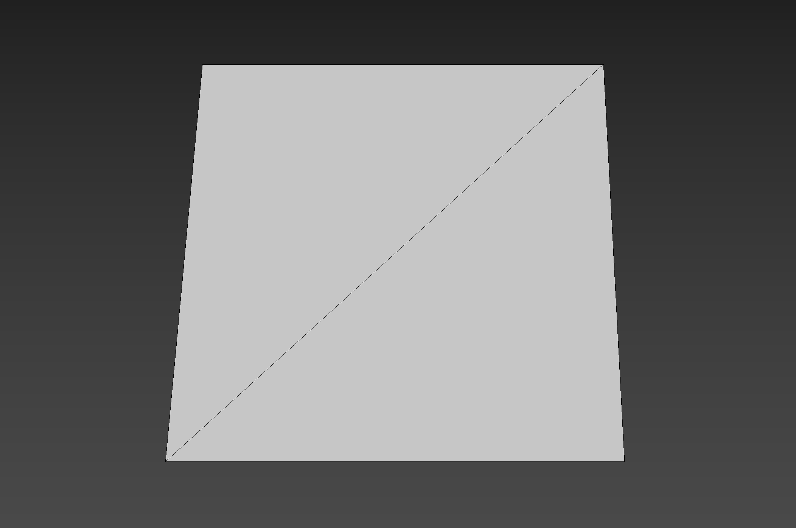
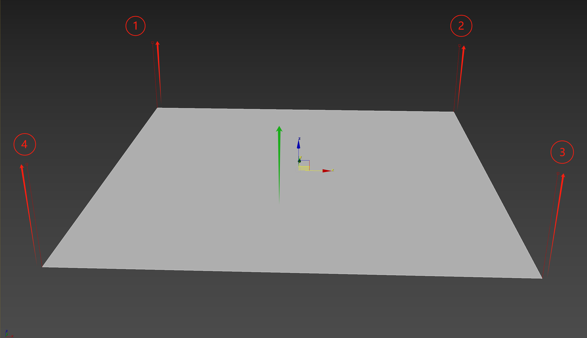
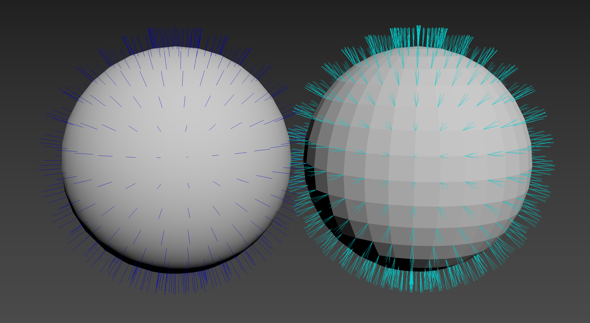
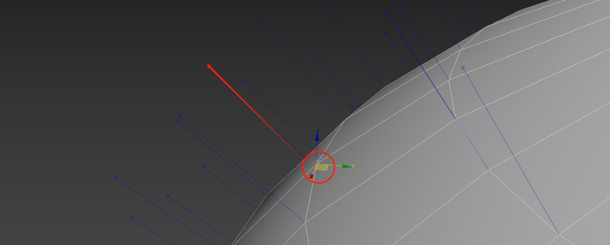
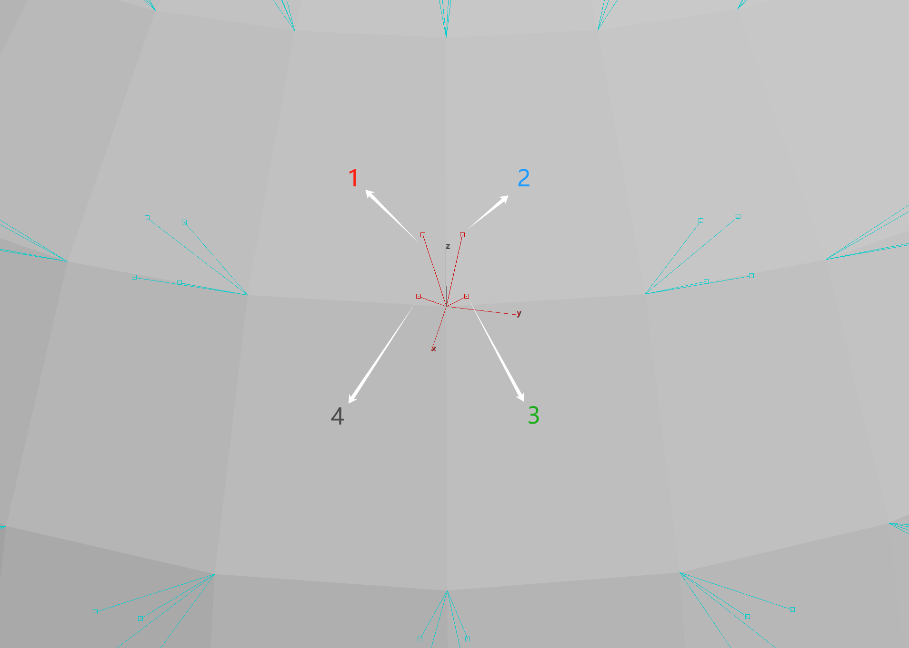
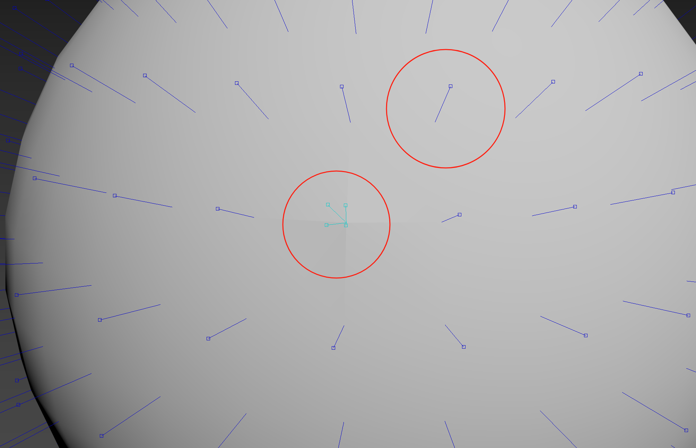
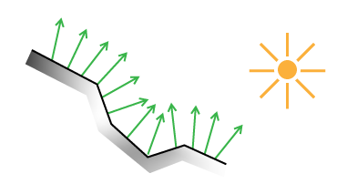

# 顶点法线与面法线

### 什么是顶点

三维模型是由若干个三角形网格组合而成的。其中三角形网格（也就是俗称的“三角面”），就分别由三个顶点所构成，如下图所示：

这样的两个三角形就可以拼接成一个四边形，如下图所示：

### 什么是顶点法线

对于三角形来说，每一个顶点都具有一个垂直于此顶点的法线。通常会将法线理解成是一个向量，而向量具备方向与大小两种信息。但对于模型来说，一般只有方向这个信息比较重要（因为大小都被归一化了）。

一个四边形平面通常具有四个顶点，并且每一个顶点都具备一根垂直向上的法线。这也意味着整个平面的朝向是垂直向上的，如下图所示：

### 多边形网格

这里就涉及到一个问题：如果出现多个平面之间共用了一个顶点怎么办？

其实这个问题很简单，对于建模美术同学来说一定非常熟悉，那就是“光滑组（3Ds Max） / 软硬边（Maya）”的概念。

先来看一组效果的对比：

上图展示了两个相同的球体，但其每个顶点具备不同的法线朝向所形成的结果。可以看到左边的球体看起来光滑圆润，而右边的球体看起来就不那么光滑了。

对于左边光滑的球体来说，其每一个顶点都与此顶点周边四个平面共用了同一根法线（也就是相同的法线朝向），如下图所示：

而对于右边不光滑的球体来说，其每一个平面都具有四个自己独特朝向的顶点法线（每一根法线朝向都不同），如下图所示：

所以，当一个顶点共用法线朝向时，就会使周边四个平面看起来光滑。当一个顶点不共用同一个法线朝向时，周边的四个平面就会独立分开，使得看起来不光滑。如下图所示：

### 如何计算顶点法线

通常使用一个三维向量来表示顶点法线的方向，此向量垂直于当前顶点所在的平面。如果有多个面共用这个顶点，那么就可以通过取这个顶点在所有面的法线朝向的平均值来计算出这个法线。如下图所示：

