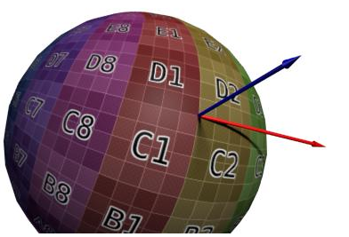

# 法线贴图

[TOC]

------

## 一、什么是法线贴图

### 1.1、如何存储法线

众所周知，当模型的顶点数（面数）越高，模型所能表达的细节就越多，效果也就越好。

因为游戏作为实时渲染，过高的顶点数会很大程度影响运行性能，往往不能够无限制的通过增加模型自身的顶点数量（面数）来达到丰富细节的目的，于是法线贴图就诞生了。通常将面数很高的模型（高模）的顶点法线信息通过烘焙的方式存储到一张纹理当中（称之为“法线贴图”）。

低面数的模型（低模）通过 UV 映射技术去采样法线贴图，达到低模能够模拟高模本身丰富的表面凹凸细节的假象。

### 1.2、切线空间坐标系

游戏中的物体会经常移动变换，如果要针对每一个状态都存储对应的法线信息，显然是不可取的。

通常使用“模型空间 / 本地（局部）坐标系（Model / Local Space）”或“切线空间坐标系（Tangent Space）”来表示法线的坐标，目前绝大多数都是采用切线空间坐标系来表示法线坐标的。模型中不同的三角形，都有对应的切线空间。而这个切线空间里有三个参数：

​	（1）顶点法线（Vertex Normal），对应切线空间 Z 轴。

​	（2）顶点副法 / 切线（Vertex Binormal / Bitangent），对应切线空间 Y 轴。

​	（3）顶点切线（Vertex Tangent），对应切线空间 X 轴。

其中 X、Y轴分别位于三角形所在平面上，结合三角面对应的顶点法线，将 X 轴为“T”、Y 轴为“B”、Z 轴为“N”所组成的坐标系即切线空间（TBN）。



如上图所示，蓝色的向量垂直于球面的某个顶点，就是法线坐标系的“Z 轴”。红色的向量和贴图的方向一致，可以认为是“X 轴”。上图中并没有表示“Y 轴”，但可以知道“Y 轴”是垂直于“X 与 Z”轴的，那么就可以计算出来。

在切线空间坐标中， (0，0，1) 代表当前顶点法线没有任何偏移，而一旦“X 或 Y”不为0，则代表着“法线 Z”分别向“X 或 Y”进行一定程度的偏移。

而这样做的好处十分明显：对于不停移动变换的物体，法线信息存储一份就可以了。因为相对当前顶点而言，这个顶点的法线和法线贴图之间的偏移总是保持不变。

### 1.3、为什么法线贴图看起来偏蓝紫色

实际的法线每个分量的值域范围是 [-1，1]，而颜色的值阈只在 [0，1]，所以要进行“值阈重映射（加一除以二）”才能把 [-1，1] 的值重映射至 [0，1]。而一根正好垂直于顶点所在三角形表面的法线向量在切空间下是（0，0，1），重映射之后就是 （0.5，0.5，1.0）。

假如用“三个字节”来表达“像素的 RGB”的话，该向量就会被转换为（128，128，255），这样的值无疑对应的颜色就是偏蓝紫色。由于大部分的法线都不会偏移这根“标准法线（0，0，1）”太远，所以大部分像素都是“偏蓝”的。

## 二、Shader 中的法线

### 2.1、计算顶点法线

获取必要数据的执行步骤：

（1）在顶点输入结构体中添加“float3 normal : NORMAL”，用于获取模型自身顶点法线信息。

（2）在顶点输出结构体中添加“float3 normal_world : TEXCOORD0”，作为顶点着色器计算模型顶点法线信息转换至世界空间的变量。

（3）在顶点着色器中添加“o.normal_world = UnityObjectToWorldNormal(v.normal)”，用于计算世界空间下的顶点法线信息。

（4）在片元着色器中直接使用“i.normal_world”作为模型在世界空间下的法线即可。

#### 以下为代码示例

```glsl
  // 顶点输入结构体
  struct VertexInput
  {
    float4 vertex : POSITION;
    float3 normal : NORMAL;
  };
```

```glsl
  // 顶点输出结构体
  struct VertexOutput
  {
    float4 pos : SV_POSITION;
    float3 normal_world : TEXCOORD0;
  };
```

```glsl
  // 顶点着色器
  VertexOutput vert(VertexInput v)
  {
    VertexOutput o;
    o.pos = UnityObjectToClipPos(v.vertex);
    o.normal_world = UnityObjectToWorldNormal(v.normal);
    return o;
  }
```

```glsl
  // 片元着色器
  float4 frag(VertexOutput i) : SV_Target
  {
    float3 worldNormal = i.normal_world;
    return float4(worldNormal, 1);
  }
```

### 2.2、计算法线贴图

获取必要数据的执行步骤：

（1）在顶点输入结构体中声明以下语义：

​	① 添加“float3 normal : NORMAL”，用于获取模型自身顶点法线信息。

​	② 添加“float4 tangent : TANGENT”，用于获取模型自身顶点切线信息。

​	③ 添加“float2 uv_mesh : TEXCOORD0”，用于获取模型自身 UV 信息。

（2）在顶点输出结构体中声明以下语义：

​	① 添加“float2 uv_mesh : TEXCOORD0”，作为顶点着色器计算模型自身 UV 坐标的变量。

​	② 添加“float3 normal_world : TEXCOORD1”，作为顶点着色器计算模型顶点法线信息转换至世界空间的变量。

​	③ 添加“float3 tangent_world : TEXCOORD2”，作为顶点着色器计算模型顶点切线信息转换至世界空间的变量。

​	④ 添加“float3 bitangent_world : TEXCOORD3”，作为顶点着色器根据世界空间法线以及切线信息去计算得到的模型顶点副切线信息的变量。

（3）在顶点着色器中编写以下语句：

​	① 添加“o.uv_mesh = v.uv_mesh”，计算模型自身 UV 坐标。

​	② 添加“o.normal_world = UnityObjectToWorldNormal(v.normal)”，计算模型空间顶点法线转换至世界空间。

​	③ 添加“o.tangent_world = normalize(mul(unity_ObjectToWorld, float4(v.tangent.xyz, 0.0)).xyz)”，计算切线空间顶点切线信息转换至世界空间。

​	④ 添加“o.bitangent_world = normalize(cross(o.normal_world, o.tangent_world) * v.tangent.w)”，根据世界空间法线以及切线信息计算得到顶点副切线信息。

（4）在片元着色器中编写以下语句：

​	① 添加“float3 normalmap = UnpackNormal(tex2D(_Normal, i.uv_mesh))”，使用“Unity”内置函数“UnpackNormal()”与“tex2D()”解码（加一除以二）并采样切线空间下的法线贴图。

​	② 添加“float3x3 TBN = float3x3(i.tangent_world, i.bitangent_world, i.normal_world)”，构建“TBN”矩阵。

​	③ 添加“float3 worldNormal = normalize(mul(normalmap, TBN))”，使用矩阵乘法将切线空间法线贴图转换至世界空间并归一化，得到最终的世界空间法线信息。

#### 以下为代码示例

```glsl
  // 顶点输入结构体
  struct VertexInput
  {
    float4 vertex 	: POSITION;
    float3 normal 	: NORMAL;
    float4 tangent 	: TANGENT;
    float2 uv_mesh 	: TEXCOORD0;
  };
```

```glsl
  // 顶点输出结构体
  struct VertexOutput
  {
    float4 pos 			    : SV_POSITION;
    float2 uv_mesh 			: TEXCOORD0;
    float3 normal_world      : TEXCOORD1;
    float3 tangent_world     : TEXCOORD2;
    float3 bitangent_world   : TEXCOORD3;
  };
```

```glsl
  // 顶点着色器
  VertexOutput vert(VertexInput v)
  {
    VertexOutput o;
    o.uv_mesh = v.uv_mesh;
    o.pos = UnityObjectToClipPos(v.vertex);
    o.normal_world = UnityObjectToWorldNormal(v.normal);
    o.tangent_world = normalize(mul(unity_ObjectToWorld, float4(v.tangent.xyz, 0.0)).xyz);
    o.bitangent_world = normalize(cross(o.normal_world, o.tangent_world) * v.tangent.w);
    return o;
  }
```

```glsl
  // 片元着色器
  float4 frag(VertexOutput i) : SV_Target
  {
    float3 normalmap = UnpackNormal(tex2D(_Normal, i.uv_mesh));
    float3x3 TBN = float3x3(i.tangent_world, i.bitangent_world, i.normal_world);
    float3 worldNormal = normalize(mul(normalmap, TBN));
    return float4(worldNormal, 1.0);
  }
```

同时可以加入参数通过属性面板调节：

（1）在参数代码块中声明【[Normal]_Normal ("Normal", 2D) = "bump" { }】语句，用于在材质面板上暴露法线贴图接口。

```glsl
  // 属性面板
  Properties
  {
    [Normal]_Normal ("Normal", 2D) = "bump" { }
  }
```

（2）在顶点着色器与片元着色器之间声明【sampler2D _Normal】语句，用于采样参数代码块中声明的法线贴图。

```glsl
  // 声明纹理参数
  sampler2D _Normal;
```

### 2.3、完整代码示例

```glsl
Shader "NormalMap"
{
  Properties
  {
    [Normal]_Normal ("Normal", 2D) = "bump" { }
  }
  
  SubShader
  {
  	Pass
    {
      CGPROGRAM
      #pragma vertex vert
      #pragma fragment frag
      #include "UnityCG.cginc"

      // 顶点输入结构体
      struct VertexInput
      {
        float4 vertex 	: POSITION;
        float3 normal 	: NORMAL;
        float4 tangent 	: TANGENT;
        float2 uv_mesh 	: TEXCOORD0;
      };

      // 顶点输出结构体
      struct VertexOutput
      {
        float4 pos 			    : SV_POSITION;
        float2 uv_mesh 			: TEXCOORD0;
        float3 normal_world      : TEXCOORD1;
        float3 tangent_world     : TEXCOORD2;
        float3 bitangent_world   : TEXCOORD3;
      };

      // 顶点着色器
      VertexOutput vert(VertexInput v)
      {
        VertexOutput o;
        o.uv_mesh = v.uv_mesh;
        o.pos = UnityObjectToClipPos(v.vertex);
        o.normal_world = UnityObjectToWorldNormal(v.normal);
        o.tangent_world = normalize(mul(unity_ObjectToWorld, float4(v.tangent.xyz, 0.0)).xyz);
        o.bitangent_world = normalize(cross(o.normal_world, o.tangent_world) * v.tangent.w);
        return o;
      }
      
      // 声明纹理参数
      sampler2D _Normal;

      // 片元着色器
      float4 frag(VertexOutput i) : SV_Target
      {
        float3 normalmap = UnpackNormal(tex2D(_Normal, i.uv_mesh));
        float3x3 TBN = float3x3(i.tangent_world, i.bitangent_world, i.normal_world);
        float3 worldNormal = normalize(mul(normalmap, TBN));
        return float4(worldNormal, 1.0);
      }
      ENDCG
    }
  }
}
```