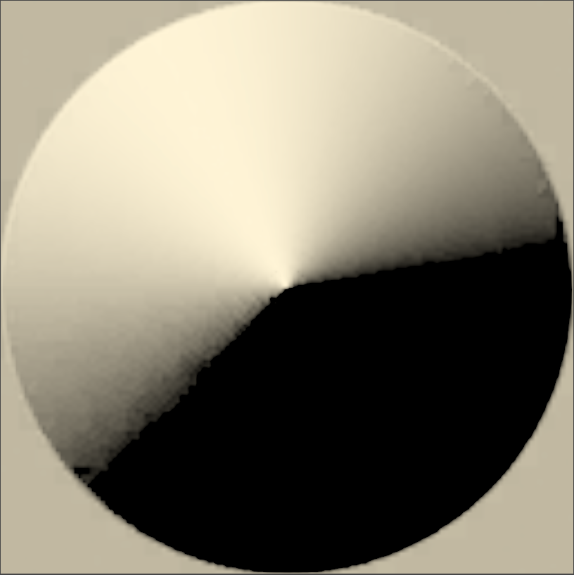
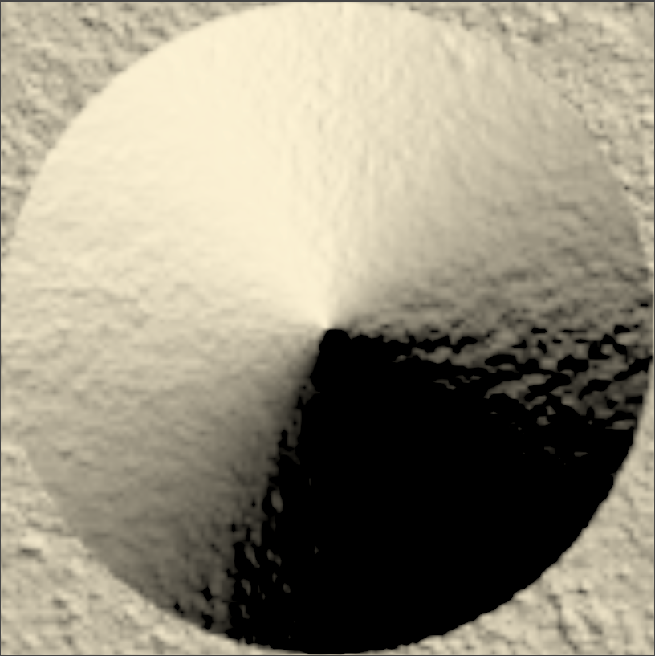
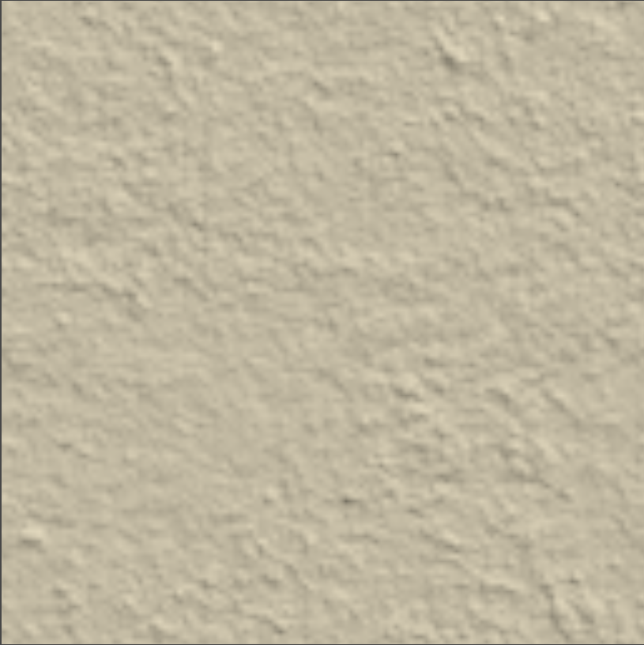
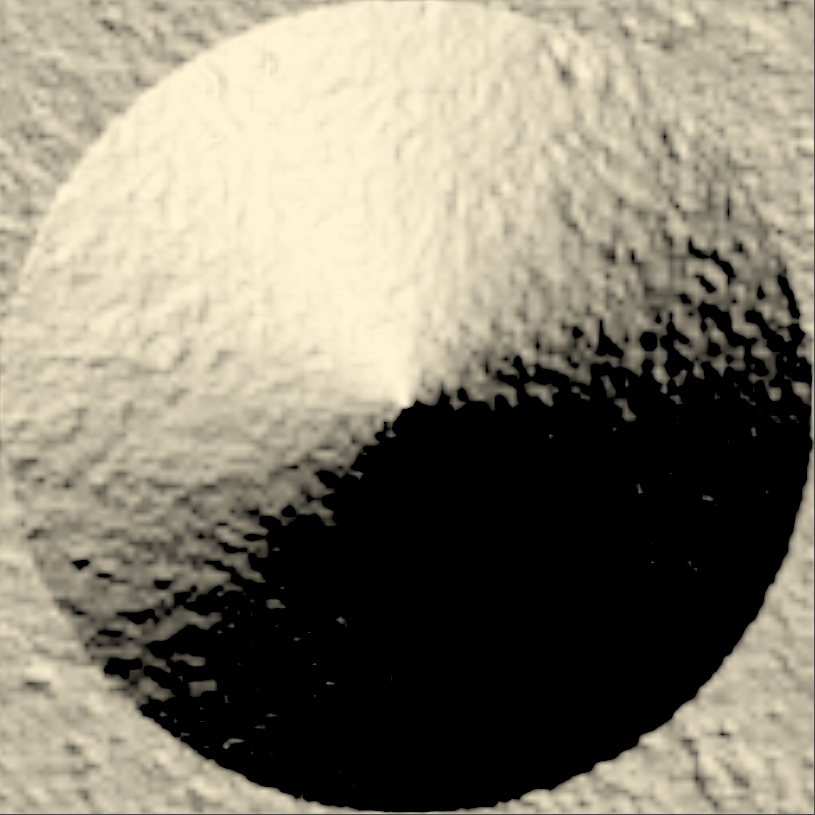
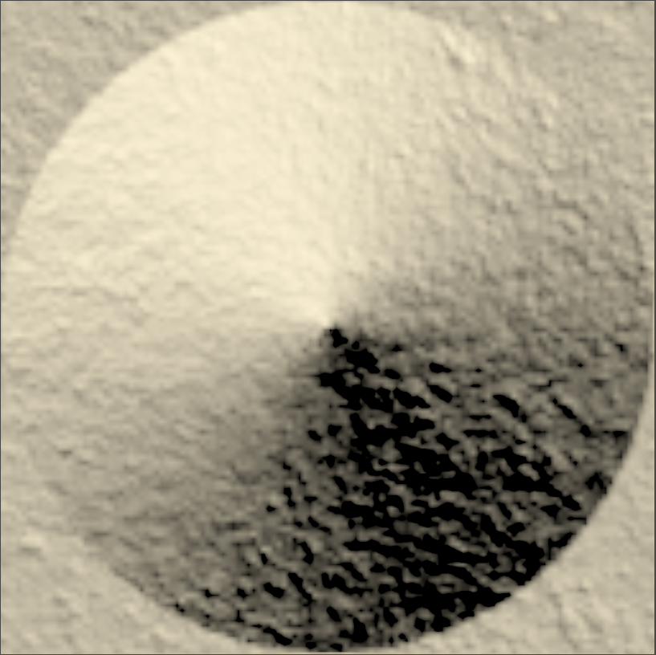
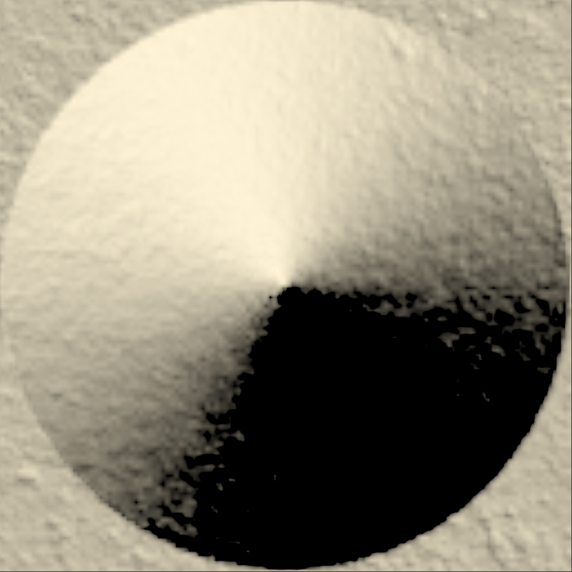
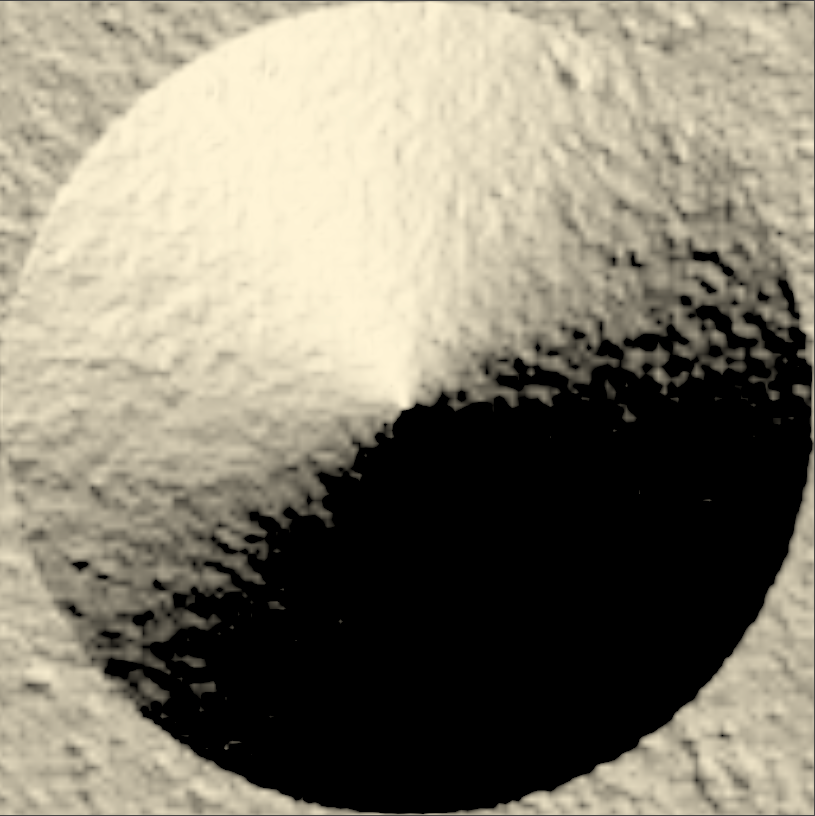

# 法线混合技术

[TOC]

------

## 一、测试素材

下图左侧为主要法线贴图，右侧为需要被混合的细节法线贴图。

|  |  |
| :----------------------------------------------------------: | :----------------------------------------------------------: |

## 二、混合算法

### 2.1、线性混合

以下为代码示例：

```glsl
float3 NormalBlending_Linear(float3 n1, float3 n2)
{
    n1 = n1 * 0.5 + 0.5;
    n2 = n2 * 0.5 + 0.5;
    float3 r = (n1 + n2) * 2.0 - 2.0;
    return normalize(r);
}
```

混合结果如下所示：

|  |  |  |
| :----------------------------------------------------------: | :----------------------------------------------------------: | :----------------------------------------------------------: |

### 2.2、叠加混合

以下为代码示例：

```glsl
float overlay(float x, float y)
{
    if (x < 0.5)
        return 2.0 * x * y;
    else
        return 1.0 - 2.0 * (1.0 - x) * (1.0 - y);
}

float3 NormalBlending_Overlay(float3 n1, float3 n2)
{
    n1 = n1 * 0.5 + 0.5;
    n2 = n2 * 0.5 + 0.5;
    float3 n;
    n.x = overlay(n1.x, n2.x);
    n.y = overlay(n1.y, n2.y);
    n.z = overlay(n1.z, n2.z);
    return normalize(n * 2 - 1);
}
```

混合结果如下所示：

|  |  |  |
| :----------------------------------------------------------: | :----------------------------------------------------------: | :----------------------------------------------------------: |

### 2.3、偏导数混合

以下为代码示例：

```glsl
float3 NormalBlending_PartialDerivative(float3 n1, float3 n2, float blend)
{
    float2 pd = lerp(n1.xy / n1.z, n2.xy / n2.z, blend);
    return normalize(float3(pd, 1));
}
```

混合结果如下所示：

|  |  |  |
| :----------------------------------------------------------: | :----------------------------------------------------------: | :----------------------------------------------------------: |

### 2.4、白光混合

以下为代码示例：

```glsl
float3 NormalBlending_Whiteout(float3 n1, float3 n2)
{
    return normalize(float3(n1.xy + n2.xy, n1.z * n2.z));
}
```

混合结果如下所示：

|  |  |  |
| :----------------------------------------------------------: | :----------------------------------------------------------: | :----------------------------------------------------------: |

### 2.5、重定向法线映射

以下为代码示例：

```glsl
float3 NormalBlending_ReorientedNormalMapping(float3 n1, float3 n2)
{
    n1.z += 1.0;
    n2.xy = -n2.xy;
    return normalize(n1 * dot(n1, n2) - n2 * n1.z);
}
```

混合结果如下所示：

|  |  |  |
| :----------------------------------------------------------: | :----------------------------------------------------------: | :----------------------------------------------------------: |

## 三、最终效果比对

### 3.1、比对结果预览

|  |  |  |  |  |
| :----------------------------------------------------------: | :----------------------------------------------------------: | :----------------------------------------------------------: | :----------------------------------------------------------: | :----------------------------------------------------------: |

上图从左到右依次是“线性、叠加、偏导数、白光、重定向法线映射”五种混合算法的结果，目前主流认为“重定向法线映射”的混合结果最为优秀。

### 3.2、完整示例代码

```glsl
#ifndef NORMALBLENDINGFUNCTIONS
#define NORMALBLENDINGFUNCTIONS

float3 NormalBlending_Linear(float3 n1, float3 n2)
{
    n1 = n1 * 0.5 + 0.5;
    n2 = n2 * 0.5 + 0.5;
    float3 r = (n1 + n2) * 2.0 - 2.0;
    return normalize(r);
}

float overlay(float x, float y)
{
    if (x < 0.5)
        return 2.0 * x * y;
    else
        return 1.0 - 2.0 * (1.0 - x) * (1.0 - y);
}

float3 NormalBlending_Overlay(float3 n1, float3 n2)
{
    n1 = n1 * 0.5 + 0.5;
    n2 = n2 * 0.5 + 0.5;
    float3 n;
    n.x = overlay(n1.x, n2.x);
    n.y = overlay(n1.y, n2.y);
    n.z = overlay(n1.z, n2.z);
    return normalize(n * 2 - 1);
}

float3 NormalBlending_PartialDerivative(float3 n1, float3 n2, float blend)
{
    float2 pd = lerp(n1.xy / n1.z, n2.xy / n2.z, blend);
    return normalize(float3(pd, 1));
}

float3 NormalBlending_Whiteout(float3 n1, float3 n2)
{
    return normalize(float3(n1.xy + n2.xy, n1.z * n2.z));
}

float3 NormalBlending_ReorientedNormalMapping(float3 n1, float3 n2)
{
    n1.z += 1.0;
    n2.xy = -n2.xy;
    return normalize(n1 * dot(n1, n2) - n2 * n1.z);
}

#endif
```

```glsl
Shader "NormalBlend"
{
    Properties
    {
        [Header(Normal Inputs ___________________________________________________________________________________________________________________________)]
        [Space(10)]
        [Normal][NoScaleOffset]_Normal1 ("Main Normal", 2D) = "bump" { }
        _Normal1Intensity ("Main Normal Intensity", Range(0.0, 1.0)) = 1.0
        [Normal][NoScaleOffset]_Normal2 ("Detail Normal", 2D) = "bump" { }
        _Normal2Intensity ("Detail Normal Intensity", Range(0.0, 1.0)) = 1.0
        [Header(Blending Mode ___________________________________________________________________________________________________________________________)]
        [Space(10)]
        [KeywordEnum(Linear, Overlay, PD, Whiteout, RNM)]_MODE ("Mode", int) = 0
    }

    SubShader
    {
        Tags { "RenderType" = "Opaque" "Queue" = "Geometry" }

        Pass
        {
            Tags { "LightMode" = "ForwardBase" }

            CGPROGRAM
            #pragma vertex vert
            #pragma fragment frag
            #include "UnityCG.cginc"
            #include "Lighting.cginc"
            #include "Assets/NormalBlending/NormalBlendingFunctions.hlsl"
            #pragma shader_feature_local _MODE_LINEAR _MODE_OVERLAY _MODE_PD _MODE_WHITEOUT _MODE_RNM

            struct appdata
            {
                float4 vertex : POSITION;
                float3 normal : NORMAL;
                float4 tangent : TANGENT;
                float2 uv_mesh : TEXCOORD0;
            };

            struct v2f
            {
                float4 pos : SV_POSITION;
                float2 uv_mesh : TEXCOORD0;
                float3 posWS : TEXCOORD1;
                float3 normal_world : TEXCOORD2;
                float3 tangent_world : TEXCOORD3;
                float3 bitangent_world : TEXCOORD4;
            };

            sampler2D _Normal1, _Normal2;
            float _Normal1Intensity, _Normal2Intensity;
            
            v2f vert(appdata v)
            {
                v2f o;
                o.uv_mesh = v.uv_mesh;
                o.pos = UnityObjectToClipPos(v.vertex);
                o.posWS = mul(unity_ObjectToWorld, v.vertex);
                o.normal_world = UnityObjectToWorldNormal(v.normal);
                o.tangent_world = normalize(mul(unity_ObjectToWorld, float4(v.tangent.xyz, 0.0)).xyz);
                o.bitangent_world = normalize(cross(o.normal_world, o.tangent_world) * v.tangent.w);
                return o;
            }

            float4 frag(v2f i) : SV_Target
            {
                float3x3 TBN = float3x3(i.tangent_world, i.bitangent_world, i.normal_world);
                float3 n1 = UnpackNormalWithScale(tex2D(_Normal1, i.uv_mesh), _Normal1Intensity);
                float3 n2 = UnpackNormalWithScale(tex2D(_Normal2, i.uv_mesh), _Normal2Intensity);

                float3 worldnormal = float3(0.0, 0.0, 1.0);
                float3 normalblend = float3(0.0, 0.0, 1.0);
                #ifdef  _MODE_LINEAR
                    normalblend = NormalBlending_Linear(n1, n2);
                    worldnormal = normalize(mul(normalblend, TBN));
                #elif _MODE_OVERLAY
                    normalblend = NormalBlending_Overlay(n1, n2);
                    worldnormal = normalize(mul(normalblend, TBN));
                #elif _MODE_PD
                    normalblend = NormalBlending_PartialDerivative(n1, n2, 0.5);
                    worldnormal = normalize(mul(normalblend, TBN));
                #elif _MODE_WHITEOUT
                    normalblend = NormalBlending_Whiteout(n1, n2);
                    worldnormal = normalize(mul(normalblend, TBN));
                #elif _MODE_RNM
                    normalblend = NormalBlending_ReorientedNormalMapping(n1, n2);
                    worldnormal = normalize(mul(normalblend, TBN));
                #else
                    worldnormal = normalize(mul(n1, TBN));
                #endif

                float3 lightDir = normalize(_WorldSpaceLightPos0.xyz);
                float lambert = saturate(dot(worldnormal, lightDir));
                float3 finalcol = lambert * _LightColor0.xyz;

                return float4(finalcol, 1.0);
            }
            ENDCG
        }
    }
}
```