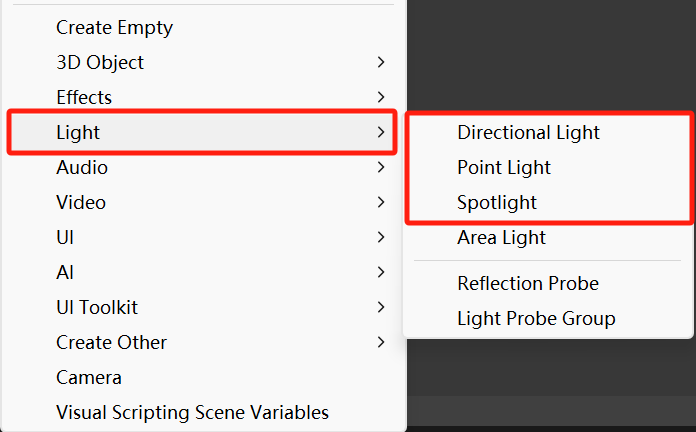
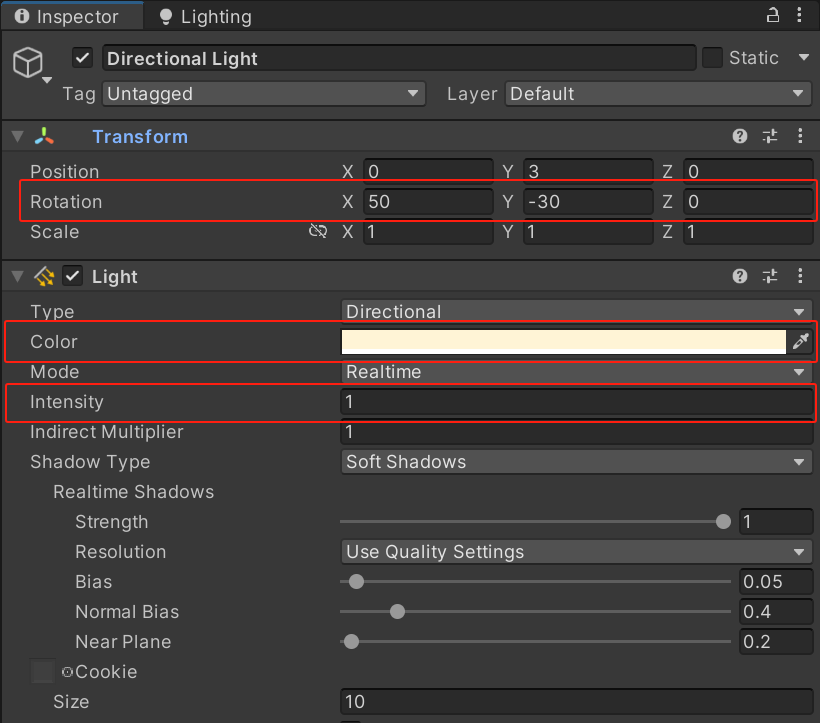
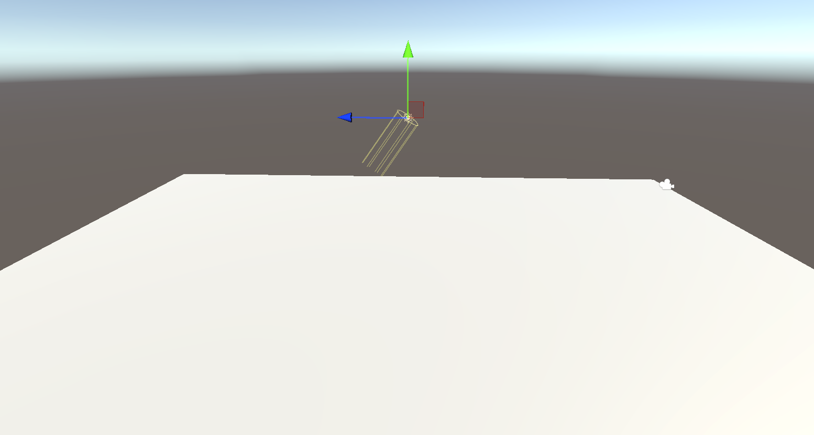
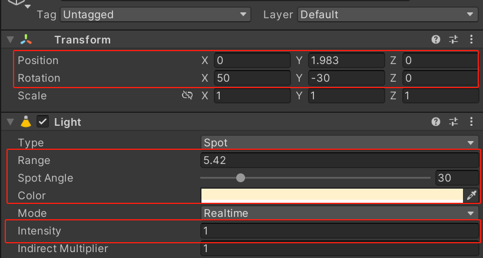
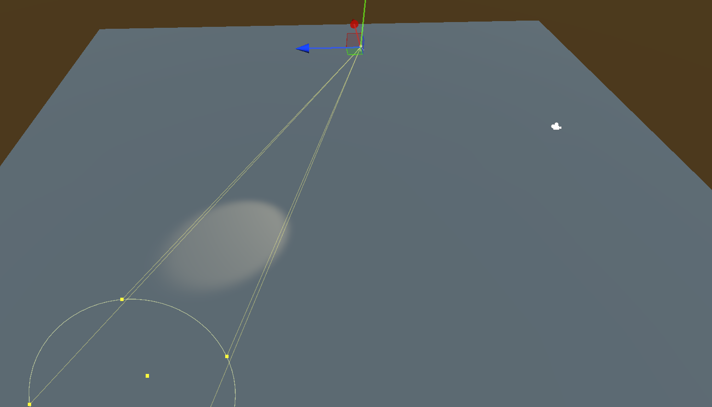
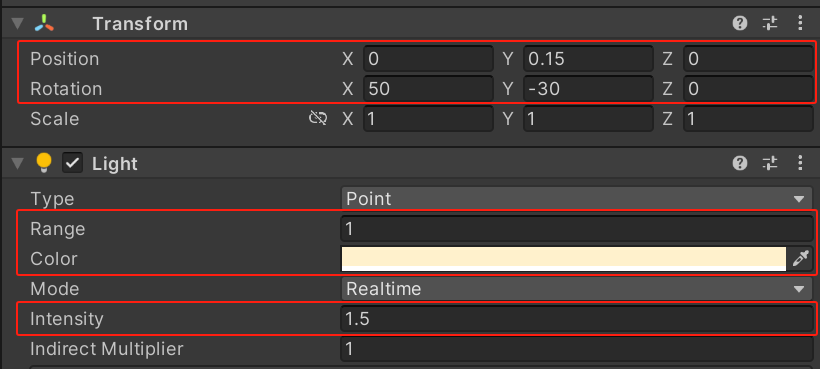
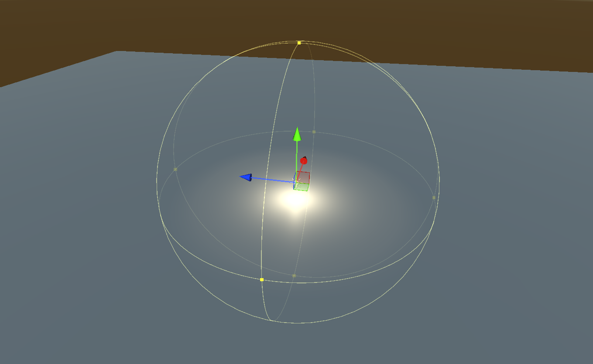

# 经验光照模型

[TOC]

------

## 一、引擎中的灯光

通常有四种灯光类型，分别是“平行光（Directional Light）”、“聚光灯（Spot Light）”、“点光源（Point Light）”、“面光源（Area Light）”，如下图所示：



因“面光源（Area Light）”目前不支持实时预览（需要烘焙），所以本文只针对前三种灯光类型。

### 1.1、平行光

“平行光（Directional Light）”作为场景中的“主光源（Main Light）”有一个特点就是为了模拟现实当中的阳光，而阳光被认为不具备衰减，所以不需要关注其在世界空间的坐标位置。

|  |  |
| :----------------------------------------------------------: | :----------------------------------------------------------: |

如上图所示，对于作为“平行光”需要关注以上三个参数，分别是：

（1）“Rotation”，代表光源的角度方向。

（2）“Color”，代表光源颜色。

（3）“Intensity”，代表光源强度。

### 1.2、聚光灯

“聚光灯（Spot Light）”作为人造光源，其能量要远小于作为模拟太阳光的“平行光”。

|  |  |
| :----------------------------------------------------------: | :----------------------------------------------------------: |

此时需要把光源的范围以及衰减考虑进去，如下图所示：

（1）“Position”，代表光源的坐标位置。

（2）“Rotation”，代表光源的角度方向。

（3）“Range”，代表光源衰减距离。

（4）“Spot Angle”，代表光源扩散范围。

（5）“Color”，代表光源颜色。

（6）“Intensity”，代表光源强度。

### 1.3、点光源

“点光源（Point Light）”同样作为人造光源，其能量要远小于作为模拟太阳光的“平行光”。

|  |  |
| :----------------------------------------------------------: | :----------------------------------------------------------: |

同样需要把光源的范围以及衰减考虑进去，如下图所示：

（1）“Position”，代表光源的坐标位置。

（2）“Rotation”，代表光源的角度方向。

（3）“Range”，代表光源衰减距离。

（4）“Color”，代表光源颜色。

（5）“Intensity”，代表光源强度。

## 二、Shader 中获取主光源信息

根据上文得知，需要获取主光源的“角度”、“颜色”、“强度”三个参数。

那么只需要以下几个步骤就可以得到：

（1）在 CG 代码块中添加“Lighting.cginc”内置文件，用于获取灯光的各种属性参数。

（2）在片元着色器中通过“_WorldSpaceLightPos0”获取主光源角度。

（3）在片元着色器中通过“_LightColor0”获取主光源颜色与强度。

代码示例如下：

```glsl
#include "Lighting.cginc"
```

```GLSL
// 获取主光源角度
float3 lightDirection = normalize(_WorldSpaceLightPos0.xyz);
// 获取主光源颜色与强度
float3 lightColor = _LightColor0.xyz;
```

## 三、经验光照模型

为了模拟现实当中的光照效果，便诞生了的一系列数学模型。而经验光照模型指的是非基于物理理论的，凭借众多实践经验总结得来的且最终经过优化后的数学模型。

基于经验的光照模型有很多，例如“Lambert”、“Phong”、“Blin-Phong”等等，接下来就一一介绍。

### 3.1、漫反射经验光照模型

#### 3.1.1、Lambert

> Lambert余弦定律：人眼所看到的反射光线的强度（也可以说成颜色）与表面法线与光源方向之间的夹角的余弦成正比，且与光源位置有关，但与观察位置无关。

计算公式：
$$
lambert = dot(normalDirection, lightDirection)
$$
其中：

（1）“normalDirection”代表物体顶点法线在世界空间当中的方向，使用向量表示。

（2）“lightDirection”代表灯光在世界空间中的方向，使用向量表示。

上述公式中的“dot()”函数是为两个向量做点乘运算，最终返回一个一维浮点值用于表示被反射光线的比例。

**而从数学角度来说：**

两个向量点乘的结果的值阈属于 [-1，1]。但是负数带入计算会产生错误的结果，而引擎中小于 0 的数值又无法显示，会被统一裁剪为 0，所以计算公式还需要改变一下：
$$
lambert = max(0.0, dot(normalDirection, lightDirection))
$$
这里加上了“max()”函数，主要用于剔除掉“dot()”函数所产生的负值。

也就是说，当物体表面的“顶点法线 N”与灯光的“光照方向 L”的点成结果会随产生的“夹角 θ”变化，如下图所示：


观察上图可以发现：

（1）当光照方向与物体表面法线朝向**相互垂直**时，其点乘结果为 0。

（2）当光照方向与物体表面法线朝向**完全重合**时，其点乘结果为 1。

（3）当光照方向与物体表面法线朝向**完全相反**时，其点乘结果为 -1。

**而从图形的角度来说：**


### 3.2、镜面反射光照模型