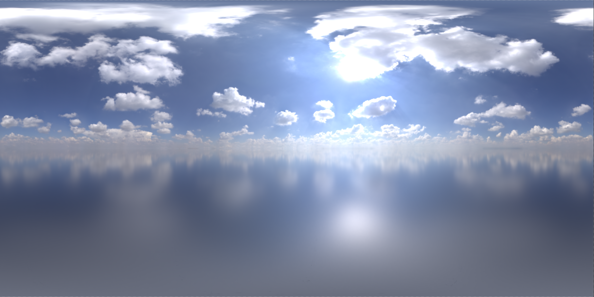
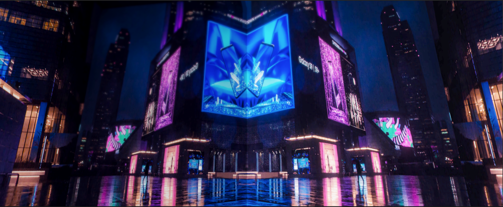

# 基于图像的照明

[TOC]

------

## 一、概述

现实中的间接光是由无数根在物体之间近乎无数次弹射的光线组成的，想要实时并且准确的计算这些光线需要非常庞大的运算量，会造成严重的性能消耗。这样的实时运算对于实时渲染领域的游戏是不现实的，尤其是移动端游戏。所以就诞生了一种利用图像（环境贴图）来近似模拟间接光照的方法，称之为“基于图像的照明（Image based lighting，简称“IBL”）”。

具体分为以下两个部分：

（1）环境贴图是如何生成与使用的。

（2）基于环境贴图的照明是如何实现的。

## 二、环境贴图

### 2.1、什么是环境贴图

首先，环境贴图的本质就是一张“立方体贴图（Cubemap）”或“全景图（Panorama）”。

其原理很容易被理解，在场景的某个坐标点（如果没有特定坐标，默认为世界中心），分别在【前、后、左、右、上、下】六个方向上放置六个摄像机去捕获这六个方向向上的图像。最后将这六张图像在组合到一起，存储在一张纹理当中。引擎会根据纹理的的模式自动计算成立方体贴图的样式。如下图所示：

|  |  |
| :----------------------------------------------------------: | :----------------------------------------------------------: |

常见的环境贴图有很多方式呈现，如下图所示：

|  |  |
| :----------------------------------------------------------: | :----------------------------------------------------------: |

上图左侧为一张“立方体贴图（Cubemap）”，右侧为一张“全景图（Panorama）”。

### 2.2、如何生成环境贴图

生成环境贴图有多种方式，比如：

（1）使用“Unity”的“Reflection Probe”烘焙。

（2）编写脚本工具生成：

```c#
using UnityEngine;
using System.Collections;
using System.Collections.Generic;
using UnityEditor;
using System.IO;
using UnityEngine.Rendering;


public class RenderCubemap : EditorWindow
{
    public enum GenMode
    {
        SingleCubemap = 0,
        SixTextures
    }

    private static string[] _names = new string[] { "16", "32", "64", "128", "256", "512", "1024", "2048" };
    private static int[] _sizes = new int[] { 16, 32, 64, 128, 256, 512, 1024, 2048 };

    private static Vector3[] _cameraAngles = new Vector3[] {
        new Vector3(0, 90, 0), new Vector3(0, -90, 0),
        new Vector3(-90, 0, 0), new Vector3(90, 0, 0),
        new Vector3(0, 0, 0), new Vector3(0, 180, 0),
    };

    private static string[] _filePostfixs = new string[] {
        "_Left", "_Right", "_Top", "_Bottom", "_Front", "_Back"
    };

    private GenMode _genMode;
    private int _selectedSize = 1024;
    private int _lastSelectedSize;
    private RenderTexture[] _rtexs;
    private Texture2D[] _colorTexs;
    private Transform _center;
    [SerializeField]
    private LayerMask _layerMask = -1;
    SerializedObject serializedObject;

    void OnEnable()
    {
        titleContent = new GUIContent("RenderCubemap");
        serializedObject = new UnityEditor.SerializedObject(this);
    }

    void OnDestroy()
    {
        DestroyResources();
    }

    void CreateResources()
    {
        _rtexs = new RenderTexture[6];
        for (int i = 0; i < 6; i++)
        {
            _rtexs[i] = new RenderTexture(_selectedSize, _selectedSize, 24);
            _rtexs[i].hideFlags = HideFlags.HideAndDontSave;
        }

        _colorTexs = new Texture2D[6];
        for (int i = 0; i < 6; i++)
            _colorTexs[i] = new Texture2D(_selectedSize, _selectedSize, TextureFormat.RGB24, false);
    }

    void DestroyResources()
    {
        if (_rtexs != null)
        {
            for (int i = 0; i < 6; i++)
                DestroyImmediate(_rtexs[i]);
            _rtexs = null;
        }

        if (_colorTexs != null)
        {
            for (int i = 0; i < 6; i++)
            {
                DestroyImmediate(_colorTexs[i]);
            }
        }
    }

    void OnGUI()
    {

        GUILayout.Space(5);

        EditorGUI.BeginChangeCheck();
        _genMode = (GenMode)EditorGUILayout.EnumPopup("Mode", _genMode);
        _selectedSize = EditorGUILayout.IntPopup("Face Size", _selectedSize, _names, _sizes);
        _center = EditorGUILayout.ObjectField("Center", _center, typeof(Transform), true) as Transform;
        EditorGUILayout.PropertyField(serializedObject.FindProperty("_layerMask"));

        GUILayout.Space(15);

        bool hasError = false;
        Color oldContentColor = GUI.contentColor;
        GUI.contentColor = Color.red;
        if (_center == null)
        {
            GUILayout.Label("必须设置'Center'!");
            hasError = true;
        }
        Camera mainCam = Camera.main;
        if (mainCam == null)
        {
            GUI.contentColor = Color.red;
            GUILayout.Label("场景中必须有Main Camera!");
            hasError = true;
        }
        GUI.contentColor = oldContentColor;

        if (hasError)
        {
            return;
        }

        // _layerMask = EditorToolUtility.LayerMaskField("Culling Mask", _layerMask);
        GUILayout.Space(15);

        EditorGUILayout.BeginHorizontal();
        GUILayout.FlexibleSpace();
        if (GUILayout.Button("Bake", GUILayout.Width(100)))
        {
            if (_rtexs == null || _selectedSize != _lastSelectedSize)
            {
                DestroyResources();
                CreateResources();
                _lastSelectedSize = _selectedSize;
            }

            GameObject go = GameObject.Instantiate(mainCam.gameObject);
            go.name = "__CubemapCamera__";
            Camera cam = go.GetComponent<Camera>();
            cam.enabled = false;
            cam.backgroundColor = Camera.main.backgroundColor;
            cam.aspect = 1;
            cam.fieldOfView = 90;
            cam.cullingMask = _layerMask;

            go.transform.position = _center.position;

            RenderTexture oldRt = RenderTexture.active;
            for (int i = 0; i < 6; i++)
            {
                go.transform.localEulerAngles = _cameraAngles[i];

                RenderTexture.active = _rtexs[i];
                cam.targetTexture = _rtexs[i];
                cam.Render();

                _colorTexs[i].ReadPixels(new Rect(0, 0, _selectedSize, _selectedSize), 0, 0);
                _colorTexs[i].Apply();
            }

            RenderTexture.active = oldRt;
            DestroyImmediate(go);

            Texture2D tex = WriteAndImportTexture();
            if (tex != null)
                Debug.Log("渲染到环境贴图完成！", tex);
        }
        EditorGUILayout.EndHorizontal();
    }

    private Texture2D WriteAndImportTexture()
    {
        if (_genMode == GenMode.SingleCubemap)
        {
            string path = EditorUtility.SaveFilePanelInProject("Save Cubemap", "", "png", "Please enter a file name to save cubemap to");
            if (!string.IsNullOrEmpty(path))
            {
                Texture2D cubeTex = new Texture2D(_selectedSize * 4, _selectedSize * 3, TextureFormat.RGB24, false);

                Color[] colors = _colorTexs[0].GetPixels();
                cubeTex.SetPixels(_selectedSize * 2, _selectedSize, _selectedSize, _selectedSize, colors);
                colors = _colorTexs[1].GetPixels();
                cubeTex.SetPixels(0, _selectedSize, _selectedSize, _selectedSize, colors);
                colors = _colorTexs[2].GetPixels();
                cubeTex.SetPixels(_selectedSize, _selectedSize * 2, _selectedSize, _selectedSize, colors);
                colors = _colorTexs[3].GetPixels();
                cubeTex.SetPixels(_selectedSize, 0, _selectedSize, _selectedSize, colors);
                colors = _colorTexs[4].GetPixels();
                cubeTex.SetPixels(_selectedSize, _selectedSize, _selectedSize, _selectedSize, colors);
                colors = _colorTexs[5].GetPixels();
                cubeTex.SetPixels(_selectedSize * 3, _selectedSize, _selectedSize, _selectedSize, colors);

                cubeTex.Apply();
                byte[] bytes = cubeTex.EncodeToPNG();
                File.WriteAllBytes(path, bytes);
                AssetDatabase.ImportAsset(path);
                TextureImporter importer = AssetImporter.GetAtPath(path) as TextureImporter;
                importer.textureShape = TextureImporterShape.TextureCube;
                //importer.textureType = TextureImporterType.Cubemap;

                importer.generateCubemap = TextureImporterGenerateCubemap.AutoCubemap;
                importer.maxTextureSize = _selectedSize;
                AssetDatabase.ImportAsset(path, ImportAssetOptions.ForceUpdate);
                cubeTex = AssetDatabase.LoadAssetAtPath(path, typeof(Texture2D)) as Texture2D;

                return cubeTex;
            }
            return null;

        }
        else if (_genMode == GenMode.SixTextures)
        {
            string path = EditorUtility.SaveFilePanelInProject("Save Textures", "", "png", "Please enter a file name to save textures to");
            if (!string.IsNullOrEmpty(path))
            {
                //Material material = new Material(Shader.Find("Skybox/6 Sided"));
                //AssetDatabase.CreateAsset(material, path);

                string header = path.Substring(0, path.Length - 4);
                for (int i = 0; i < 6; i++)
                {
                    if (header.EndsWith(_filePostfixs[i]))
                    {
                        header = header.Substring(0, header.Length - _filePostfixs[i].Length);
                        break;
                    }
                }

                Texture2D[] newTextures = new Texture2D[6];
                for (int i = 0; i < 6; i++)
                {
                    string outPath = header + _filePostfixs[i] + ".png";

                    byte[] bytes = _colorTexs[i].EncodeToPNG();
                    File.WriteAllBytes(outPath, bytes);

                    AssetDatabase.ImportAsset(outPath);
                    TextureImporter importer = AssetImporter.GetAtPath(outPath) as TextureImporter;
                    importer.textureType = TextureImporterType.Default;
                    importer.wrapMode = TextureWrapMode.Clamp;
                    importer.maxTextureSize = _selectedSize;
                    AssetDatabase.ImportAsset(outPath, ImportAssetOptions.ForceUpdate);

                    newTextures[i] = AssetDatabase.LoadAssetAtPath(outPath, typeof(Texture2D)) as Texture2D;
                }

                return newTextures[0];
            }
        }

        return null;
    }

    [MenuItem("美术工具/生成立方体贴图", false, 5000)]
    private static void Init()
    {
        RenderCubemap editWindow = ScriptableObject.CreateInstance<RenderCubemap>();
        editWindow.Show();
    }
}
```

（3）使用第三方工具制作：

​	① HDR Shop：[ICT Vision & Graphics Lab (usc.edu)](https://vgl.ict.usc.edu/)

​	② HDR Light Studio：[HDR Light Studio - Make and edit image-based lighting in your 3D software (lightmap.co.uk)](https://www.lightmap.co.uk/)

​	③ cmftStudio：[cmftStudio - GUI counterpart of cmft - cross-platform open-source cubemap filtering - General Forums / Latest News - Blender Artists Community](https://blenderartists.org/t/cmftstudio-gui-counterpart-of-cmft-cross-platform-open-source-cubemap-filtering/636154?mobile_view=1)

## 三、Shader 中的环境贴图

### 3.1、反射向量

|  |  |  |
| :----------------------------------------------------------: | :----------------------------------------------------------: | :----------------------------------------------------------: |

如上图所示，在拿到相机视角的世界坐标位置后，使用内置函数“reflect()”计算得出“反射向量 R”。以下为代码示例：

```glsl
float3 cameraPosition = normalize(_WorldSpaceCameraPos.xyz - i.pos_world.xyz);
float3 reflecDir = normalize(reflect(-cameraPosition, i.normal_world));
```

### 3.2、采样环境贴图的方法

#### 3.2.1、方法一 - 立方体贴图

直接使用“反射向量 R”作为 UV 坐标使用内置函数“texCUBE()”采样“立方体贴图（Cubemap）”。

以下为代码示例：

```glsl
float3 cameraPosition = normalize(_WorldSpaceCameraPos.xyz - i.pos_world.xyz);
float3 reflecDir = normalize(reflect(-cameraPosition, i.normal_world));
float4 envCubemap = texCUBE(_textureCube, reflecDir);
```

效果如下所示：


但要注意一个问题，那就是通常场景中会使用一张具有 HDR 信息的纹理作为环境贴图，但在某些移动平台中不支持直接读取 HDR 信息。为了适应不同平台，因此需要对 HDR 信息先解码：

（1）声明一个以“_HDR”作为后缀的“float4”类型的变量，用于定义需要解码的 HDR 信息。

（2）使用内置函数“DecoadHDR()”来解码。

以下为代码示例：

```glsl
samplerCUBE _textureCube;
float4 _textureCube_HDR;

float4 frag(VertexOutput i) : SV_Target
{
  float3 cameraPosition = normalize(_WorldSpaceCameraPos.xyz - i.pos_world.xyz);
  float3 reflecDir = normalize(reflect(-cameraPosition, i.normal_world));
  float4 envCubemap = texCUBE(_textureCube, reflecDir);
  // 支持移动平台能获取到 HDR 信息
  float3 envCubemapHDR = DecodeHDR(envCubemap, _textureCube_HDR);
  return float4(envCubemapHDR, 1.0);
}
```

解码后的 HDR 信息可用于“Bloom 后处理”，如下对比图所示：

|  |  |
| ------------------------------------------------------------ | ------------------------------------------------------------ |

完整代码示例：

```glsl
Shader "IBL_Cubemap"
{
    Properties
    {
        [NoScaleOffset]_envCube ("Env Cube", Cube) = "white" { }
    }

    SubShader
    {
        Tags { "RenderType" = "Opaque" }

        Pass
        {
            CGPROGRAM
            #pragma vertex vert
            #pragma fragment frag
            #include "UnityCG.cginc"

            struct VertexInput
            {
                float4 vertex : POSITION;
                float3 normal : NORMAL;
            };

            struct VertexOutput
            {
                float4 pos : SV_POSITION;
                float3 pos_world : TEXCOORD0;
                float3 normal_world : TEXCOORD1;
            };

            VertexOutput vert(VertexInput v)
            {
                VertexOutput o;
                o.pos = UnityObjectToClipPos(v.vertex);
                o.pos_world = mul(unity_ObjectToWorld, v.vertex);
                o.normal_world = UnityObjectToWorldNormal(v.normal);
                return o;
            }

            float _envRotation;
            float4 _envCube_HDR;
            samplerCUBE _envCube;

            float4 frag(VertexOutput i) : SV_Target
            {
                float3 worldNormal = normalize(i.normal_world);
                float3 cameraPosition = normalize(_WorldSpaceCameraPos.xyz - i.pos_world.xyz);
                float3 reflecDir = normalize(reflect(-cameraPosition, worldNormal));
                float4 envCubemap = texCUBE(_envCube, reflecDir);
                float3 envCubemapHDR = DecodeHDR(envCubemap, _envCube_HDR);
                return float4(envCubemapHDR, 1.0);
            }
            ENDCG
        }
    }
}
```

#### 3.2.2、方法二 - 全景图

此方法通过修改“反射向量 R”作为环境贴图的坐标来采样“2D 全景图（Panorama）”。

将“反射向量 R”从三维转换至二维算法如下：

```glsl
float2 ReflectionDir2(float3 reflecDir)
{
  float latItude = acos(reflecDir.y);
  float longItude = atan2(reflecDir.z, reflecDir.x);
  float2 amount = float2(0.5 / UNITY_PI, 1.0 / UNITY_PI);
  float2 coordsSphere = float2(longItude, latItude);
  coordsSphere *= amount;
  float2 uv_Panorama = float2(0.5, 1.0) - coordsSphere;
  return uv_Panorama;
}
```

得到二维空间“反射向量 R”后，采样“2D 全景图（Panorama）”，代码示例如下：

```glsl
  float3 cameraPosition = normalize(_WorldSpaceCameraPos.xyz - i.pos_world.xyz);
  float3 reflecDir = normalize(reflect(-cameraPosition, i.normal_world));
  // 将“反射向量 R”从三维转换至二维算法
  float2 reflecDirPanorama = ReflectionDir2(reflecDir);
  // 采样 2D 全景图
  float4 envPanorama = texCUBE(_texture2D, reflecDirPanorama);
```

效果如下所示：


完整代码示例：

```glsl
Shader "IBL_Panorama"
{
    Properties
    {
        [NoScaleOffset]_envPanorama ("Env Panorama", 2D) = "white" { }
    }

    SubShader
    {
        Tags { "RenderType" = "Opaque" }

        Pass
        {
            CGPROGRAM
            #pragma vertex vert
            #pragma fragment frag
            #include "UnityCG.cginc"

            struct VertexInput
            {
                float4 vertex : POSITION;
                float3 normal : NORMAL;
            };

            struct VertexOutput
            {
                float4 pos : SV_POSITION;
                float3 pos_world : TEXCOORD0;
                float3 normal_world : TEXCOORD1;
            };

            VertexOutput vert(VertexInput v)
            {
                VertexOutput o;
                o.pos = UnityObjectToClipPos(v.vertex);
                o.pos_world = mul(unity_ObjectToWorld, v.vertex);
                o.normal_world = UnityObjectToWorldNormal(v.normal);
                return o;
            }

            float _rotationAngle;
            float4 _envPanorama_HDR;
            sampler2D _envPanorama;

            float2 ReflectionDir2(float3 reflecDir)
            {
                float latItude = acos(reflecDir.y);
                float longItude = atan2(reflecDir.z, reflecDir.x);
                float2 amount = float2(0.5 / UNITY_PI, 1.0 / UNITY_PI);
                float2 coordsSphere = float2(longItude, latItude);
                coordsSphere *= amount;
                float2 uv_Panorama = float2(0.5, 1.0) - coordsSphere;
                return uv_Panorama;
            }

            float4 frag(VertexOutput i) : SV_Target
            {
                float3 worldNormal = normalize(i.normal_world);
                float3 cameraPosition = normalize(_WorldSpaceCameraPos.xyz - i.pos_world.xyz);
                float3 reflecDir = normalize(reflect(-cameraPosition, worldNormal));
  			   // 将“反射向量 R”从三维转换至二维算法
                float2 panoramaUV = ReflectionDir2(reflecDir);
  			   // 采样 2D 全景图
                float4 envPanorama = tex2D(_envPanorama, panoramaUV);
                float3 envPanoramaHDR = DecodeHDR(envPanorama, _envPanorama_HDR);
                return float4(envPanoramaHDR, 1.0);
            }
            ENDCG
        }
    }
}
```

### 3.3、可旋转的反射向量

也可以对“反射向量 R”进行改进得到一个可以围绕“Y 轴”旋转的新“反射向量 R”。大致思路如下：

（1）使用以下“角度转弧度公式”计算出旋转角度：
$$
旋转角度 = 旋转数值 * UNITY_-PI / 180.0
$$
（2）构建一个以二位旋转矩阵，并使用矩阵乘法“mul()”用来修改“反射向量 R”的“xz”分量。

（3）最终对反射向量【R】的三个分量进行重组就得到了新的可以旋转的反射向量【R】。

具体算法示例如下所示：

```glsl
float3 RotationY(float angle, float3 reflecDir)
{
  // 角度转弧度公式
  float rotationAngle = angle * UNITY_PI / 180.0;
  // 构建二维旋转矩阵
  float2x2 m_Rotation = float2x2(cos(rotationAngle), -sin(rotationAngle), sin(rotationAngle), cos(rotationAngle));
  // 修改反射向量
  float2 rotationDir = mul(m_Rotation, reflecDir.xz);
  reflecDir = float3(rotationDir.x, reflecDir.y, rotationDir.y);
  return reflecDir;
}
```

效果预览：


## 四、局限性与解决方案

### 4.1、局限性

使用“立方体贴图（Cubemap）”之类的方案会存在采样点误差的问题，如下图所示：

|  |  |
| ------------------------------------------------------------ | ------------------------------------------------------------ |

上面左侧图的方法只根据反射方向来进行采样，而对于“点 P”与“点 origin”来说，二者的反射向量的方向及大小都一致。但从几何意义角度出发，这两个向量却相等，所以造成了最终采样点不明确的缺陷。从而最终导致上面右侧图中图像的错位、失真等问题。

这也是为什么“立方体贴图（Cubemap）”技术不适合用于平面模型进行反射的原因。

### 4.2、解决方案

为了解决“立方体贴图（Cubemap）”存在的误差问题，可以使用“Local Reflection”的改良方案。“Local Reflection”通过纠正“反射向量 R”并配合参数就可以达到准确的平面反射效果，如下图所示：

|  |  |
| :----------------------------------------------------------: | :----------------------------------------------------------: |

上图左侧是未使用“Local Reflection”的错误效果，右侧是使用了“Local Reflection”后的正确效果。并且，侧立面的反射也是可以被纠正的，如下图所示：

|  |  |
| :----------------------------------------------------------: | :----------------------------------------------------------: |

以下为“Local Reflection”的示例代码：

```glsl
float3 LocalReflection(float3 reflecDir, float3 worldPosition, float3 boxSize, float3 boxCenter)
{
  float3 a = (-boxSize - worldPosition) / reflecDir;
  float3 b = (boxSize - worldPosition) / reflecDir;
  float3 c = max(a, b);
  float d = min(min(c.x, c.y), c.z);

  float3 finalReflectionDir = d * reflecDir + worldPosition + boxCenter;
  return normalize(finalReflectionDir);
}
```

完整示例代码：

```glsl
Shader "IBL_LocalReflection"
{
    Properties
    {
        [NoScaleOffset]_envCube ("Env Cube", Cube) = "white" { }
        [Toggle(LOCALREFLECTION)]_localReflection ("Local Reflection", float) = 0.0
        _envSize ("Env Size", vector) = (5.0, 5.0, 5.0, 0.0)
        _envCenter ("Env Center", vector) = (0.0, 0.0, 0.0, 0.0)
    }

    SubShader
    {
        Tags { "RenderType" = "Opaque" }

        Pass
        {
            Name "FORWARDLIT"
            CGPROGRAM
            #pragma vertex vert
            #pragma fragment frag
            #include "UnityCG.cginc"
            #pragma shader_feature_local LOCALREFLECTION

            struct VertexInput
            {
                float4 vertex : POSITION;
                float3 normal : NORMAL;
            };

            struct VertexOutput
            {
                float4 pos : SV_POSITION;
                float3 pos_world : TEXCOORD0;
                float3 normal_world : TEXCOORD1;
            };

            VertexOutput vert(VertexInput v)
            {
                VertexOutput o;
                o.pos = UnityObjectToClipPos(v.vertex);
                o.pos_world = mul(unity_ObjectToWorld, v.vertex);
                o.normal_world = UnityObjectToWorldNormal(v.normal);
                return o;
            }

            float4 _envCube_HDR, _envSize, _envCenter;
            samplerCUBE _envCube;

            float3 LocalReflection(float3 reflecDir, float3 worldPosition, float3 boxSize, float3 boxCenter)
            {
                float3 a = (-boxSize - worldPosition) / reflecDir;
                float3 b = (boxSize - worldPosition) / reflecDir;
                float3 c = max(a, b);
                float d = min(min(c.x, c.y), c.z);
                float3 finalReflectionDir = d * reflecDir + worldPosition + boxCenter;
                return normalize(finalReflectionDir);
            }

            float4 frag(VertexOutput i) : SV_Target
            {
                float3 worldNormal = normalize(i.normal_world);
                float3 cameraPosition = normalize(_WorldSpaceCameraPos.xyz - i.pos_world.xyz);
                float3 reflecDir = normalize(reflect(-cameraPosition, worldNormal));
                #ifdef LOCALREFLECTION
                    reflecDir = LocalReflection(reflecDir, i.pos_world.xyz, _envSize, _envCenter);
                #endif
                // Cubemap
                float4 envCubemap = texCUBE(_envCube, reflecDir);
                float3 envCubemapHDR = DecodeHDR(envCubemap, _envCube_HDR);

                return float4(envCubemapHDR, 1.0);
            }
            ENDCG
        }
    }
}
```

## 五、基于图像的照明

### 5.1、镜面反射的渐远纹理

采样环境贴图的过程与方法上文已经说明，只是不需要解码 HDR 信息而已，故不再赘述。代码示例如下：

```glsl
float3 cameraPosition = normalize(_WorldSpaceCameraPos.xyz - i.pos_world.xyz);
float3 reflecDir = normalize(reflect(-cameraPosition, i.normal_world));
// 不需要解码 HDR 信息
float4 envCubemap = texCUBE(_textureCube, reflecDir);
```

但通过此方法得到的环境贴图信息依旧还是过于高频了，不满足需要的低频要求。如下图所示：


所以，需要对此结果继续优化。

优化的方法就是对其进行复杂的离线计算来得到光照数据，最终再将计算出的信息存储回这张环境贴图。而此步骤不需要特殊的计算操作，只需要在引擎中对“立方体贴图（Cubemap）”进行一些设置即可。

如下图所示：

|  |
| :----------------------------------------------------------: |
|  |
|  |

按以上步骤设置好纹理参数后，引擎会将计算好的光照信息存储回这张“立方体贴图（Cubemap）”。

其中“Convolution Type”设置为“Specular（Glossy Reflection）”且开启“Generate Mip Maps”后，引擎会将模糊后的（粗糙的）数据存储到图片的“Mip Map Level”中。

当调节“Mip Map Level”滑块时可以明显看见模糊后的效果（模拟光滑与粗糙），如下图所示：

|  |  |
| ------------------------------------------------------------ | ------------------------------------------------------------ |

如上图可以看到，当“Mip Map Level”数值逐渐增大后，图像开始变得模糊，也就趋近于需要的“低频信息”。

而当“Mip Map Level”数值足够大时，就得到了需要的“低频信息”。如下图所示：


待上述操作都完成后，就可以在 Shader 中使用内置函数“texCUBElod()”对其进行采样。代码示例如下：

```glsl
float4 envCubemap = texCUBElod(Cubemap, float4(reflecDir, MipMapLevel));
```

其中，参数“MipMapLevel”获取的就是上图中的“Mip Map Level”滑块对应的参数。这也就可以通过调节属性面板来得到需要的“低频信息”，也就是漫反射信息。如下图所示：


### 5.2、IBL 漫反射与球谐光照漫反射

#### 5.2.1、IBL 漫反射

对于 IBL 漫反射部分的计算，只需要取上述采样环境贴图的方法一中获得的低频信息即可。

不过与镜面反射部分不同的是，需要将“Convolution Type”设置为“Diffuse（Irradiance）”模式，其他参数保持相同。而 Shader 采样部分无变化：

```glsl
float3 cameraPosition = normalize(_WorldSpaceCameraPos.xyz - i.pos_world.xyz);
float3 reflecDir = normalize(reflect(-cameraPosition, i.normal_world));
float4 envCubemap = texCUBElod(Cubemap, float4(reflecDir, MipMapLevel));
```

最终得到的效果如下图所示：


#### 5.2.2、球谐光照漫反射

而获得环境漫反射的另一种方法是使用内置函数“ShadeSH9()”来采样引擎自动生成的球谐光照信息。

但也同时需要注意一个问题：使用内置函数“ShadeSH9()”，需要添加“Tags { "LightMode" = "ForwardBase" }”。代码示例如下：

```glsl
Tags { "LightMode" = "ForwardBase" }
```

```glsl
float3 worldNormal = normalize(i.normal_world));
float3 irradiance = ShadeSH9(float4(worldNormal, 1.0));
```

效果如下图所示：


可以看得出，效果比 IBL 漫反射来说有显著提升。

完整代码：

```glsl
Shader "IBL_ShadeSH9"
{
  SubShader
  {
    Tags { "RenderType" = "Opaque" }

    Pass
    {
      Tags { "LightMode" = "ForwardBase" }
      CGPROGRAM
      #pragma vertex vert
      #pragma fragment frag
      #include "UnityCG.cginc"

      struct VertexInput
      {
        float4 vertex : POSITION;
        float3 normal : NORMAL;
      };

      struct VertexOutput
      {
        float4 pos : SV_POSITION;
        float3 pos_world : TEXCOORD0;
        float3 normal_world : TEXCOORD1;
      };

      VertexOutput vert(VertexInput v)
      {
        VertexOutput o;
        o.pos = UnityObjectToClipPos(v.vertex);
        o.pos_world = mul(unity_ObjectToWorld, v.vertex);
        o.normal_world = UnityObjectToWorldNormal(v.normal);
        return o;
      }

      float4 frag(VertexOutput i) : SV_Target
      {
        float3 worldNormal = normalize(i.normal_world);
        float3 irradiance = ShadeSH9(float4(worldNormal, 1.0));
        return float4(irradiance, 1.0);
      }
      ENDCG
    }
  }
}
```

#### 5.2.3、自定义工具获取球谐光照信息

通过“C#”编写获取球谐光照的工具：

（1）CubemapSHProjector

```c#
using System.Collections;
using System.Collections.Generic;
using UnityEngine;
using UnityEditor;

public class CubemapSHProjector : EditorWindow
{
    //PUBLIC FIELDS
    public Texture envMap;
    public Transform go;

    //PRIVATE FIELDS
    private Material    view_mat;
    private float       view_mode;
    private Vector4[]   coefficients;

    private SerializedObject so;
    private SerializedProperty sp_input_cubemap;

    private Texture2D tmp = null;

    private static void CheckAndConvertEnvMap(ref Texture envMap, ref Vector4[] sh_out)
    {
        if (!envMap) return;

        string map_path = AssetDatabase.GetAssetPath(envMap);

        if (string.IsNullOrEmpty(map_path)) return;

        TextureImporter ti = AssetImporter.GetAtPath(map_path) as TextureImporter;
        if (!ti) return;

        bool read_able = ti.isReadable;
        bool need_reimport = false;

        if (ti.textureShape != TextureImporterShape.TextureCube)
        {
            ti.textureShape = TextureImporterShape.TextureCube;
            need_reimport = true;
        }

        if (!ti.mipmapEnabled)
        {
            ti.mipmapEnabled = true;
            need_reimport = true;
        }

        if (!ti.sRGBTexture)
        {
            ti.sRGBTexture = true;
            need_reimport = true;
        }

        if (ti.filterMode != FilterMode.Trilinear)
        {
            ti.filterMode = FilterMode.Trilinear;
            need_reimport = true;
        }

        TextureImporterSettings tis = new TextureImporterSettings();
        ti.ReadTextureSettings(tis);
        if (tis.cubemapConvolution != TextureImporterCubemapConvolution.Specular)
        {
            tis.cubemapConvolution = TextureImporterCubemapConvolution.Specular;
            ti.SetTextureSettings(tis);
            need_reimport = true;
        }

        if (!read_able)
        {
            ti.isReadable = true;
            need_reimport = true;
        }

        if (need_reimport)
        {
            ti.SaveAndReimport();
        }

        envMap = AssetDatabase.LoadAssetAtPath<Texture>(map_path);
        if (!envMap) return;

        Vector3[] sh = new Vector3[9];
        SphericalHarmonicsCoefficient.sphericalHarmonicsFromCubemap9((Cubemap)envMap, ref sh);
        SphericalHarmonicsCoefficient.ConvertSHConstants(sh, ref sh_out);


        if (ti.isReadable != read_able)
        {
            ti.isReadable = read_able;
            ti.SaveAndReimport();
            envMap = AssetDatabase.LoadAssetAtPath<Texture>(map_path);
        }
    }

    [MenuItem("美术工具/SH系数生成", false, 2100)]
    static void Init()
    {
        CubemapSHProjector window = (CubemapSHProjector)EditorWindow.GetWindow(typeof(CubemapSHProjector));
        window.Show();
        window.titleContent = new GUIContent("SH生成器");
    }

    private void OnFocus()
    {
        Initialize();
    }

    private void OnEnable()
    {
        Initialize();
    }

    private void Initialize()
    {
        so = new SerializedObject(this);
        sp_input_cubemap = so.FindProperty("input_cubemap");
    }

    private void OnGUI()
    {
        EditorGUI.BeginChangeCheck();
        envMap = EditorGUILayout.ObjectField("环境图", envMap, typeof(Texture), false) as Texture;

        if (envMap != null)
        {
            EditorGUILayout.Space();

            if (GUILayout.Button("Calc"))
            {
                if (envMap != null)
                {
                    coefficients = new Vector4[7];
                    CheckAndConvertEnvMap(ref envMap, ref coefficients);
                }
                SceneView.RepaintAll();
            }

            EditorGUILayout.Space();

            go = EditorGUILayout.ObjectField("Obj", go, typeof(Transform), true) as Transform;
            if (go != null)
            {
                if (GUILayout.Button("Apply"))
                {
                    List<Material> mat_list = new List<Material>();
                    var renders = go.GetComponentsInChildren<Renderer>();
                    foreach (var render in renders)
                    {
                        mat_list.AddRange(render.sharedMaterials);
                    }
                    foreach (var mat in mat_list)
                    {
                        mat.SetVector("custom_SHAr", coefficients[0]);
                        mat.SetVector("custom_SHAg", coefficients[1]);
                        mat.SetVector("custom_SHAb", coefficients[2]);
                        mat.SetVector("custom_SHBr", coefficients[3]);
                        mat.SetVector("custom_SHBg", coefficients[4]);
                        mat.SetVector("custom_SHBb", coefficients[5]);
                        mat.SetVector("custom_SHC", coefficients[6]);
                    }
                    mat_list.Clear();
                    SceneView.RepaintAll();
                }
            }

            EditorGUILayout.Space();

            //print the 9 coefficients
            if (coefficients != null)
            {
                EditorGUILayout.LabelField("custom_SHAr" + ": " + coefficients[0].ToString("F4"));
                EditorGUILayout.LabelField("custom_SHAg" + ": " + coefficients[1].ToString("F4"));
                EditorGUILayout.LabelField("custom_SHAb" + ": " + coefficients[2].ToString("F4"));
                EditorGUILayout.LabelField("custom_SHBr" + ": " + coefficients[3].ToString("F4"));
                EditorGUILayout.LabelField("custom_SHBg" + ": " + coefficients[4].ToString("F4"));
                EditorGUILayout.LabelField("custom_SHBb" + ": " + coefficients[5].ToString("F4"));
                EditorGUILayout.LabelField("custom_SHC" + ": " + coefficients[6].ToString("F4"));
            }
        }

        EditorGUILayout.Space();
        if (tmp != null)
            GUILayout.Label(tmp);
    }
}
```

（2）SphericalHarmonicsCoefficient

```c#
using UnityEngine;
using UnityEditor;

public static class SphericalHarmonicsCoefficient
{
    public static void sphericalHarmonicsFromCubemap9(Cubemap cubeTexture, ref Vector3[] output)
    {
        // allocate memory for calculations
        float[] resultR = new float[9];
        float[] resultG = new float[9];
        float[] resultB = new float[9];

        // initialize values
        float fWt = 0.0f;
        for (uint i = 0; i < 9; i++)
        {
            resultR[i] = 0;
            resultG[i] = 0;
            resultB[i] = 0;
        }

        float[] shBuff = new float[9];
        float[] shBuffB = new float[9];

        // for each face of cube texture
        for (int face = 0; face < 6; face++)
        {
            // step between two texels for range [0, 1]
            float invWidth = 1.0f / cubeTexture.width;
            // initial negative bound for range [-1, 1]
            float negativeBound = -1.0f + invWidth;
            // step between two texels for range [-1, 1]
            float invWidthBy2 = 2.0f / cubeTexture.width;

            Color[] data = cubeTexture.GetPixels((CubemapFace)face);

            for (int y = 0; y < cubeTexture.width; y++)
            {
                // texture coordinate V in range [-1 to 1]
                float fV = negativeBound + y * invWidthBy2;

                for (int x = 0; x < cubeTexture.width; x++)
                {
                    // texture coordinate U in range [-1 to 1]
                    float fU = negativeBound + x * invWidthBy2;

                    // determine direction from center of cube texture to current texel
                    Vector3 dir;

                    switch ((CubemapFace)face)
                    {
                        case CubemapFace.PositiveX:
                            dir.x = 1.0f;
                            dir.y = 1.0f - (invWidthBy2 * y + invWidth);
                            dir.z = 1.0f - (invWidthBy2 * x + invWidth);
                            break;
                        case CubemapFace.NegativeX:
                            dir.x = -1.0f;
                            dir.y = 1.0f - (invWidthBy2 * y + invWidth);
                            dir.z = -1.0f + (invWidthBy2 * x + invWidth);
                            break;
                        case CubemapFace.PositiveY:
                            dir.x = -1.0f + (invWidthBy2 * x + invWidth);
                            dir.y = 1.0f;
                            dir.z = -1.0f + (invWidthBy2 * y + invWidth);
                            break;
                        case CubemapFace.NegativeY:
                            dir.x = -1.0f + (invWidthBy2 * x + invWidth);
                            dir.y = -1.0f;
                            dir.z = 1.0f - (invWidthBy2 * y + invWidth);
                            break;
                        case CubemapFace.PositiveZ:
                            dir.x = -1.0f + (invWidthBy2 * x + invWidth);
                            dir.y = 1.0f - (invWidthBy2 * y + invWidth);
                            dir.z = 1.0f;
                            break;
                        case CubemapFace.NegativeZ:
                            dir.x = 1.0f - (invWidthBy2 * x + invWidth);
                            dir.y = 1.0f - (invWidthBy2 * y + invWidth);
                            dir.z = -1.0f;
                            break;
                        default:
                            return;
                    }

                    // normalize direction
                    dir = dir.normalized;

                    // scale factor depending on distance from center of the face
                    float fDiffSolid = 4.0f / ((1.0f + fU * fU + fV * fV) * Mathf.Sqrt(1.0f + fU * fU + fV * fV));
                    fWt += fDiffSolid;

                    // calculate coefficients of spherical harmonics for current direction
                    sphericalHarmonicsEvaluateDirection9(ref shBuff, dir);
                    //XMSHEvalDirection(dir, ref shBuff);

                    // index of texel in texture
                    int pixOffsetIndex = x + y * cubeTexture.width;
                    // get color from texture and map to range [0, 1]
                    Vector3 clr= new Vector3(data[pixOffsetIndex].r, data[pixOffsetIndex].g, data[pixOffsetIndex].b);
                    //if (data[pixOffsetIndex].a == 1)
                    //{
                    //    clr = new Vector3(data[pixOffsetIndex].r, data[pixOffsetIndex].g, data[pixOffsetIndex].b);
                    //}
                    //else
                    //{
                    //    clr = DecodeHDR(data[pixOffsetIndex]);
                    //}
                    if (PlayerSettings.colorSpace == ColorSpace.Gamma)
                    {
                        clr.x = Mathf.GammaToLinearSpace(clr.x);
                        clr.y = Mathf.GammaToLinearSpace(clr.y);
                        clr.z = Mathf.GammaToLinearSpace(clr.z);
                    }
                    // scale color and add to previously accumulated coefficients
                    sphericalHarmonicsScale9(ref shBuffB, shBuff, clr.x * fDiffSolid);
                    sphericalHarmonicsAdd9(ref resultR, resultR, shBuffB);
                    sphericalHarmonicsScale9(ref shBuffB, shBuff, clr.y * fDiffSolid);
                    sphericalHarmonicsAdd9(ref resultG, resultG, shBuffB);
                    sphericalHarmonicsScale9(ref shBuffB, shBuff, clr.z * fDiffSolid);
                    sphericalHarmonicsAdd9(ref resultB, resultB, shBuffB);
                }
            }
        }

        // final scale for coefficients
        float fNormProj = (4.0f * Mathf.PI) / fWt;
        sphericalHarmonicsScale9(ref resultR, resultR, fNormProj);
        sphericalHarmonicsScale9(ref resultG, resultG, fNormProj);
        sphericalHarmonicsScale9(ref resultB, resultB, fNormProj);

        // save result
        for (uint i = 0; i < 9; i++)
        {
            output[i].x = resultR[i];
            output[i].y = resultG[i];
            output[i].z = resultB[i];
        }
    }

    private static Vector3 DecodeHDR(Color clr)
    {
        return new Vector3(clr.r, clr.g, clr.b) * clr.a;// * Mathf.Pow(clr.a, 2);// * (Mathf.Pow(clr.a, 0.1f) * 1);
    }

    private static void sphericalHarmonicsEvaluateDirection9(ref float[] outsh, Vector3 dir)
    {
        // 86 clocks
        // Make sure all constants are never computed at runtime
        const float kInv2SqrtPI = 0.28209479177387814347403972578039f; // 1 / (2*sqrt(kPI))
        const float kSqrt3Div2SqrtPI = 0.48860251190291992158638462283835f; // sqrt(3) / (2*sqrt(kPI))
        const float kSqrt15Div2SqrtPI = 1.0925484305920790705433857058027f; // sqrt(15) / (2*sqrt(kPI))
        const float k3Sqrt5Div4SqrtPI = 0.94617469575756001809268107088713f; // 3 * sqrtf(5) / (4*sqrt(kPI))
        const float kSqrt15Div4SqrtPI = 0.54627421529603953527169285290135f; // sqrt(15) / (4*sqrt(kPI))
        const float kOneThird = 0.3333333333333333333333f; // 1.0/3.0
        outsh[0] = kInv2SqrtPI;
        outsh[1] = -dir.y * kSqrt3Div2SqrtPI;
        outsh[2] = dir.z * kSqrt3Div2SqrtPI;
        outsh[3] = -dir.x * kSqrt3Div2SqrtPI;
        outsh[4] = dir.x * dir.y * kSqrt15Div2SqrtPI;
        outsh[5] = -dir.y * dir.z * kSqrt15Div2SqrtPI;
        outsh[6] = (dir.z * dir.z - kOneThird) * k3Sqrt5Div4SqrtPI;
        outsh[7] = -dir.x * dir.z * kSqrt15Div2SqrtPI;
        outsh[8] = (dir.x * dir.x - dir.y * dir.y) * kSqrt15Div4SqrtPI;
    }

    private static void sphericalHarmonicsAdd9(ref float[] result, float[] inputA, float[] inputB)
    {
        for (int i = 0; i < 9; i++)
        {
            result[i] = inputA[i] + inputB[i];
        }
    }

    private static void sphericalHarmonicsScale9(ref float[] result, float[] input, float scale)
    {
        for (int i = 0; i < 9; i++)
        {
            result[i] = input[i] * scale;
        }
    }

    public static readonly float s_fSqrtPI = Mathf.Sqrt(Mathf.PI);
    public static readonly float fC0 = 1.0f / (2.0f * s_fSqrtPI);
    public static readonly float fC1 = Mathf.Sqrt(3.0f) / (3.0f * s_fSqrtPI);
    public static readonly float fC2 = Mathf.Sqrt(15.0f) / (8.0f * s_fSqrtPI);
    public static readonly float fC3 = Mathf.Sqrt(5.0f) / (16.0f * s_fSqrtPI);
    public static readonly float fC4 = 0.5f * fC2;
    public static void ConvertSHConstants(Vector3[] sh, ref Vector4[] SHArBrC)
    {
        int iC;
        for (iC = 0; iC < 3; iC++)
        {
            SHArBrC[iC].x = -fC1 * sh[3][iC];
            SHArBrC[iC].y = -fC1 * sh[1][iC];
            SHArBrC[iC].z = fC1 * sh[2][iC];
            SHArBrC[iC].w = fC0 * sh[0][iC] - fC3 * sh[6][iC];
        }

        for (iC = 0; iC < 3; iC++)
        {
            SHArBrC[iC + 3].x = fC2 * sh[4][iC];
            SHArBrC[iC + 3].y = -fC2 * sh[5][iC];
            SHArBrC[iC + 3].z = 3.0f * fC3 * sh[6][iC];
            SHArBrC[iC + 3].w = -fC2 * sh[7][iC];
        }

        SHArBrC[6].x = fC4 * sh[8][0];
        SHArBrC[6].y = fC4 * sh[8][1];
        SHArBrC[6].z = fC4 * sh[8][2];
        SHArBrC[6].w = 1.0f;
    }
}
```

然后在 Shader 中通过自定义函数来接受和计算球谐信息：

```glsl
float3 SHCOLOR(float3 normal_dir, half4 SHAr, half4 SHAg, half4 SHAb, half4 SHBr, half4 SHBg, half4 SHBb, half4 SHC, float intensity = 1.0)
{
  float4 normalForSH = float4(normal_dir, 1.0);
  //SHEvalLinearL0L1
  half3 x;
  x.r = dot(SHAr, normalForSH);
  x.g = dot(SHAg, normalForSH);
  x.b = dot(SHAb, normalForSH);
  //SHEvalLinearL2
  half3 x1, x2;
  // 4 of the quadratic (L2) polynomials
  half4 vB = normalForSH.xyzz * normalForSH.yzzx;
  x1.r = dot(SHBr, vB);
  x1.g = dot(SHBg, vB);
  x1.b = dot(SHBb, vB);
  // Final (5th) quadratic (L2) polynomial
  half vC = normalForSH.x * normalForSH.x - normalForSH.y * normalForSH.y;
  x2 = SHC.rgb * vC;
  float3 sh = max(float3(0.0, 0.0, 0.0), (x + x1 + x2));
  // 看情况使用
  //sh = pow(sh, 1.0 / 2.2);
  return sh * intensity;
}
```

最终得出的结果如下图所示：


可以看到，这个方法得出的结果也相当不错。完整代码示例如下：

```glsl
Shader "IBL_SH"
{
    Properties
    {
        [Header((SH))]
        [Space(5)]
        custom_SHAr ("Custom SHAr", Vector) = (0.0, 0.0, 0.0, 0.0)
        custom_SHAg ("Custom SHAg", Vector) = (0.0, 0.0, 0.0, 0.0)
        custom_SHAb ("Custom SHAb", Vector) = (0.0, 0.0, 0.0, 0.0)
        custom_SHBr ("Custom SHBr", Vector) = (0.0, 0.0, 0.0, 0.0)
        custom_SHBg ("Custom SHBg", Vector) = (0.0, 0.0, 0.0, 0.0)
        custom_SHBb ("Custom SHBb", Vector) = (0.0, 0.0, 0.0, 0.0)
        custom_SHC ("Custom SHC", Vector) = (0.0, 0.0, 0.0, 1.0)
    }

    SubShader
    {
        Tags { "RenderType" = "Opaque" }

        Pass
        {
            Tags { "LightMode" = "ForwardBase" }
            CGPROGRAM
            #pragma vertex vert
            #pragma fragment frag
            #include "UnityCG.cginc"

            struct VertexInput
            {
                float4 vertex : POSITION;
                float3 normal : NORMAL;
            };

            struct VertexOutput
            {
                float4 pos : SV_POSITION;
                float3 pos_world : TEXCOORD0;
                float3 normal_world : TEXCOORD1;
            };

            VertexOutput vert(VertexInput v)
            {
                VertexOutput o;
                o.pos = UnityObjectToClipPos(v.vertex);
                o.pos_world = mul(unity_ObjectToWorld, v.vertex);
                o.normal_world = UnityObjectToWorldNormal(v.normal);
                return o;
            }

            float4 custom_SHAr, custom_SHAg, custom_SHAb, custom_SHBr, custom_SHBg, custom_SHBb, custom_SHC;

            float3 SHCOLOR(float3 normal_dir, half4 SHAr, half4 SHAg, half4 SHAb, half4 SHBr, half4 SHBg, half4 SHBb, half4 SHC, float intensity = 1.0)
            {
                float4 normalForSH = float4(normal_dir, 1.0);
                //SHEvalLinearL0L1
                half3 x;
                x.r = dot(SHAr, normalForSH);
                x.g = dot(SHAg, normalForSH);
                x.b = dot(SHAb, normalForSH);
                //SHEvalLinearL2
                half3 x1, x2;
                // 4 of the quadratic (L2) polynomials
                half4 vB = normalForSH.xyzz * normalForSH.yzzx;
                x1.r = dot(SHBr, vB);
                x1.g = dot(SHBg, vB);
                x1.b = dot(SHBb, vB);
                // Final (5th) quadratic (L2) polynomial
                half vC = normalForSH.x * normalForSH.x - normalForSH.y * normalForSH.y;
                x2 = SHC.rgb * vC;
                float3 sh = max(float3(0.0, 0.0, 0.0), (x + x1 + x2));
                // sh = pow(sh, 1.0 / 2.2) * intensity;
                return sh * intensity;
            }

            float4 frag(VertexOutput i) : SV_Target
            {
                float3 worldNormal = normalize(i.normal_world);
                float3 Indirect_diffuse = SHCOLOR(worldNormal, custom_SHAr, custom_SHAg, custom_SHAb, custom_SHBr, custom_SHBg, custom_SHBb, custom_SHC);
                return float4(Indirect_diffuse, 1.0);
            }
            ENDCG
        }
    }
}
```

#### 5.2.4、最终效果比对

|  |  |  |
| :----------------------------------------------------------: | :----------------------------------------------------------: | :----------------------------------------------------------: |

上图从左到右依次是“IBL 漫反射”、“球谐光照漫反射”、“自定义工具获取球谐光照信息”三种方法所获得的环境光照漫反射信息，可以看到最左侧的“IBL 漫反射”效果不佳。

而最右侧通过自定义工具离线计算获得的球谐光照信息与中间的内置函数“ShadeSH9()”相比，效果接近。但因为是离线计算的结果，所以性能更好但灵活性较差，可以考虑按情况选择使用。

## 六、总结

（1）“IBL 漫反射”通过调整“MipMapLevel”的方法效果不是很自然，并且单独采样一张“立方体贴图（Cubemap）”性能消耗也更大。

（2）使用内置函数“ShadeSH9()”得到了很自然的环境光漫反射信息。

（3）使用自定义工具生成的 SH 系数得到了与内置函数“ShadeSH9()”非常接近的效果。同样因为是一些数值参数，所以对于性能更加友好。
