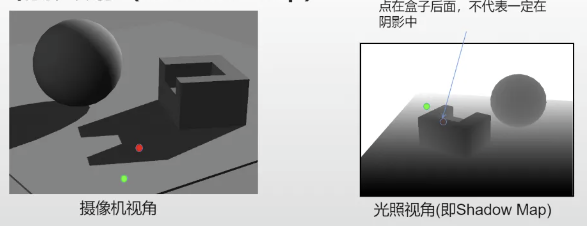
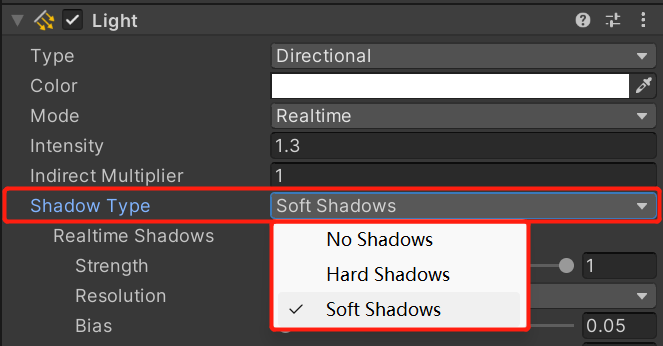
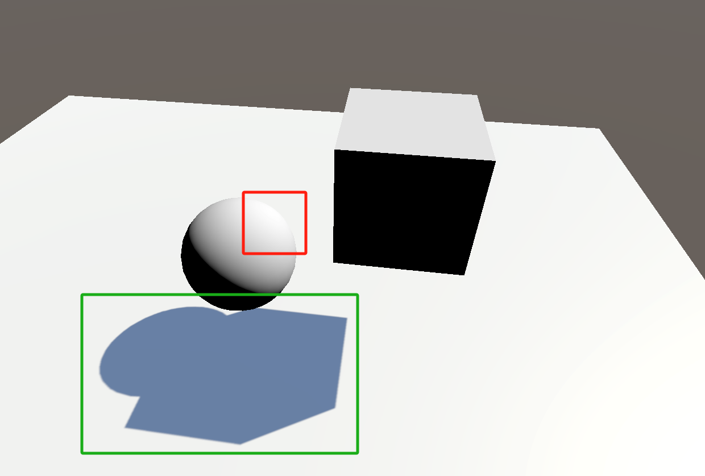
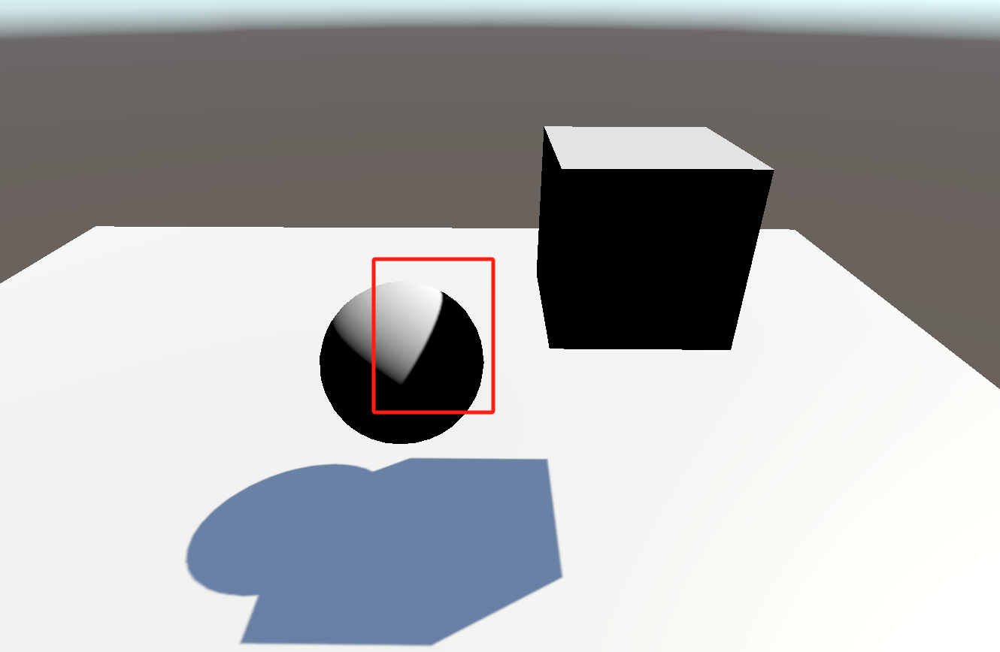
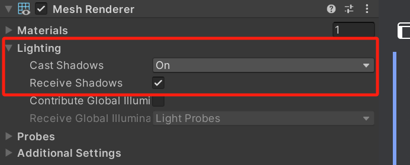
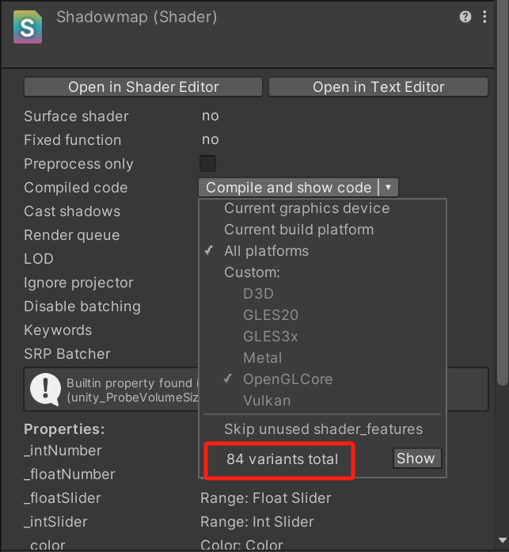
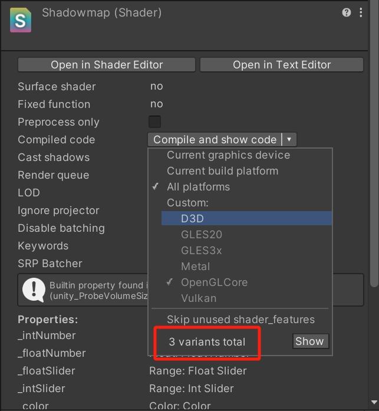

# 实时阴影技术

[TOC]

------

## 一、Shadowmap 原理

> “Shadowmap”是通过测试像素是否能够被光源所看到来创建的。从光源的视角出发，用像素与深度缓冲或深度图做比较来测试像素是否可见，并以纹理的形式存储。

在实时渲染中，最常用的一种技术就是“Shadowmap”。原理理解起来其实非常简单，首先将摄像机放置到光源的位置与其重合，那么需要为光源产生阴影的地方就是相机所看不到的位置。如下图所示：



“Unity”选择使用一个额外的“Shadow Caster Pass”来单独绘制与更新“Shadowmap”，这个 Pass 的渲染目标仅是“Shadowmap”或“Depth Map”。底层渲染引擎会在当前 Shader 中找到 “LightMode”被设置为“ShadowCaster”的 Pass，如果没有找到就会进入“Fallback”中继续找。若是还没有找到，则该物体就无法投射阴影，但可以接收其他物体的投影。

## 二、Shader 中实时阴影的投射与接收

首先需要打开灯光组件的实时投影功能：



### 2.1、投射阴影

想要让物体投射阴影需要执行以下步骤：

（1）在“SubShader”代码块中添加一个新的 Pass，并为其添加“LightMode”=“ShadowCaster”的 Tags。

（2）在顶点输出结构体中包含“V2F_SHADOW_CASTER”的宏定义。

（3）在顶点着色器中添加“TRANSFER_SHADOW_CASTER_NORMALOFFSET(o)”的宏定义。

（4）在片元着色器中添加“SHADOW_CASTER_FRAGMENT(i)”的宏定义。

以下是代码示例：

```glsl
    SubShader
    {
        // 第一个基础 Pass，用于材质渲染（不用管这个 pass）
        Pass
        {
            Name "FORWARDLIT"
            Tags { "LightMode" = "ForwardBase" }
            ...
        }
        
	    // 第二个投影 Pass，专门用于投影
        Pass
        {
            Name "SHADOWCASTER"
            Tags { "LightMode" = "ShadowCaster" }

            CGPROGRAM
            #pragma vertex vert
            #pragma fragment frag
            #include "UnityCG.cginc"

            struct appdata
            {
                float4 vertex : POSITION;
                float3 normal : NORMAL;
            };

            struct v2f
            {
                V2F_SHADOW_CASTER;
            };

            v2f vert(appdata v)
            {
                v2f o;
                TRANSFER_SHADOW_CASTER_NORMALOFFSET(o)
                return o;
            }

            float4 frag(v2f i) : SV_Target
            {
                SHADOW_CASTER_FRAGMENT(i)
            }
            ENDCG
        }
    }
```

效果预览如下图所示：



如上图可以看到，虽然物体已经成功对平面产生了投影，但小球却没有接收到阴影。

### 2.2、接受投影

想要让物体接收投影需要执行以下步骤：

（1）在第一个基础 Pass 中添加“LightMode”=“ForwardBase”的 Tags。

（2）在 CG 代码块中添加“#include "AutoLight.cginc"”的内置文件。

（3）在 CG 代码块中添加“#pragma multi_compile_fwdbase”的宏定义。

（4）在顶点输出结构体中声明“SHADOW_COORDS(n)”，用于输出顶点阴影坐标。

（5）在顶点着色器中声明“TRANSFER_SHADOW(o)”，用于计算裁剪空间下的顶点变换坐标。

（6）在片元着色器中声明“UNITY_LIGHT_ATTENUATION(atten, i, i.pos_world)”，用于采样与计算像素阴影。其参数中的“atten”就是需要的阴影衰减值，将其与最终颜色相乘即可。

（7）第二个“Shader Caster Pass”保持与上文一致即可。

以下是代码示例：

```glsl
    SubShader
    {
        Pass
        {
            Name "FORWARDLIT"
            Tags { "LightMode" = "ForwardBase" }

            CGPROGRAM
            #pragma vertex vert
            #pragma fragment frag
            #include "UnityCG.cginc"
            #include "AutoLight.cginc"
            #pragma multi_compile_fwdbase

            struct VertexInput
            {
                float4 vertex : POSITION;
                float3 normal : NORMAL;
            };

            struct VertexOutput
            {
                float4 pos : SV_POSITION;
                float3 pos_world : TEXCOORD0;
                float3 normal_world : TEXCOORD1;
                SHADOW_COORDS(2)
            };

            VertexOutput vert(VertexInput v)
            {
                VertexOutput o;
                o.pos = UnityObjectToClipPos(v.vertex);
                o.pos_world = mul(unity_ObjectToWorld, v.vertex);
                o.normal_world = UnityObjectToWorldNormal(v.normal);
                TRANSFER_SHADOW(o)
                return o;
            }

            float4 frag(VertexOutput i) : SV_Target
            {
                float3 lightDir = normalize(_WorldSpaceLightPos0.xyz);
                // 这里使用了 lambert 光照模型做测试
                float lambert = max(0, dot(i.normal_world, lightDir));
                // 计算像素阴影
                UNITY_LIGHT_ATTENUATION(atten, i, i.pos_world)
                float3 finalcolor = lambert * atten;

                return float4(finalcolor, 1);
            }
            ENDCG
        }

        Pass
        {
            Name "ShadowCaster"
            Tags { "LightMode" = "ShadowCaster" }
		   ...
        }
    }
```

效果预览如下图所示：



在这里可以看到物体已经成功的接受了投影。

### 2.3、组件控制

在完成了上述步骤后，就已经实现了对阴影的投影与接收。此时就可以通过“Inspector”面板上的“Mesh Render”组件对阴影进行操控：



## 三、优化

上文的方法中，在第一个 Pass 里添加了“\#pragma multi_compile_fwdbase”的宏定义，是一堆宏定义的集合。其中包含了很多子宏，盲目使用会造成额外的性能消耗。

因为上述方法只是针对场景中唯一的一盏平行光的阴影做了投影与接收，所以有很多其他类型灯光阴影的宏定义是不需要的。这就需要做剔除操作，否则在打包时会编译很多不需要的宏，造成额外的内存占用。

先看一下优化前后的着色器变体数量对比：

|  |  |
| :----------------------------------------------------------: | :----------------------------------------------------------: |

上图左侧为优化前的数量，可以看到总共有 84 个着色器变体，其中绝大部分都是因为“\#pragma multi_compile_fwdbase”造成的。点击一下数字右侧的“Show”可以在代码编辑器中看到具体的着色器变体排列组合顺序，如下所示：

```glsl
DIRECTIONAL
DIRECTIONAL LIGHTPROBE_SH
DIRECTIONAL LIGHTPROBE_SH SHADOWS_SHADOWMASK
DIRECTIONAL DYNAMICLIGHTMAP_ON
DIRECTIONAL LIGHTMAP_ON
DIRECTIONAL DYNAMICLIGHTMAP_ON LIGHTMAP_ON
DIRECTIONAL LIGHTMAP_ON LIGHTPROBE_SH
DIRECTIONAL LIGHTMAP_ON LIGHTMAP_SHADOW_MIXING
DIRECTIONAL DYNAMICLIGHTMAP_ON LIGHTMAP_ON LIGHTMAP_SHADOW_MIXING
DIRECTIONAL LIGHTMAP_ON LIGHTMAP_SHADOW_MIXING LIGHTPROBE_SH
DIRECTIONAL DIRLIGHTMAP_COMBINED DYNAMICLIGHTMAP_ON
DIRECTIONAL DIRLIGHTMAP_COMBINED LIGHTMAP_ON
DIRECTIONAL DIRLIGHTMAP_COMBINED LIGHTMAP_ON LIGHTPROBE_SH
DIRECTIONAL DIRLIGHTMAP_COMBINED DYNAMICLIGHTMAP_ON LIGHTMAP_ON
DIRECTIONAL DIRLIGHTMAP_COMBINED LIGHTMAP_ON LIGHTMAP_SHADOW_MIXING
DIRECTIONAL DIRLIGHTMAP_COMBINED LIGHTMAP_ON LIGHTMAP_SHADOW_MIXING LIGHTPROBE_SH
DIRECTIONAL DIRLIGHTMAP_COMBINED DYNAMICLIGHTMAP_ON LIGHTMAP_ON LIGHTMAP_SHADOW_MIXING
DIRECTIONAL LIGHTMAP_ON SHADOWS_SHADOWMASK
DIRECTIONAL DYNAMICLIGHTMAP_ON LIGHTMAP_ON SHADOWS_SHADOWMASK
DIRECTIONAL LIGHTMAP_ON LIGHTPROBE_SH SHADOWS_SHADOWMASK
DIRECTIONAL DIRLIGHTMAP_COMBINED LIGHTMAP_ON SHADOWS_SHADOWMASK
DIRECTIONAL DIRLIGHTMAP_COMBINED DYNAMICLIGHTMAP_ON LIGHTMAP_ON SHADOWS_SHADOWMASK
DIRECTIONAL DIRLIGHTMAP_COMBINED LIGHTMAP_ON LIGHTPROBE_SH SHADOWS_SHADOWMASK
DIRECTIONAL LIGHTMAP_ON LIGHTMAP_SHADOW_MIXING SHADOWS_SHADOWMASK
DIRECTIONAL DYNAMICLIGHTMAP_ON LIGHTMAP_ON LIGHTMAP_SHADOW_MIXING SHADOWS_SHADOWMASK
DIRECTIONAL LIGHTMAP_ON LIGHTMAP_SHADOW_MIXING LIGHTPROBE_SH SHADOWS_SHADOWMASK
DIRECTIONAL DIRLIGHTMAP_COMBINED LIGHTMAP_ON LIGHTMAP_SHADOW_MIXING SHADOWS_SHADOWMASK
DIRECTIONAL DIRLIGHTMAP_COMBINED DYNAMICLIGHTMAP_ON LIGHTMAP_ON LIGHTMAP_SHADOW_MIXING SHADOWS_SHADOWMASK
DIRECTIONAL DIRLIGHTMAP_COMBINED LIGHTMAP_ON LIGHTMAP_SHADOW_MIXING LIGHTPROBE_SH SHADOWS_SHADOWMASK
DIRECTIONAL SHADOWS_SCREEN
DIRECTIONAL LIGHTPROBE_SH SHADOWS_SCREEN
DIRECTIONAL DYNAMICLIGHTMAP_ON SHADOWS_SCREEN
DIRECTIONAL LIGHTMAP_SHADOW_MIXING LIGHTPROBE_SH SHADOWS_SCREEN
DIRECTIONAL DYNAMICLIGHTMAP_ON LIGHTMAP_SHADOW_MIXING SHADOWS_SCREEN
DIRECTIONAL LIGHTPROBE_SH SHADOWS_SCREEN SHADOWS_SHADOWMASK
DIRECTIONAL DYNAMICLIGHTMAP_ON SHADOWS_SCREEN SHADOWS_SHADOWMASK
DIRECTIONAL LIGHTMAP_SHADOW_MIXING LIGHTPROBE_SH SHADOWS_SCREEN SHADOWS_SHADOWMASK
DIRECTIONAL DYNAMICLIGHTMAP_ON LIGHTMAP_SHADOW_MIXING SHADOWS_SCREEN SHADOWS_SHADOWMASK
DIRECTIONAL LIGHTMAP_ON SHADOWS_SCREEN
DIRECTIONAL DYNAMICLIGHTMAP_ON LIGHTMAP_ON SHADOWS_SCREEN
DIRECTIONAL LIGHTMAP_ON LIGHTPROBE_SH SHADOWS_SCREEN
DIRECTIONAL LIGHTMAP_ON LIGHTMAP_SHADOW_MIXING SHADOWS_SCREEN
DIRECTIONAL DYNAMICLIGHTMAP_ON LIGHTMAP_ON LIGHTMAP_SHADOW_MIXING SHADOWS_SCREEN
DIRECTIONAL LIGHTMAP_ON LIGHTMAP_SHADOW_MIXING LIGHTPROBE_SH SHADOWS_SCREEN
DIRECTIONAL LIGHTMAP_ON SHADOWS_SCREEN SHADOWS_SHADOWMASK
DIRECTIONAL DYNAMICLIGHTMAP_ON LIGHTMAP_ON SHADOWS_SCREEN SHADOWS_SHADOWMASK
DIRECTIONAL LIGHTMAP_ON LIGHTPROBE_SH SHADOWS_SCREEN SHADOWS_SHADOWMASK
DIRECTIONAL LIGHTMAP_ON LIGHTMAP_SHADOW_MIXING SHADOWS_SCREEN SHADOWS_SHADOWMASK
DIRECTIONAL DYNAMICLIGHTMAP_ON LIGHTMAP_ON LIGHTMAP_SHADOW_MIXING SHADOWS_SCREEN SHADOWS_SHADOWMASK
DIRECTIONAL LIGHTMAP_ON LIGHTMAP_SHADOW_MIXING LIGHTPROBE_SH SHADOWS_SCREEN SHADOWS_SHADOWMASK
DIRECTIONAL DIRLIGHTMAP_COMBINED DYNAMICLIGHTMAP_ON SHADOWS_SCREEN
DIRECTIONAL DIRLIGHTMAP_COMBINED LIGHTMAP_ON SHADOWS_SCREEN
DIRECTIONAL DIRLIGHTMAP_COMBINED LIGHTMAP_ON LIGHTPROBE_SH SHADOWS_SCREEN
DIRECTIONAL DIRLIGHTMAP_COMBINED DYNAMICLIGHTMAP_ON LIGHTMAP_ON SHADOWS_SCREEN
DIRECTIONAL DIRLIGHTMAP_COMBINED LIGHTMAP_ON LIGHTMAP_SHADOW_MIXING SHADOWS_SCREEN
DIRECTIONAL DIRLIGHTMAP_COMBINED LIGHTMAP_ON LIGHTMAP_SHADOW_MIXING LIGHTPROBE_SH SHADOWS_SCREEN
DIRECTIONAL DIRLIGHTMAP_COMBINED DYNAMICLIGHTMAP_ON LIGHTMAP_ON LIGHTMAP_SHADOW_MIXING SHADOWS_SCREEN
DIRECTIONAL DIRLIGHTMAP_COMBINED LIGHTMAP_ON SHADOWS_SCREEN SHADOWS_SHADOWMASK
DIRECTIONAL DIRLIGHTMAP_COMBINED LIGHTMAP_ON LIGHTPROBE_SH SHADOWS_SCREEN SHADOWS_SHADOWMASK
DIRECTIONAL DIRLIGHTMAP_COMBINED DYNAMICLIGHTMAP_ON LIGHTMAP_ON SHADOWS_SCREEN SHADOWS_SHADOWMASK
DIRECTIONAL DIRLIGHTMAP_COMBINED LIGHTMAP_ON LIGHTMAP_SHADOW_MIXING SHADOWS_SCREEN SHADOWS_SHADOWMASK
DIRECTIONAL DIRLIGHTMAP_COMBINED LIGHTMAP_ON LIGHTMAP_SHADOW_MIXING LIGHTPROBE_SH SHADOWS_SCREEN SHADOWS_SHADOWMASK
DIRECTIONAL DIRLIGHTMAP_COMBINED DYNAMICLIGHTMAP_ON LIGHTMAP_ON LIGHTMAP_SHADOW_MIXING SHADOWS_SCREEN SHADOWS_SHADOWMASK
DIRECTIONAL VERTEXLIGHT_ON
DIRECTIONAL LIGHTPROBE_SH VERTEXLIGHT_ON
DIRECTIONAL DYNAMICLIGHTMAP_ON VERTEXLIGHT_ON
DIRECTIONAL DIRLIGHTMAP_COMBINED DYNAMICLIGHTMAP_ON VERTEXLIGHT_ON
DIRECTIONAL SHADOWS_SCREEN VERTEXLIGHT_ON
DIRECTIONAL LIGHTPROBE_SH SHADOWS_SCREEN VERTEXLIGHT_ON
DIRECTIONAL DYNAMICLIGHTMAP_ON SHADOWS_SCREEN VERTEXLIGHT_ON
DIRECTIONAL DIRLIGHTMAP_COMBINED DYNAMICLIGHTMAP_ON SHADOWS_SCREEN VERTEXLIGHT_ON
DIRECTIONAL LIGHTMAP_SHADOW_MIXING SHADOWS_SCREEN VERTEXLIGHT_ON
DIRECTIONAL LIGHTMAP_SHADOW_MIXING LIGHTPROBE_SH SHADOWS_SCREEN VERTEXLIGHT_ON
DIRECTIONAL DYNAMICLIGHTMAP_ON LIGHTMAP_SHADOW_MIXING SHADOWS_SCREEN VERTEXLIGHT_ON
DIRECTIONAL DIRLIGHTMAP_COMBINED DYNAMICLIGHTMAP_ON LIGHTMAP_SHADOW_MIXING SHADOWS_SCREEN VERTEXLIGHT_ON
DIRECTIONAL SHADOWS_SCREEN SHADOWS_SHADOWMASK VERTEXLIGHT_ON
DIRECTIONAL LIGHTPROBE_SH SHADOWS_SCREEN SHADOWS_SHADOWMASK VERTEXLIGHT_ON
DIRECTIONAL DYNAMICLIGHTMAP_ON SHADOWS_SCREEN SHADOWS_SHADOWMASK VERTEXLIGHT_ON
DIRECTIONAL DIRLIGHTMAP_COMBINED DYNAMICLIGHTMAP_ON SHADOWS_SCREEN SHADOWS_SHADOWMASK VERTEXLIGHT_ON
DIRECTIONAL LIGHTMAP_SHADOW_MIXING SHADOWS_SCREEN SHADOWS_SHADOWMASK VERTEXLIGHT_ON
DIRECTIONAL LIGHTMAP_SHADOW_MIXING LIGHTPROBE_SH SHADOWS_SCREEN SHADOWS_SHADOWMASK VERTEXLIGHT_ON
DIRECTIONAL DYNAMICLIGHTMAP_ON LIGHTMAP_SHADOW_MIXING SHADOWS_SCREEN SHADOWS_SHADOWMASK VERTEXLIGHT_ON
DIRECTIONAL DIRLIGHTMAP_COMBINED DYNAMICLIGHTMAP_ON LIGHTMAP_SHADOW_MIXING SHADOWS_SCREEN SHADOWS_SHADOWMASK VERTEXLIGHT_ON
```

可以看到，里面包含了非常多无效变体，具体的剔除方法为：

在 CG 代码块中使用“#pragma skip_variants xxx”方法剔除不需要的变体名称，其中的“xxx”代表不同的变体名称。如果存在多个需要剔除的变体，使用空格分开。

代码示例如下：

```glsl
#pragma skip_variants DIRLIGHTMAP_COMBINED LIGHTMAP_ON LIGHTPROBE_SH VERTEXLIGHT_ON SHADOWS_SHADOWMASK LIGHTMAP_SHADOW_MIXING DYNAMICLIGHTMAP_ON
```

剔除掉不需要的变体后，就只剩下了 3 个被用到的变体了：

```
DIRECTIONAL
DIRECTIONAL SHADOWS_SCREEN
```

完整代码示例：

```glsl
Shader "Shadowmap"
{
    SubShader
    {
        Pass
        {
            Name "FORWARDLIT"
            Tags { "LightMode" = "ForwardBase" }

            CGPROGRAM
            #pragma vertex vert
            #pragma fragment frag
            #include "UnityCG.cginc"
            #include "AutoLight.cginc"
            #pragma multi_compile_fwdbase
            // 变体优化
            #pragma skip_variants DIRLIGHTMAP_COMBINED LIGHTMAP_ON LIGHTPROBE_SH VERTEXLIGHT_ON SHADOWS_SHADOWMASK LIGHTMAP_SHADOW_MIXING DYNAMICLIGHTMAP_ON

            struct VertexInput
            {
                float4 vertex : POSITION;
                float3 normal : NORMAL;
            };

            struct VertexOutput
            {
                float4 pos : SV_POSITION;
                float3 pos_world : TEXCOORD0;
                float3 normal_world : TEXCOORD1;
                SHADOW_COORDS(2)
            };

            VertexOutput vert(VertexInput v)
            {
                VertexOutput o;
                o.pos = UnityObjectToClipPos(v.vertex);
                o.pos_world = mul(unity_ObjectToWorld, v.vertex);
                o.normal_world = UnityObjectToWorldNormal(v.normal);
                TRANSFER_SHADOW(o)
                return o;
            }

            samplerCUBE _textureCube;

            float4 frag(VertexOutput i) : SV_Target
            {
                float3 lightDir = normalize(_WorldSpaceLightPos0.xyz);
                // 这里使用了 lambert 光照模型做测试
                float lambert = max(0, dot(i.normal_world, lightDir));
                // 计算像素阴影
                UNITY_LIGHT_ATTENUATION(atten, i, i.pos_world)
                float3 finalcolor = lambert * atten;

                return float4(finalcolor, 1);
            }
            ENDCG
        }

        Pass
        {
            Name "ShadowCaster"
            Tags { "LightMode" = "ShadowCaster" }

            CGPROGRAM
            #pragma vertex vert
            #pragma fragment frag
            #include "UnityCG.cginc"

            struct appdata
            {
                float4 vertex : POSITION;
                float3 normal : NORMAL;
            };

            struct v2f
            {
                V2F_SHADOW_CASTER;
            };

            v2f vert(appdata v)
            {
                v2f o;
                TRANSFER_SHADOW_CASTER_NORMALOFFSET(o)
                return o;
            }

            float4 frag(v2f i) : SV_Target
            {
                SHADOW_CASTER_FRAGMENT(i)
            }
            ENDCG
        }
    }
}
```

