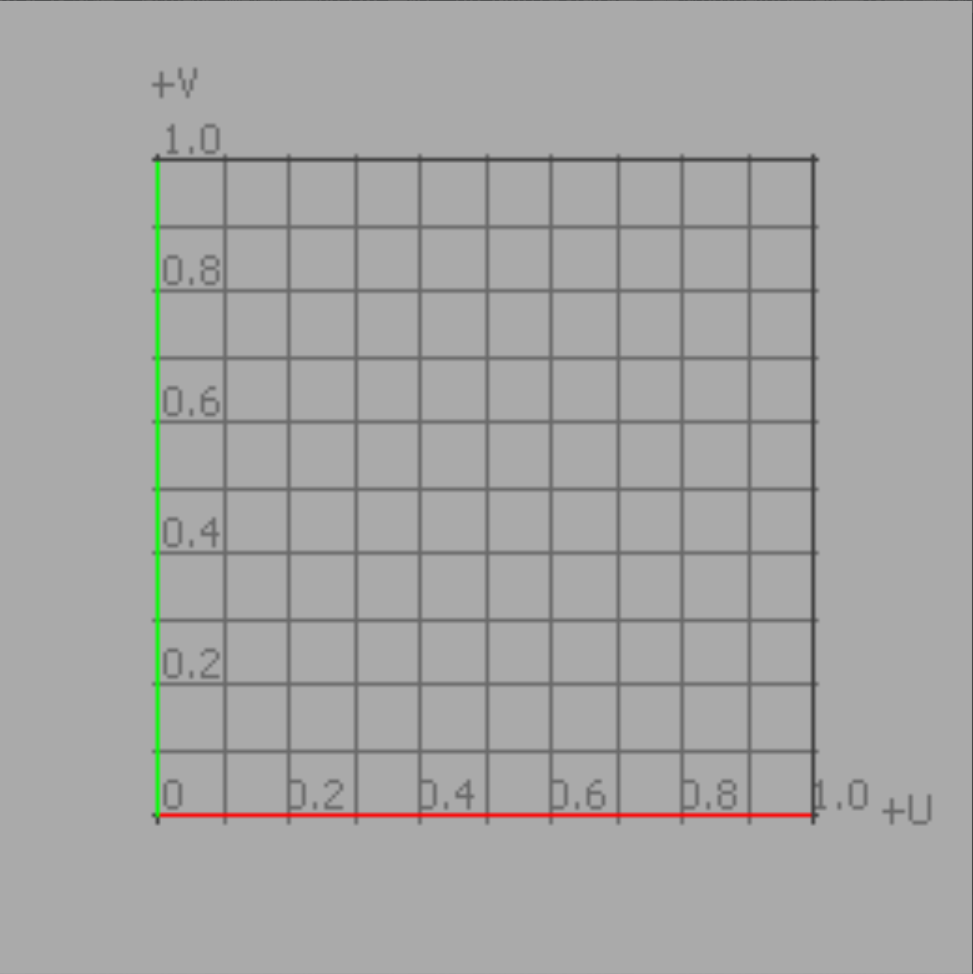
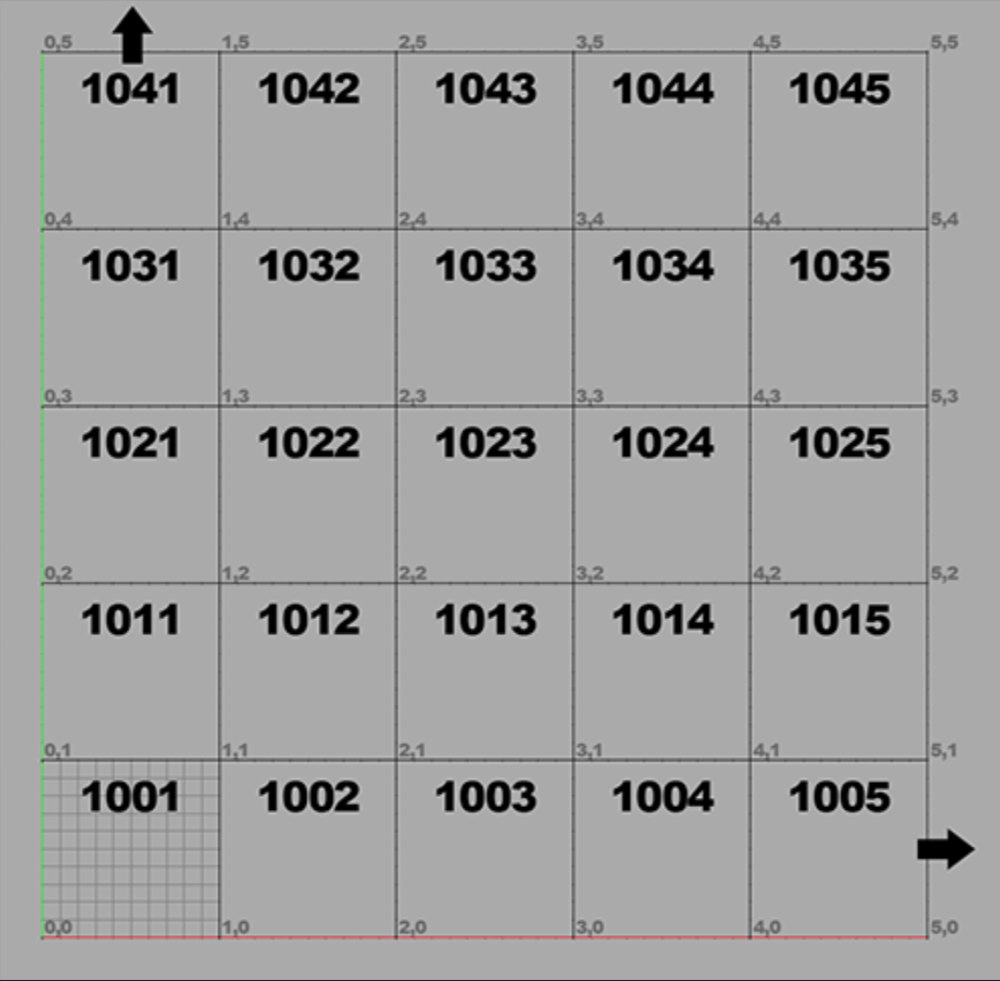

# 原理概述

## UV 映射的基础知识

UV 映射是将三维表面转换为平面位图图像的二维坐标系（反之亦然，具体取决于观察方式）。那么，在 UV 象限中为原始曲面的每个顶点提供一个坐标，并且中间的像素值在平面多边形曲面上进行插值以实现高度精确的纹理控制。UV 贴图的坐标值将被组织到一个格网系统中，其中纹理本身显示在格网的 [0-1] 范围内，而此图块之外的区域只是向外重复。因此，本质上只有 UV象限中的 [0-1] 才被真正使用。

## UDIM 的基础知识

> 多象限纹理映射（UDIM）的核心是一个 UV 偏移系统。是对基础 UV 纹理工作流的增强，使 UV 贴图生成更容易，纹理分配更简单。
>
> 它将纹理分配给特定的 UV 象限，可以使用多个较低分辨率的纹理组合成一个高分辨率的结果，而无需使用单个超高精度纹理。

如上图所示，每一张图像都可以拥有不同的 UV 象限，也就意味着可以拥有不同的分辨率。其每个整数部分（1001、1002、1003…）都可以分配独立的纹理，沿正方向移动不超过十个整数区间（如：U 方向为 1001 - 1010，V 方向为 1001 - 1091）去分别采样纹理。

在理解了上述原理之后，用一句话来总结 UDIM 那就是将多张纹理分别对应不同的 UV 象限，并对 UV 偏移值进行判断。每个 UV 值偏移步进一整个 UV 象限时就采样零一张纹理，最后将这些wen'li

