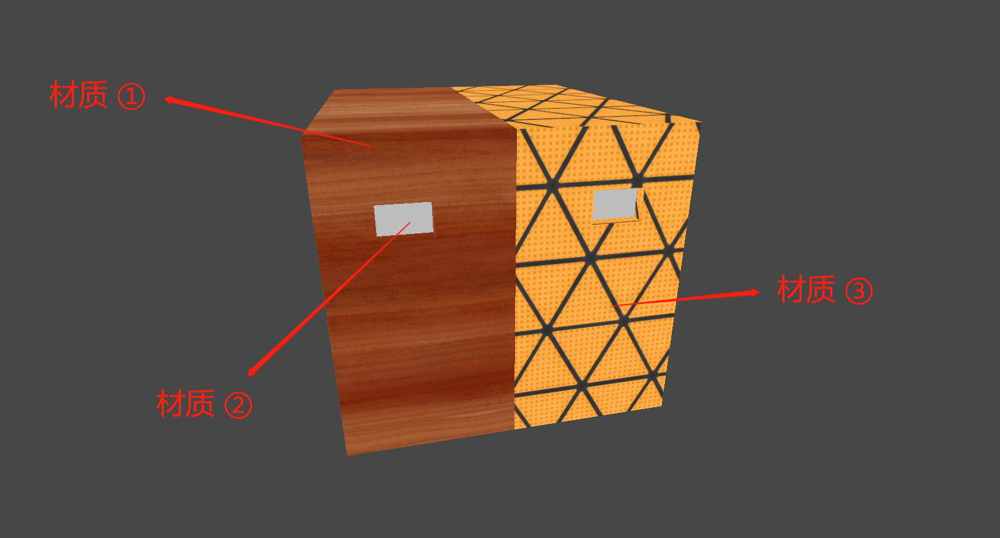
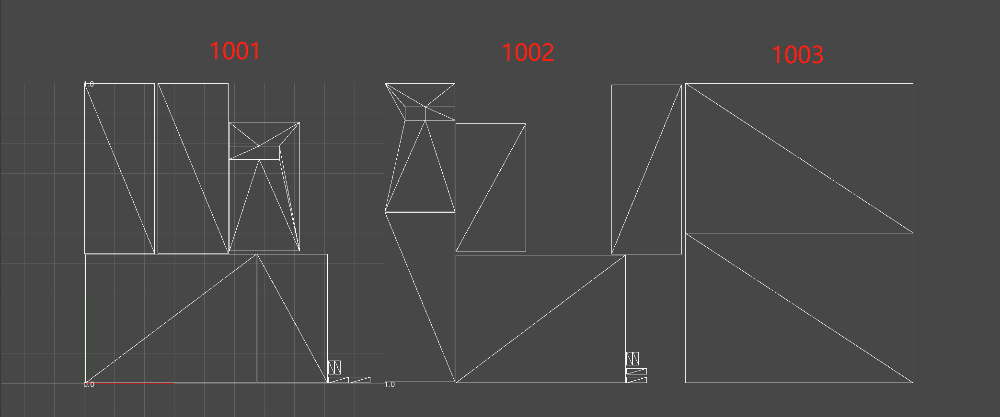

# 技术实现

## 一、测试资源

如下所示，测试资源拥有三种材质，并且资源制作时也分配了三个象限的 UV。

|  |  |
| ------------------------------------------------------------ | ------------------------------------------------------------ |

## 二、代码部分

### 2.1、构造一个混合采样函数

根据前文的原理可以总结出大致的思路：

（1）确定一个 UV 的平铺方向。

（2）通过预设条件来判断何时切换采样纹理。

（3）最终通过“lerp”函数混合采样结果并输出。

当前美术资源的 UDIM 纹理是朝着 U 方向平铺的，所以使用“UV.x”来计算 UV 的走格，并且扩展至第三象限“1003”。此时就可以使用条件语句“if…else…”来计算 UV 的走格来采样不同的纹理。

以下为条件语句的示例代码：

```glsl
// uv_dir：代表 uv 走格的方向
// 1：代表一个象限的最大值，用于数值比较。
// lerpFactor：代表 lerp 函数的 alpha 值。
if (uv_dir >= 1)
	lerpFactor = 1.0;
else
	lerpFactor = 0.0;

// lerpResult：代表最终返回结果。
float3 lerpResult = lerp(col_01, col_02, lerpFactor);
```

如上述示例代码所示，通过判断条件来决定“lerp”函数的“alpha”值便可以在两张纹理中选择一张使用。

以上步骤完成了当 UV 值在 [0-1] 时使用“col_01（第一张颜色纹理）”，当 UV 值大于“1”时使用“col_02（第二张颜色纹理）”。在知道这个逻辑后很容易就能推导出如何使用第三张纹理，那就是当 UV 值大于“2”后便是用“col_03（第三张颜色纹理）”。以下为自定义方法函数示例代码（注意，当前示例函数只能采样三张纹理）：

```glsl
float3 UDIMColor_Blend3(float uv_dir, float3 col_01, float3 col_02, float3 col_03)
{
	float lerpFactor = 0.0;
	// 判断当前 UV 值是否增大至超出第一象限
	if (uv_dir >= 1)
		lerpFactor = 1.0;
	else
		lerpFactor = 0.0;
	// 当前 UV 值超出第一象限时，则采样第二张颜色纹理
	float3 lerpResult01 = lerp(col_01, col_02, lerpFactor);
    
    // 判断当前 UV 值是否增大至超出第二象限
	if (uv_dir >= 2)
		lerpFactor = 1.0;
	else
		lerpFactor = 0.0;
    // 当前 UV 值超出第二象限时，则采样第三张颜色纹理
	float3 lerpResult02 = lerp(lerpResult01, col_03, lerpFactor);

    // 最终返回三张纹理的混合采样结果
	return lerpResult02;
}
```

如上述示例代码所示，这是一个最终会返回一个三维向量类型的浮点值函数，它的输入参数为一个“UV 方向”与三个“颜色值”。使用一个简单“Unlit Sahder”测试一下结果：

```glsl

```

