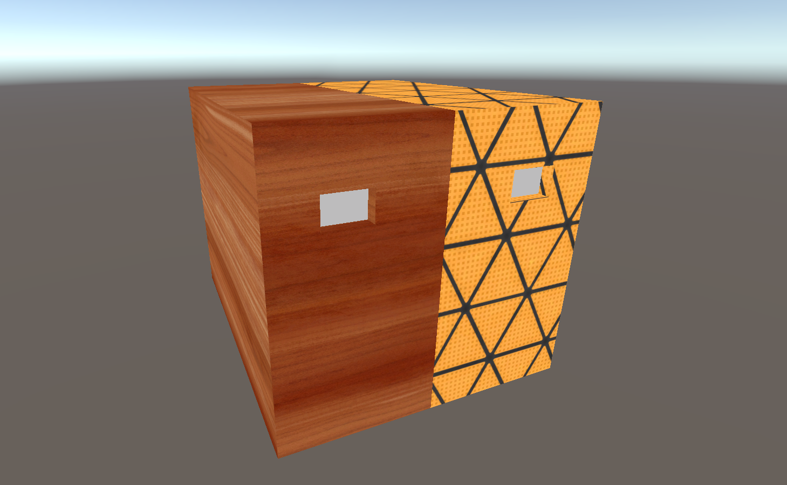
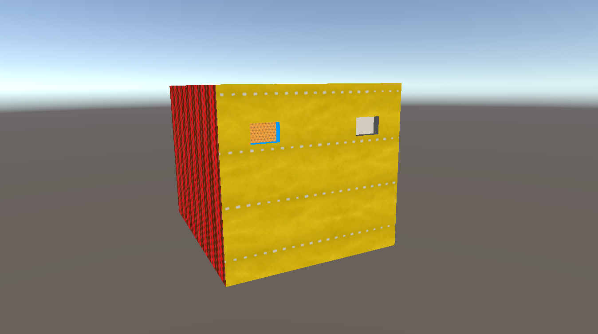
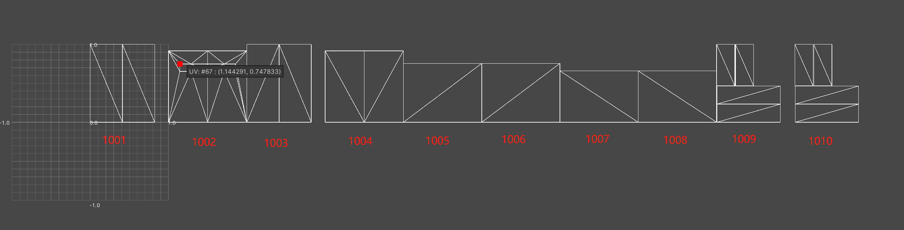

# 技术实现

## 一、测试资源

如下所示，测试资源拥有三种材质，并且资源制作时也分配了三个象限的 UV。

|  |  |
| ------------------------------------------------------------ | ------------------------------------------------------------ |

## 二、代码部分

### 2.1、构造一个混合采样函数

根据前文的原理可以总结出大致的思路：

（1）确定一个 UV 的平铺方向。

（2）通过预设条件来判断何时切换采样纹理。

（3）最终通过“lerp”函数混合采样结果并输出。

当前美术资源的 UDIM 纹理是朝着 U 方向平铺的，所以使用“UV.x”来计算 UV 的走格，并且扩展至第三象限“1003”。此时就可以使用条件语句“if…else…”来计算 UV 的走格来采样不同的纹理。

以下为条件语句的示例代码：

```glsl
// uv_dir：代表 uv 走格的方向
// 1：代表一个象限的最大值，用于数值比较。
// lerpFactor：代表 lerp 函数的 alpha 值。
if (uv_dir >= 1)
	lerpFactor = 1.0;
else
	lerpFactor = 0.0;

// lerpResult：代表最终返回结果。
float3 lerpResult = lerp(col_01, col_02, lerpFactor);
```

如上述示例代码所示，通过判断条件来决定“lerp”函数的“alpha”值便可以在两张纹理中选择一张使用。

以上步骤完成了当 UV 值在 [0-1] 时使用“col_01（第一张颜色纹理）”，当 UV 值大于“1”时使用“col_02（第二张颜色纹理）”。在知道这个逻辑后很容易就能推导出如何使用第三张纹理，那就是当 UV 值大于“2”后便是用“col_03（第三张颜色纹理）”。以下为自定义方法函数示例代码（注意，当前示例函数只能采样三张纹理）：

```glsl
float3 UDIMColor_Blend3(float uv_dir, float3 col_01, float3 col_02, float3 col_03)
{
	float lerpFactor = 0.0;
	// 判断当前 UV 值是否增大至超出第一象限
	if (uv_dir >= 1)
		lerpFactor = 1.0;
	else
		lerpFactor = 0.0;
	// 当前 UV 值超出第一象限时，则采样第二张颜色纹理
	float3 lerpResult01 = lerp(col_01, col_02, lerpFactor);
    
    // 判断当前 UV 值是否增大至超出第二象限
	if (uv_dir >= 2)
		lerpFactor = 1.0;
	else
		lerpFactor = 0.0;
    // 当前 UV 值超出第二象限时，则采样第三张颜色纹理
	float3 lerpResult02 = lerp(lerpResult01, col_03, lerpFactor);

    // 最终返回三张纹理的混合采样结果
	return lerpResult02;
}
```

如上述示例代码所示，这是一个最终会返回一个三维向量类型的浮点值函数，它的输入参数为一个“UV 方向”与三个“颜色值”。

### 2.2、测试

使用一个简单“Unlit Shader”测试一下结果，这里在写代码时需要注意，要想使用上文中构建的自定义函数“UDIMColor_Blend3”，需要将其整段复制粘贴至“顶点”着色器与“片元”着色器之间：

```glsl
Shader "UDIM"
{
    Properties
    {
        [NoScaleOffset]_Albedo1001 ("Albedo(1001)", 2D) = "white" { }
        [NoScaleOffset]_Albedo1002 ("Albedo(1002)", 2D) = "white" { }
        [NoScaleOffset]_Albedo1003 ("Albedo(1003)", 2D) = "white" { }
    }

    SubShader
    {
        Tags
        {
            "RenderType" = "Opaque"
            "Queue" = "Geometry"
        }

        Pass
        {
            Name "Forward"
            Cull Back ZWrite On ZTest LEqual

            CGPROGRAM
            #pragma vertex vert
            #pragma fragment frag
            #include "UnityCG.cginc"

            struct VertexInput
            {
                float4 vertex : POSITION;
                float2 uv : TEXCOORD0;
            };

            struct VertexOutput
            {
                float4 clipPos : SV_POSITION;
                float2 uv_udim : TEXCOORD0;
            };

            sampler2D _Albedo1001, _Albedo1002, _Albedo1003;

            // 顶点着色器
            VertexOutput vert(VertexInput v)
            {
                VertexOutput o = (VertexOutput)0;
                o.clipPos = UnityObjectToClipPos(v.vertex.xyz);
                o.uv_udim = v.uv;
                return o;
            }

            // 自定义函数
            float3 UDIMColor_Blend3(float uv_dir, float3 col_01, float3 col_02, float3 col_03)
            {
                float lerpFactor = 0.0;
                // 判断当前 UV 值是否增大至超出第一象限
                if (uv_dir >= 1)
                    lerpFactor = 1.0;
                else
                    lerpFactor = 0.0;
                // 当前 UV 值超出第一象限时，则采样第二张颜色纹理
                float3 lerpResult01 = lerp(col_01, col_02, lerpFactor);

                // 判断当前 UV 值是否增大至超出第二象限
                if (uv_dir >= 2)
                    lerpFactor = 1.0;
                else
                    lerpFactor = 0.0;
                // 当前 UV 值超出第二象限时，则采样第三张颜色纹理
                float3 lerpResult02 = lerp(lerpResult01, col_03, lerpFactor);
                
                // 最终返回三张纹理的混合采样结果
                return lerpResult02;
            }

            // 片元着色器
            float4 frag(VertexOutput i) : SV_Target
            {
                float2 textureUV = i.uv_udim;
                float4 col_1001 = tex2D(_Albedo1001, textureUV);
                float4 col_1002 = tex2D(_Albedo1002, textureUV);
                float4 col_1003 = tex2D(_Albedo1003, textureUV);
                // UDIM
                float3 colorBlend_U = UDIMColor_Blend3(i.uv_udim.x, col_1001, col_1002, col_1003);

                return float4(colorBlend_U, 1.0);
            }
            ENDCG
        }
    }
}
```

简单测试之后得到了正确结果，如下图所示：



### 2.3、升级混合采样函数

在证明了方法正确以后就可以扩展混合的数量，以达到支持更多的材质贴图。

由于在“原理概述”篇中介绍了不论是“U 方向”还是“V 方向”，平铺数量不得超过 10 个 UV 象限可以推导出新的自定义混合函数：

```glsl
float3 UDIMColor_Blend10(float uv_dir, float3 col_01, float3 col_02, float3 col_03, float3 col_04, float3 col_05, float3 col_06, float3 col_07, float3 col_08, float3 col_09, float3 col_10)
{
    float lerpFactor = 0.0;
    // 1
    if (uv_dir >= 1)
        lerpFactor = 1.0;
    else
        lerpFactor = 0.0;
    float3 lerpResult01 = lerp(col_01, col_02, lerpFactor);
    // 2
    if (uv_dir >= 2)
        lerpFactor = 1.0;
    else
        lerpFactor = 0.0;
    float3 lerpResult02 = lerp(lerpResult01, col_03, lerpFactor);
    // 3
    if (uv_dir >= 3)
        lerpFactor = 1.0;
    else
        lerpFactor = 0.0;
    float3 lerpResult03 = lerp(lerpResult02, col_04, lerpFactor);
    // 4
    if (uv_dir >= 4)
        lerpFactor = 1.0;
    else
        lerpFactor = 0.0;
    float3 lerpResult04 = lerp(lerpResult03, col_05, lerpFactor);
    // 5
    if (uv_dir >= 5)
        lerpFactor = 1.0;
    else
        lerpFactor = 0.0;
    float3 lerpResult05 = lerp(lerpResult04, col_06, lerpFactor);
    // 6
    if (uv_dir >= 6)
        lerpFactor = 1.0;
    else
        lerpFactor = 0.0;
    float3 lerpResult06 = lerp(lerpResult05, col_07, lerpFactor);
    // 7
    if (uv_dir >= 7)
        lerpFactor = 1.0;
    else
        lerpFactor = 0.0;
    float3 lerpResult07 = lerp(lerpResult06, col_08, lerpFactor);
    // 8
    if (uv_dir >= 8)
        lerpFactor = 1.0;
    else
        lerpFactor = 0.0;
    float3 lerpResult08 = lerp(lerpResult07, col_09, lerpFactor);
    // 9
    if (uv_dir >= 9)
        lerpFactor = 1.0;
    else
        lerpFactor = 0.0;
    float3 lerpResult09 = lerp(lerpResult08, col_10, lerpFactor);

    return lerpResult09;
}
```

再回到 Shader 中进行测试依然可以得到正确的结果：



上述测试使用了新的带有 10 个 UV 象限材质的模型资源：



### 2.4、最终代码

```glsl
Shader "UDIM"
{
    Properties
    {
        [NoScaleOffset]_Albedo1001 ("Albedo(1001)", 2D) = "white" { }
        [NoScaleOffset]_Albedo1002 ("Albedo(1002)", 2D) = "white" { }
        [NoScaleOffset]_Albedo1003 ("Albedo(1003)", 2D) = "white" { }
        [NoScaleOffset]_Albedo1004 ("Albedo(1004)", 2D) = "white" { }
        [NoScaleOffset]_Albedo1005 ("Albedo(1005)", 2D) = "white" { }
        [NoScaleOffset]_Albedo1006 ("Albedo(1006)", 2D) = "white" { }
        [NoScaleOffset]_Albedo1007 ("Albedo(1007)", 2D) = "white" { }
        [NoScaleOffset]_Albedo1008 ("Albedo(1008)", 2D) = "white" { }
        [NoScaleOffset]_Albedo1009 ("Albedo(1009)", 2D) = "white" { }
        [NoScaleOffset]_Albedo1010 ("Albedo(1010)", 2D) = "white" { }
    }

    SubShader
    {
        Tags
        {
            "RenderType" = "Opaque"
            "Queue" = "Geometry"
        }

        Pass
        {
            Name "Forward"
            Cull Back ZWrite On ZTest LEqual

            CGPROGRAM
            #pragma vertex vert
            #pragma fragment frag
            #include "UnityCG.cginc"

            struct VertexInput
            {
                float4 vertex : POSITION;
                float2 uv : TEXCOORD0;
            };

            struct VertexOutput
            {
                float4 clipPos : SV_POSITION;
                float2 uv_udim : TEXCOORD0;
            };

            sampler2D _Albedo1001, _Albedo1002, _Albedo1003, _Albedo1004, _Albedo1005, _Albedo1006, _Albedo1007, _Albedo1008, _Albedo1009, _Albedo1010;

            VertexOutput vert(VertexInput v)
            {
                VertexOutput o = (VertexOutput)0;
                o.clipPos = UnityObjectToClipPos(v.vertex.xyz);
                o.uv_udim = v.uv;
                return o;
            }

            float3 UDIMColor_Blend3(float uv_dir, float3 col_01, float3 col_02, float3 col_03)
            {
                float lerpFactor = 0.0;
                // 判断当前 UV 值是否增大至超出第一象限
                if (uv_dir >= 1)
                    lerpFactor = 1.0;
                else
                    lerpFactor = 0.0;
                // 当前 UV 值超出第一象限时，则采样第二张颜色纹理
                float3 lerpResult01 = lerp(col_01, col_02, lerpFactor);

                // 判断当前 UV 值是否增大至超出第二象限
                if (uv_dir >= 2)
                    lerpFactor = 1.0;
                else
                    lerpFactor = 0.0;
                // 当前 UV 值超出第二象限时，则采样第三张颜色纹理
                float3 lerpResult02 = lerp(lerpResult01, col_03, lerpFactor);

                // 最终返回三张纹理的混合采样结果
                return lerpResult02;
            }

            float3 UDIMColor_Blend10(float uv_dir, float3 col_01, float3 col_02, float3 col_03, float3 col_04, float3 col_05, float3 col_06, float3 col_07, float3 col_08, float3 col_09, float3 col_10)
            {
                float lerpFactor = 0.0;
                // 1
                if (uv_dir >= 1)
                    lerpFactor = 1.0;
                else
                    lerpFactor = 0.0;
                float3 lerpResult01 = lerp(col_01, col_02, lerpFactor);
                // 2
                if (uv_dir >= 2)
                    lerpFactor = 1.0;
                else
                    lerpFactor = 0.0;
                float3 lerpResult02 = lerp(lerpResult01, col_03, lerpFactor);
                // 3
                if (uv_dir >= 3)
                    lerpFactor = 1.0;
                else
                    lerpFactor = 0.0;
                float3 lerpResult03 = lerp(lerpResult02, col_04, lerpFactor);
                // 4
                if (uv_dir >= 4)
                    lerpFactor = 1.0;
                else
                    lerpFactor = 0.0;
                float3 lerpResult04 = lerp(lerpResult03, col_05, lerpFactor);
                // 5
                if (uv_dir >= 5)
                    lerpFactor = 1.0;
                else
                    lerpFactor = 0.0;
                float3 lerpResult05 = lerp(lerpResult04, col_06, lerpFactor);
                // 6
                if (uv_dir >= 6)
                    lerpFactor = 1.0;
                else
                    lerpFactor = 0.0;
                float3 lerpResult06 = lerp(lerpResult05, col_07, lerpFactor);
                // 7
                if (uv_dir >= 7)
                    lerpFactor = 1.0;
                else
                    lerpFactor = 0.0;
                float3 lerpResult07 = lerp(lerpResult06, col_08, lerpFactor);
                // 8
                if (uv_dir >= 8)
                    lerpFactor = 1.0;
                else
                    lerpFactor = 0.0;
                float3 lerpResult08 = lerp(lerpResult07, col_09, lerpFactor);
                // 9
                if (uv_dir >= 9)
                    lerpFactor = 1.0;
                else
                    lerpFactor = 0.0;
                float3 lerpResult09 = lerp(lerpResult08, col_10, lerpFactor);

                return lerpResult09;
            }

            float4 frag(VertexOutput i) : SV_Target
            {
                float2 textureUV = i.uv_udim;
                float3 col_1001 = tex2D(_Albedo1001, textureUV).rgb;
                float3 col_1002 = tex2D(_Albedo1002, textureUV).rgb;
                float3 col_1003 = tex2D(_Albedo1003, textureUV).rgb;
                float3 col_1004 = tex2D(_Albedo1004, textureUV).rgb;
                float3 col_1005 = tex2D(_Albedo1005, textureUV).rgb;
                float3 col_1006 = tex2D(_Albedo1006, textureUV).rgb;
                float3 col_1007 = tex2D(_Albedo1007, textureUV).rgb;
                float3 col_1008 = tex2D(_Albedo1008, textureUV).rgb;
                float3 col_1009 = tex2D(_Albedo1009, textureUV).rgb;
                float3 col_1010 = tex2D(_Albedo1010, textureUV).rgb;
                // UDIM
                float3 colorBlend_U = UDIMColor_Blend10(i.uv_udim.x, col_1001, col_1002, col_1003, col_1004, col_1005, col_1006, col_1007, col_1008, col_1009, col_1010);

                return float4(colorBlend_U, 1.0);
            }
            ENDCG
        }
    }
}
```
