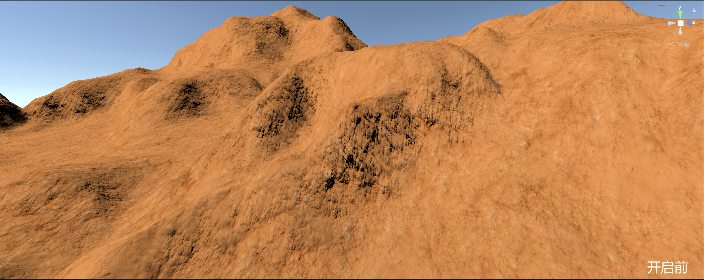
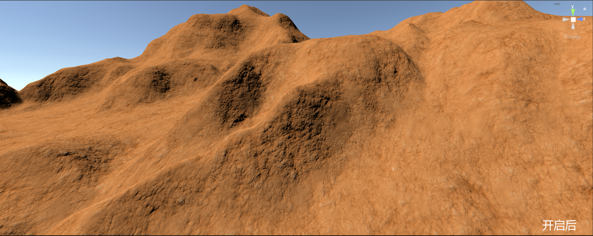
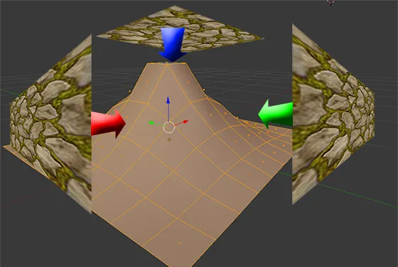
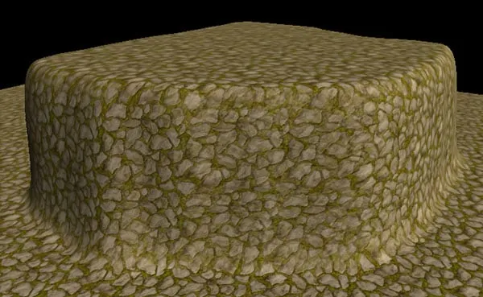

# 原理概述

## 作用

当使用传统 2D 平面 UV 进行纹理映射时，在起伏变化剧烈的地形、山峦等模型上体现的效果不佳且陡坡严重的地方会有明显的纹理拉伸。为了解决这个问题，“三平面映射（Tri-planar Mapping）”技术诞生了。

如下对比图所示，开启三平面映射后极大地改善了拉伸问题：

|  |  |
| :----------------------------------------------------------: | :----------------------------------------------------------: |

## 原理

|  |  |
| :----------------------------------------------------------: | :----------------------------------------------------------: |

如上图所示，三平面映射的原理是使用世界空间顶点坐标的“X”、“Y”、“Z”三个方向来分别采样一次纹理，并计算混合权重值，最终再将三个方向的采样结果通过权重值混合来得到一个相对舒适的计算结果。所以，此技术比较适用于地形渲染。