# 技术实现

## 一、基本思路

### 1.1、三方采样纹理

分别按世界空间的“X”、“Y”、“Z”三个方向采样一次纹理：

| 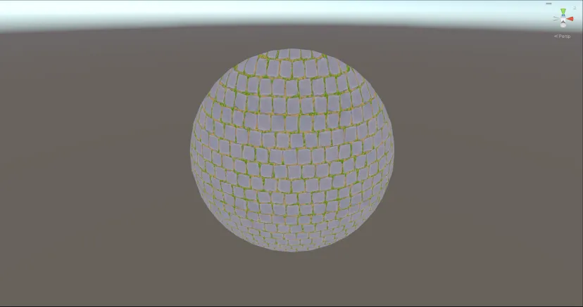 | 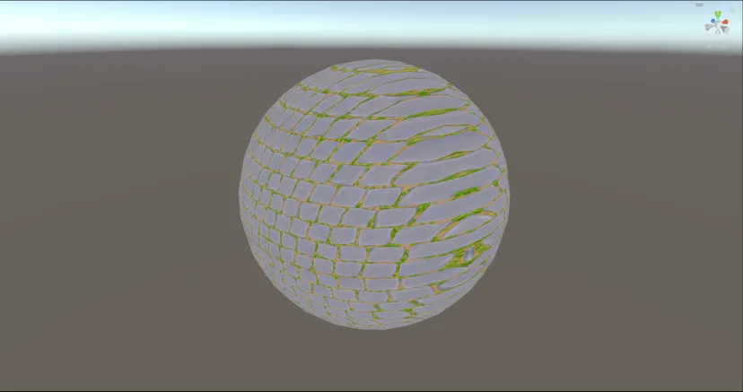 | 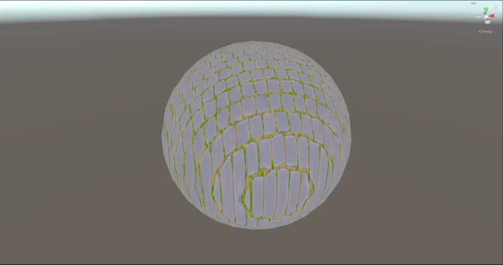 |
| :----------------------------------------------------------: | :----------------------------------------------------------: | :----------------------------------------------------------: |

仔细观察上图可以发现，除了被采样的方向，其他两个方向的纹理都是拉伸的。

以下为代码示例：

```glsl
float3 worldPosition = input.pos_world;
// calculate triplanar uvs
float2 uvX = worldPosition.zy;
float2 uvY = worldPosition.xz;
float2 uvZ = worldPosition.xy;
// textures sample
float3 color_side = SAMPLE_TEXTURE2D(_BaseMap, sampler_BaseMap, uvX).xyz;
float3 color_top = SAMPLE_TEXTURE2D(_BaseMap, sampler_BaseMap, uvY).xyz;
float3 color_front = SAMPLE_TEXTURE2D(_BaseMap, sampler_BaseMap, uvZ).xyz;
```

### 1.2、计算权重值

权重值是基于世界空间法线来计算的，再通过一个参数来控制权重值遮罩的边缘硬度，如下图所示：

| 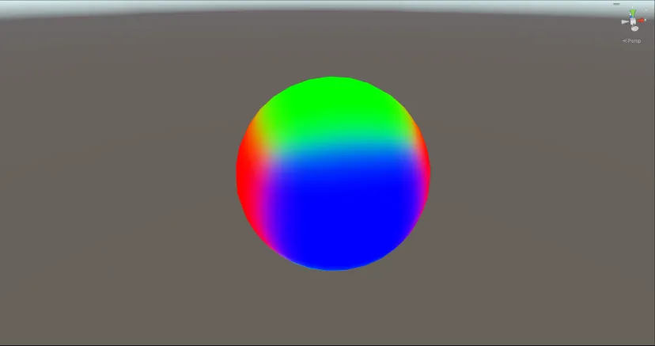 | 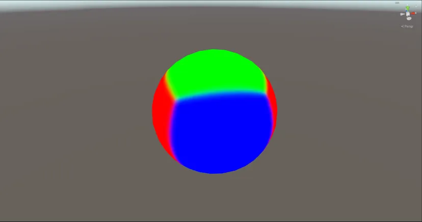 | 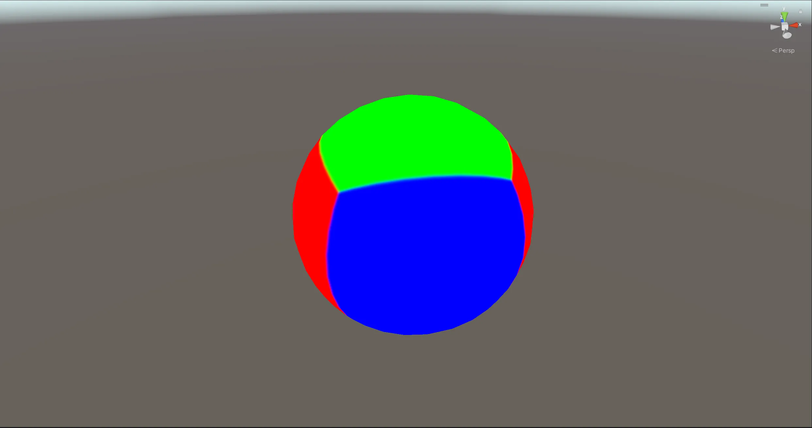 |
| :-------------------------------------------: | :---------------------------------------------: | :----------------------------------------------------------: |

以下是混合算法的代码示例：

```glsl
float3 worldNormal = normalize(input.normal_world);
// calculate triplanar blend
float3 triblend = pow(abs(worldNormal), _BlendShape);
triblend /= max(0.0, dot(triblend, float3(1.0, 1.0, 1.0)));
return triblend.xyzz;
```

根据权重值单独输出每一个方向上的计算结果确认效果正确，如下图所示：

| 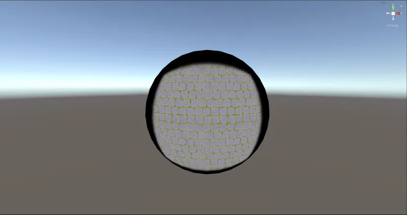 | 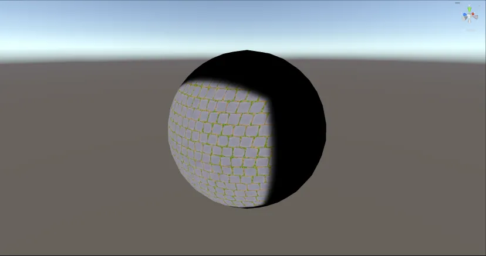 | 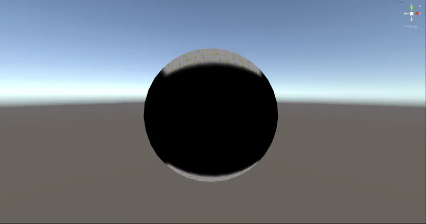 |
| :----------------------------------------------------------: | :----------------------------------------------------------: | :----------------------------------------------------------: |

以下为代码示例：

```glsl
color_side *= triblend.z;
return color_side.xyzz;

color_front *= triblend.x;
return color_front.xyzz;

color_top *= triblend.y;
return color_top.xyzz;
```

### 1.3、混合采样

最后，按权重值混合之前采样的纹理即可，如下图所示：

|  | 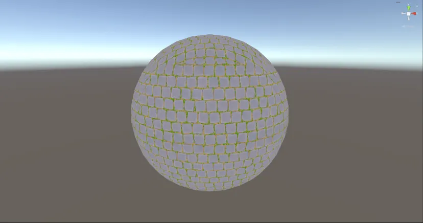 |
| :----------------------------------------------------------: | :----------------------------------------------------------: |

仔细观差混合的交界处可以看到有很明显的虚实变化，这是调整权重参数引起的。

以下为代码示例：

```glsl
float3 finalcol = color_front + color_side + color_top;
return finalcol.xyzz;
```

### 1.4、问题与改进

在移动物体时发现纹理并不会跟着移动，如下图所示：


出现这个问题是因为，在采样纹理时使用的是世界空间坐标（绝对坐标）。要想解决很简单，只需要将世界空间坐标转换至模型本地坐标即可：

```glsl
float3 worldPosition = input.pos_world;
worldPosition = mul(unity_WorldToObject, float4(worldPosition, 1.0)).xyz;
```

改进后的效果如下图所示：


### 1.5、片元着色器完整示例代码

```glsl
float4 LitPassFragment(Varyings input) : SV_Target
{
    float3 worldPosition = input.pos_world;
    worldPosition = mul(unity_WorldToObject, float4(worldPosition, 1.0)).xyz;
    float3 worldNormal = normalize(input.normal_world);
    // calculate triplanar uvs
    float2 uvX = worldPosition.zy * _GlobalTilling * 0.1;
    float2 uvY = worldPosition.xz * _GlobalTilling * 0.1;
    float2 uvZ = worldPosition.xy * _GlobalTilling * 0.1;
    // texture sample
    float3 color_side = SAMPLE_TEXTURE2D(_BaseMap, sampler_BaseMap, uvX).xyz;
    float3 color_top = SAMPLE_TEXTURE2D(_BaseMap, sampler_BaseMap, uvY).xyz;
    float3 color_front = SAMPLE_TEXTURE2D(_BaseMap, sampler_BaseMap, uvZ).xyz;
    // calculate triplanar blend
    float3 triblend = pow(abs(worldNormal), _BlendShape);
    triblend /= max(0.0, dot(triblend, float3(1.0, 1.0, 1.0)));

    float3 finalColor = color_side * triblend.x + color_top * triblend.y + color_front * triblend.z;
    return float4(finalColor, 1.0);
}
```

## 二、关于法线

要想在增加对法线贴图的支持，有很多细节要注意，并不只是像上文中的颜色贴图一样简单。在采样法线贴图时要注意法线在不同的方向有可能会产生因目标平台不同所引发的通道反转问题，这就需要对采样法线贴图的 UV 以及朝向进行修正。

首先，提前声明一个用于在水平方向上根据不同平台会自行判断并反转的宏定义：

```glsl
// flip UVs horizontally to correct for back side projection
#define TRIPLANAR_CORRECT_PROJECTED_U
```

在片元着色器中根据世界空间法线方向进行判断是否需要镜像 UV：

```glsl
// minor optimization of sign(). prevents return value of 0
float3 axisSign = worldNormal < 0 ? - 1 : 1;

// flip UVs horizontally to correct for back side projection
#if defined(TRIPLANAR_CORRECT_PROJECTED_U)
	uvX.x *= axisSign.x;
	uvY.x *= axisSign.y;
	uvZ.x *= -axisSign.z;
#endif
```

当完成以上步骤之后就可以使用新的 UV 来采样法线贴图了：

```glsl
// tangent space normal maps
float3 normal_side = UnpackNormalScale(SAMPLE_TEXTURE2D(_NormalMap, sampler_NormalMap, uvX), _NormalStrength);
float3 normal_top = UnpackNormalScale(SAMPLE_TEXTURE2D(_NormalMap, sampler_NormalMap, uvY), _NormalStrength);
float3 normal_front = UnpackNormalScale(SAMPLE_TEXTURE2D(_NormalMap, sampler_NormalMap, uvZ), _NormalStrength);
```

得到三个方向上的法线后，便可以配合修正后的 UV 对其进行朝向的修正与混合操作，在混合时依旧选择法线重定向混合算法（《法线混合技术》篇章中有所表述）：

```glsl
float3 NormalBlending_ReorientedNormalMapping(float3 n1, float3 n2)
{
    n1.z += 1.0;
    n2.xy = -n2.xy;
    return normalize(n1 * dot(n1, n2) - n2 * n1.z);
}
```

```glsl
// flip normal maps' x axis to account for flipped UVs
#if defined(TRIPLANAR_CORRECT_PROJECTED_U)
	normal_side.x *= axisSign.x;
	normal_top.x *= axisSign.y;
	normal_front.x *= -axisSign.z;
#endif

// normal Blend
float3 absVertNormal = abs(worldNormal);
// swizzle world normals to match tangent space and apply reoriented normal mapping blend
normal_side = NormalBlending_ReorientedNormalMapping(float3(worldNormal.zy, absVertNormal.x), normal_side);
normal_top = NormalBlending_ReorientedNormalMapping(float3(worldNormal.xz, absVertNormal.y), normal_top);
normal_front = NormalBlending_ReorientedNormalMapping(float3(worldNormal.xy, absVertNormal.z), normal_front);

// apply world space sign to tangent space Z
normal_side.z *= axisSign.x;
normal_top.z *= axisSign.y;
normal_front.z *= axisSign.z;
```

最终，使用混合权重值将三个方向上的法线混合即可：

```glsl
// sizzle tangent normals to match world normal and blend together
float3 finalNormalWS = normalize(normal_side.zyx * triblend.x + normal_top.xzy * triblend.y + normal_front.xyz * triblend.z);
```

最终效果：

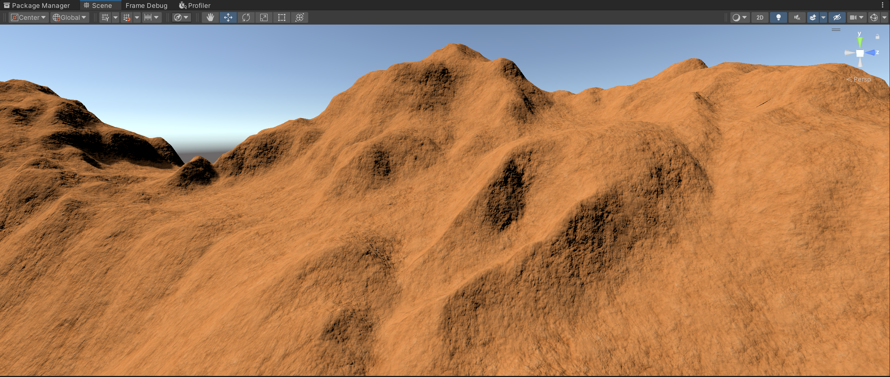

### 带法线的完整示例代码

```glsl
Shader "TriplanarMapping"
{
    Properties
    {
        _Color ("Color", Color) = (1.0, 1.0, 1.0, 0.0)
        [NoScaleOffset] _BaseMap ("Albedo", 2D) = "white" { }
        _GlobalTilling ("Global Tilling", float) = 1.0
        [Normal][NoScaleOffset] _NormalMap ("Normal", 2D) = "bump" { }
        _NormalStrength ("Normal Strength", Range(0.0, 3.0)) = 1.0
        _BlendShape ("Blend Shape", Range(1.0, 32.0)) = 4
    }
    
    SubShader
    {
        Tags
        {
            "RenderPipeline" = "UniversalPipeline"
            "UniversalMaterialType" = "Lit"
            "RenderType" = "Opaque"
            "Queue" = "Geometry"
        }

        Pass
        {
            HLSLPROGRAM

            #pragma vertex LitPassVertex
            #pragma fragment LitPassFragment
            #include "Packages/com.unity.render-pipelines.universal/ShaderLibrary/Core.hlsl"
            #include "Packages/com.unity.render-pipelines.universal/ShaderLibrary/Lighting.hlsl"

            #pragma shader_feature_local _LIGHTINGCHECK_DIRECTDIFFUSE _LIGHTINGCHECK_DIRECTSPECULAR _LIGHTINGCHECK_INDIRECTDIFFUSE _LIGHTINGCHECK_INDIRECTSPECULAR _LIGHTINGCHECK_DIRECTLIGHTING _LIGHTINGCHECK_INDIRECTLIGHTING _LIGHTINGCHECK_ALL
            #pragma multi_compile_fragment _ _SHADOWS_SOFT
            #pragma multi_compile _ _MAIN_LIGHT_SHADOWS _MAIN_LIGHT_SHADOWS_CASCADE _MAIN_LIGHT_SHADOWS_SCREEN
            
            #pragma target 3.0

            // flip UVs horizontally to correct for back side projection
            #define TRIPLANAR_CORRECT_PROJECTED_U

            struct Attributes
            {
                float4 pos_vertex : POSITION;
                float3 normal_vertex : NORMAL;
            };

            struct Varyings
            {
                float4 pos_clip : SV_POSITION;
                float3 pos_world : TEXCOORD0;
                float3 normal_world : TEXCOORD1;
                float4 shadowCoord : TEXCOORD2;
            };

            Varyings LitPassVertex(Attributes input)
            {
                Varyings output = (Varyings)0;
                ////////////////////////////
                //    Normal Transform    //
                ////////////////////////////
                VertexNormalInputs normalInput = GetVertexNormalInputs(input.normal_vertex, input.tangent_vertex);
                output.normal_world = normalInput.normalWS;
                //////////////////////////////
                //    Position Transform    //
                //////////////////////////////
                VertexPositionInputs vertexInput = GetVertexPositionInputs(input.pos_vertex.xyz);
                output.pos_world = vertexInput.positionWS;
                ///////////////////////////
                //    Vertex Outputs     //
                ///////////////////////////
                output.pos_clip = TransformObjectToHClip(input.pos_vertex.xyz);
                output.shadowCoord = output.shadowCoord;
                return output;
            }

            TEXTURE2D(_BaseMap);        SAMPLER(sampler_BaseMap);
            TEXTURE2D(_NormalMap);      SAMPLER(sampler_NormalMap);
            CBUFFER_START(UnityPerMaterial)
                float4 _Color;
                float _GlobalTilling, _NormalStrength, _BlendShape;
            CBUFFER_END

            float3 NormalBlending_ReorientedNormalMapping(float3 n1, float3 n2)
            {
                n1.z += 1.0;
                n2.xy = -n2.xy;
                return normalize(n1 * dot(n1, n2) - n2 * n1.z);
            }

            float4 LitPassFragment(Varyings input) : SV_Target
            {
                float3 worldPosition = input.pos_world;
                worldPosition = mul(unity_WorldToObject, float4(worldPosition, 1.0)).xyz;
                float3 worldNormal = normalize(input.normal_world);

                // Calculate the shadow coordinates
                float4 shadowUV = input.shadowCoord;
                #if defined(_MAIN_LIGHT_SHADOWS_SCREEN)
                    float4 positionCS = TransformWorldToHClip(worldPosition);
                    shadowUV = ComputeScreenPos(positionCS);
                #else
                    shadowUV = TransformWorldToShadowCoord(worldPosition);
                #endif
                float4 shadowMask = float4(1.0, 1.0, 1.0, 1.0);
                Light light = GetMainLight(shadowUV, worldPosition, shadowMask);
                float3 lightColor = light.color;
                float3 lightDirection = light.direction;
                // Calculate the main light's shadow attenuation, because of the directional light
                float shadow = light.shadowAttenuation;

                // calculate triplanar blend
                float3 triblend = pow(abs(worldNormal), _BlendShape);
                triblend /= max(0.0, dot(triblend, float3(1.0, 1.0, 1.0)));

                // calculate triplanar uvs
                float2 uvX = worldPosition.zy * _GlobalTilling * 0.1;
                float2 uvY = worldPosition.xz * _GlobalTilling * 0.1;
                uvY += 0.33;
                float2 uvZ = worldPosition.xy * _GlobalTilling * 0.1;
                uvZ += 0.67;

                // minor optimization of sign(). prevents return value of 0
                float3 axisSign = worldNormal < 0 ? - 1 : 1;

                // flip UVs horizontally to correct for back side projection
                #if defined(TRIPLANAR_CORRECT_PROJECTED_U)
                    uvX.x *= axisSign.x;
                    uvY.x *= axisSign.y;
                    uvZ.x *= -axisSign.z;
                #endif

                float3 color_side = SAMPLE_TEXTURE2D(_BaseMap, sampler_BaseMap, uvX).xyz;
                float3 color_top = SAMPLE_TEXTURE2D(_BaseMap, sampler_BaseMap, uvY).xyz;
                float3 color_front = SAMPLE_TEXTURE2D(_BaseMap, sampler_BaseMap, uvZ).xyz;
                float3 finalColor = color_side * triblend.x + color_top * triblend.y + color_front * triblend.z;
                // return finalColor.xyzz;

                // tangent space normal maps
                float3 normal_side = UnpackNormalScale(SAMPLE_TEXTURE2D(_NormalMap, sampler_NormalMap, uvX), _NormalStrength);
                float3 normal_top = UnpackNormalScale(SAMPLE_TEXTURE2D(_NormalMap, sampler_NormalMap, uvY), _NormalStrength);
                float3 normal_front = UnpackNormalScale(SAMPLE_TEXTURE2D(_NormalMap, sampler_NormalMap, uvZ), _NormalStrength);

                // flip normal maps' x axis to account for flipped UVs
                #if defined(TRIPLANAR_CORRECT_PROJECTED_U)
                    normal_side.x *= axisSign.x;
                    normal_top.x *= axisSign.y;
                    normal_front.x *= -axisSign.z;
                #endif

                // normal Blend
                float3 absVertNormal = abs(worldNormal);
                // swizzle world normals to match tangent space and apply reoriented normal mapping blend
                normal_side = NormalBlending_ReorientedNormalMapping(float3(worldNormal.zy, absVertNormal.x), normal_side);
                normal_top = NormalBlending_ReorientedNormalMapping(float3(worldNormal.xz, absVertNormal.y), normal_top);
                normal_front = NormalBlending_ReorientedNormalMapping(float3(worldNormal.xy, absVertNormal.z), normal_front);

                // apply world space sign to tangent space Z
                normal_side.z *= axisSign.x;
                normal_top.z *= axisSign.y;
                normal_front.z *= axisSign.z;

                // sizzle tangent normals to match world normal and blend together
                float3 finalNormalWS = normalize(normal_side.zyx * triblend.x + normal_top.xzy * triblend.y + normal_front.xyz * triblend.z);
                float lambert = saturate(dot(finalNormalWS, lightDirection));

                float3 finalcol = _Color.xyz * finalColor * lightColor * lambert * shadow;
                return float4(finalcol, 1.0);
            }
            ENDHLSL
        }

        Pass
        {
            Name "ShadowCaster"
            Tags
            {
                "LightMode" = "ShadowCaster"
            }

            HLSLPROGRAM
            #pragma exclude_renderers gles gles3 glcore
            #pragma target 4.5
            // #pragma shader_feature_local _ALPHATESTON
            // This is used during shadow map generation to differentiate between directional and punctual light shadows, as they use different formulas to apply Normal Bias
            #pragma multi_compile_vertex _ _CASTING_PUNCTUAL_LIGHT_SHADOW
            #pragma vertex ShadowPassVertex
            #pragma fragment ShadowPassFragment
            #include "Packages/com.unity.render-pipelines.universal/Shaders/LitInput.hlsl"
            #include "Packages/com.unity.render-pipelines.universal/Shaders/ShadowCasterPass.hlsl"
            ENDHLSL
        }

        Pass
        {
            Name "DepthOnly"
            Tags
            {
                "LightMode" = "DepthOnly"
            }
            
            HLSLPROGRAM
            #pragma exclude_renderers gles gles3 glcore
            #pragma target 4.5
            #pragma vertex DepthOnlyVertex
            #pragma fragment DepthOnlyFragment
            #include "Packages/com.unity.render-pipelines.universal/Shaders/LitInput.hlsl"
            #include "Packages/com.unity.render-pipelines.universal/Shaders/DepthOnlyPass.hlsl"
            ENDHLSL
        }
    }
}
```

