# 理论精炼

[TOC]

------

## 一、基本问题

### 1.1、光与颜色

#### 1.1.1、什么是光

> 💡 光的本质是**电磁波**，是一种**振动方向与其传播方向相垂直的横波**，同时具有**粒子特性**。

而光在传播的过程中，遇到介面会发生反射与折射的现象，遇到粒子会发生散射的现象（例如瑞利散射、米式散射），对于这一过程，可以理解为物质将光的能量吸收，并向其他方向发射出去。

#### 1.1.2、波长的概念

> 💡 波长是**电磁波的属性**，人眼可以感受到的电磁波范围约为 400 - 700nm。

光谱（Spectrum）可以对光在此一定范围内的能量进行度量，光谱的分布情况（谱密度分布 SPD）决定了光的颜色。

下图展示了经典的 Cornell Box 场景在 410、450、 500、550、600、650、700nm 波长处的强度图像：

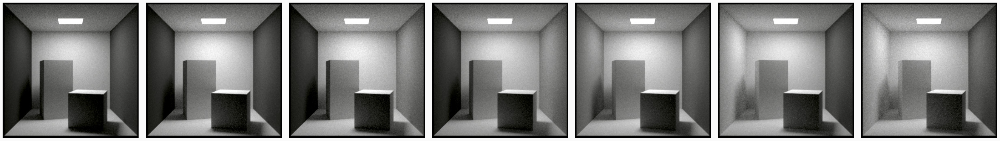

#### 1.1.3、光的行为

光的三种传播方式：

- 沿直线传播（光线在**相同的介质**中的传播轨迹是**绝对的直线（例如空气）**）。

- 反射。

- 折射。

扩展 - 几何光学基础：**三条基本定理**

- 入射光线、反射光线、折射光线与界面的法线共居于一个平面。反射光线、折射光线、与入射光线分居法线两侧。
- 反射定律：反射角等于入射角。
- 折射定律：入射角的正弦值与折射角的正弦值的比值，对折射率一定的两种介质是一个常数。

当光线击中物体表面时，通常可能发生两件事：

- 反射行为

​	光线根据**反射定律**被表面完全反射并且被弹向一个完全不同的角度。

- 折射行为

​	光线按**折射形式**由一种介质传递给另一种介质，这时的光线会被分成折射与反射**两个部分**。

​	在物体表面，光线可能同时存在折射与反射的可能性。其中，折射部分可能最终在物体内部被吸收（吸收衰竭的过程不会发生在物体表面）。

#### 1.1.4、吸收与散射

> 💡 当光线在各向异性的介质（也就是半透明物体）中传播时，光线可能被吸收或散射。

- 吸收

​	当光线在介质中**被吸收时**，光能会**随着被转换成其他形式的能量而衰竭**（通常是热量）。同时，光线的颜色（波长）也会根据不同介质的吸收特性而改变，但传播**方向不会改变**。

- 散射

​	当光线在介质中**被散射时**，光线传播的方向会**随机变化**，但**强度不变**。其传播方向的变化幅度取决于介质的性质。而光线在介质中**传播的越远**，散射与吸收所带来的**能量损失就越多**。因此，物体的**厚度**在散射和吸收的过程中起到了重要的作用。

#### 1.1.5、什么是颜色

> 💡 物体表面的颜色来自于光线的波长。光源发出的光线，在经过物体的**吸收与反射**后（**包括漫反射与高光**），最终进入眼睛的光线的波长就是颜色。

例如下图，苹果之所以被看到的是红色是因为苹果在对光线进行吸收与反射后，最终将红色（苹果本身的颜色）的光线反射入人眼。

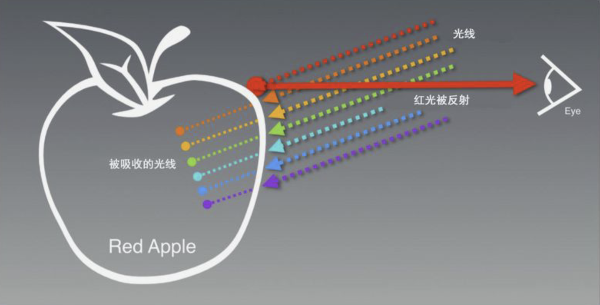

### 1.2、什么是 PBR

> 💡 Physically Based Rendering（基于物理的渲染过程，以下简称 PBR）是对光与材质之间进行**更加真实的建模**。实际上指的是一些在不同程度上都基于与现实世界的物理原理更相符的基本理论所构成的渲染技术的**集合**。
>
> 同时也可以把 PBR 理解成一种**理念**，使用从现实世界中**物理测量**的表面参数来准确表示真实世界材质的**渲染理念**。正是因为要遵循这样的理念，所以才逐渐形成了一套标准的资源与光照渲染流程。
>
> 虽然如此，PBR 仍然只是对基于物理原理的现实世界的一种**近似**，这也就是为什么 PBR 是**基于物理而非真实物理**的原因。

而 PBR 需要从**三个维度**来讨论：

- 基于物理的**着色**。

- 基于物理度量的**光照**。

- 基于物理特征的**摄像机**。

目前，本文只讨论**基于物理的着色**（Physically Based Shading，以下简称 PBS），也就是用于物体表面材质表现的着色技术。

### 1.3、为什么要有 PBR

> 💡 正是因为 PBR 的目的是为了使用更符合物理学规律的方式来模拟光线与物体之间的交互行为，所以与传统的经验光照模型相比看起来更逼真。

#### 1.3.1、光照模型

**光照模型**说明光在物体表面的行为是可以**预测**的，同时包括在不透明物体表面的反射与在穿过不同介质界面的折射等。

而在 PBR 诞生以前，大多都是在使用**基于经验的光照模型**。即通过大量的实践总结成的一套看起来“逼真”的光照模型。

在实际生产过程，因其缺点非常明显（光照结果不统一），需要美术不断地调整以达到一个好的效果，往往耗时耗力。

#### 1.3.2、总结

由于 PBR 与物理性质非常接近，因此，美术可以直接以物理参数为依据来制作材质。不论光照条件如何，材质看上去都是正确的。这也说明了 PBR 具有更为统一的光照结果，便于美术资源制作。

这样，就能够完整地在虚拟世界中模拟一条光线的**生命周期**。从光线的起点一直到最后因为散射与吸收而衰竭变成热能，都可以在计算机中都可以通过相应的模型去计算。

最终，从**艺术创作**与**生产效率**的角度可以总结以下几点优势：

- 艺术家创建真实资源时**更加便利**。

- 所产出的资产适用于**任何光照条件**。

- 为不同的美术提供了**统一的标准工作流程**。

## 二、PBS 的核心理念

### 2.1、物质的光学特性【Substance Optical Properties】

> 💡 根据物质的光学特性【Substance Optical Properties】可得知，现实中的物质根据其导电性大致可分为三大类：
>
> - 导体。
> - 半导体。
> - 绝缘体。
>
> ​      而在实时渲染领域通常只描述两大类：
>
> - **导体（泛指金属）**。
> - **绝缘体（泛指非金属）**。

#### 2.1.1、导体（金属介质）

- 具有很高的反射率【70% ～ 100%，≥ 0.5】。

- 所有的可见颜色都来自于镜面反射，为**三通道彩色**。

- 会**立即吸收任何折射光**，从而导致不会出现任何次表面散射与透明效果，如下图所示：

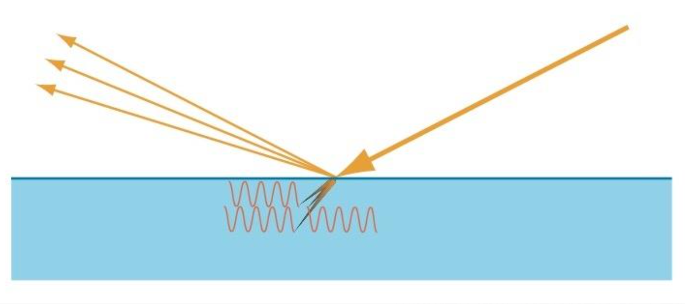

#### 2.1.2、绝缘体（非金属介质）

- 具有很低的反射率【2% ～ 5%，≤ 0.05】。

- 镜面反射为**单通道的灰色**。

- 具有漫反射与镜面反射，如下图所示：

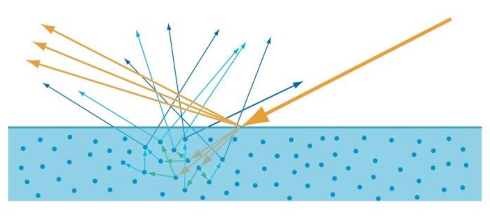

### 2.2、微平面理论【Microfacet Theory】

> 💡 一种认为物体表面是由**无数个微观尺度**，同时又有着**随机朝向的理想镜面反射**来建模的理论，最终推导出了一个**基于粗糙度**的 BRDF 公式（见下文）来描述物体表面的反射。

在这个理论中，每个微平面都像完美镜面一样，基于自身法线将光线反射向同一个方向。其核心为**光与非光学平坦表面交互原理【Non-Optically-Flat Surface】**。

但从物理学的角度来说，现实世界中**绝大多数物体表面都不是光学平滑的**。这种微观几何上的变化会导致每个表面上的点都具有不同程度的反射与折射，如下图所示：

| 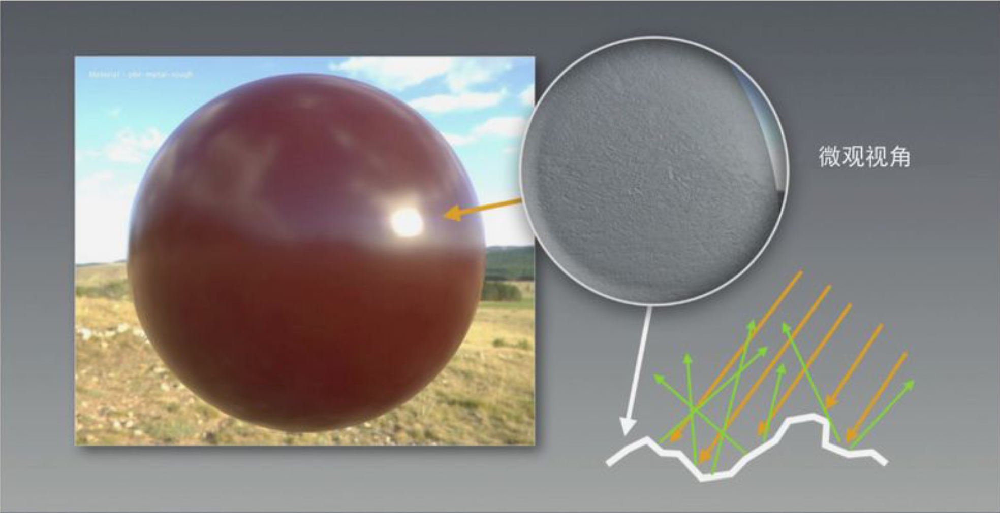 | 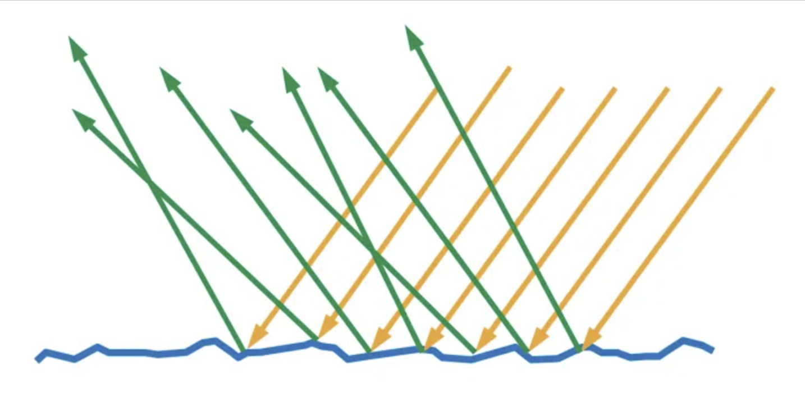 |
| ------------------------------------------------------------ | ------------------------------------------------------------ |

然而由于这些微平面已经微小到无法逐像素地继续对其进行区分，因此假设一个粗糙度参数，然后用统计学的方法来估算微平面的粗糙程度。计算方法如下所示：
$$
h = \frac { l + v } { || l + v || }
$$

> 💡 基于一个平面的**粗糙度**来计算出众多微平面中朝向**沿着某个向量 H 的比例**。其中向量H便是位于**光线向量 L**和**视线向量 V** 之间的**半角向量（Halfway Vector）**。

| 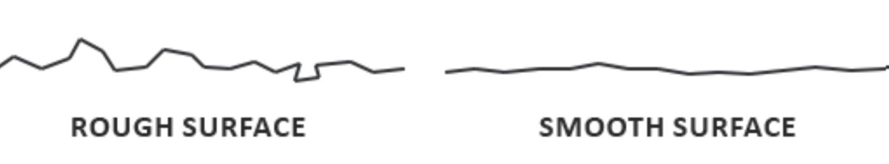 | 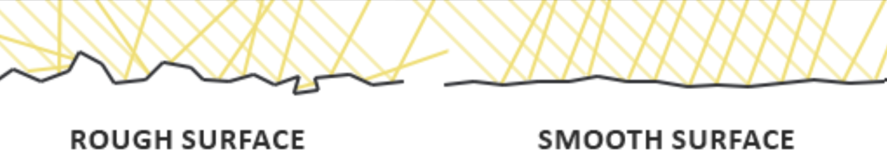 |
| ------------------------------------------------------------ | ------------------------------------------------------------ |

如上图所示，假想任何平面都是又微平面组成的，并且根据这些微平面的**不同粗糙程度**去采用粗糙度贴图或者高光贴图来表示。那么，就可以总结出两条规律：

- 一个物体表面**越粗糙**，则说明表面的微平面排列就**越混乱**。从而导致被反射的光线**越分散**，看到的反射信息**越模糊**。

- 一个物体表面**越光滑**，则说明表面的微平面排布就**越整齐**。从而导致被反射的光线**越一致**，看到的反射信息**越清晰**。

### 2.3、能量守恒定律【Energy Conservation】

> 💡 **热力学第一定律**。定义了能量可以从一个物体传递到另一个物体，也可以转换为其他的能量形式。**转换的过程中，能量的总值保持不变**。

而在 PBS 中使用了出射光线的能量**永远不能超过**入射光线的能量的能量守恒形式。

如下图可以发现，随着**粗糙度的上升**，镜面反射区域的**面积随之增大**。而**基于能量守恒的原则**，镜面反射区域的**平均亮度则会下降**，但同时也需要考虑到**物体表面的粗糙度**。

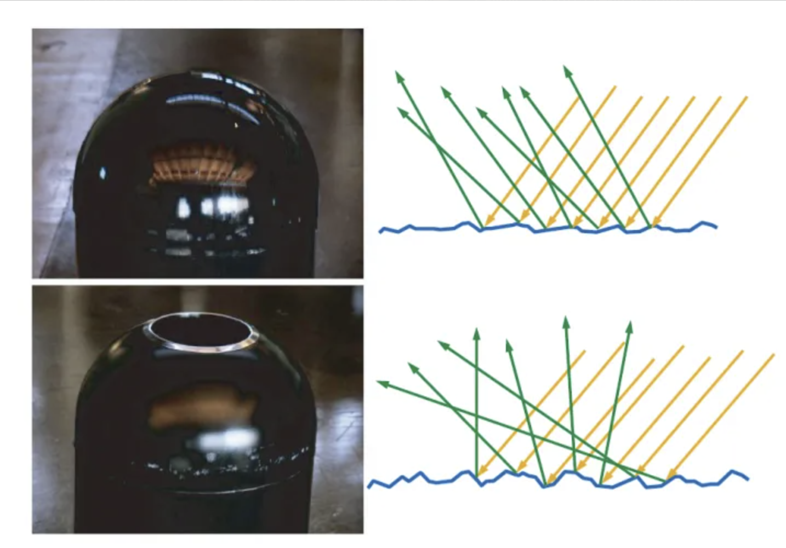

### 2.4、基于 F0 建模的菲涅尔反射效应【Fresnel Reflectance】

> 💡 用于表示看到**光线的反射率（以下简称 F0）与视角相关的现象**。

由于物质的光学特性，导致金属与非金属的反射率不一样：

- 金属的 F0 **较大**。

- 非金属的 F0 **较小**。

而处于**简化计算**的原因，会通过**金属度**在一个预设的 F0 值与自身颜色之间进行**插值**。

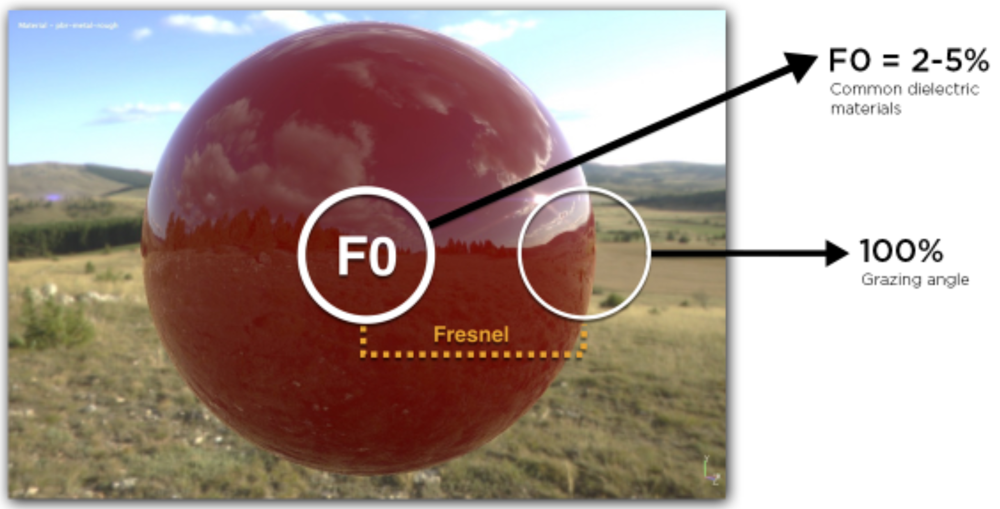

如上图所示，光源入射方向与平面法线方向夹角的对应关系有两种：

- 夹角**越大**，反射**越强**。

- 夹角**越小**，反射**越弱**（切记**并不是没有**反射，真实世界中的测量结果为2%）。

### 2.5、（附加）线性空间光照【Linear Space Lighting】（待更新）

> 💡 由于人眼对**低亮度**的颜色变化**感知更强**，而对**高亮度**的颜色变化**感知较弱**。所以为了提高图片的**显示辨识度**，将自然界**线性【Linear】**的颜色存储在**非线性【Gamma】**的色彩空间当中。

### 2.6、（附加）色调映射【Tone-Mapping】（待更新）

- HDR 与 LDR

（一）HDR：High Dynamic Range，高动态范围，通常指超出1的颜色。

（二）LDR：Low Dynamic Range，低动态范围，通常指在[0，1]的颜色。

在 PBS 中的光照计算部分，最终输出的颜色值经常超过1。而超过1的部分会泛白过曝。为了解决这个问题，将 HDR 颜色转换为 LDR 颜色的算法就是色调映射。

在各种色调映射算法中，ACES 效果与性能兼优，被广泛使用。

## 三、反射率方程解析

### 3.1、反射率方程简介

> 💡 PBS 所坚定遵循的是一种反射率方程【The Reflectance Equation】，是经典渲染方程的**简化**版本。

$$
L_o(p,w_o) = \int_{Ω} f_r(p,w_i,w_o) L_i (p,w_i) n \cdot w_idw_i
$$

如上所示，经典反射率方程描述了**光在场景中的运动**。简化后的表达式为：
$$
L_o = L_e + \int_{Ω} f_r \cdot L_i \cdot (W_i \cdot n) \cdot dW_i
$$

表达式中的每一项分别代表一个含义：

- Lo：代表当前点的**出射光亮度**。

- Le：代表当前点的**自发光亮度**。

- fr：代表当前点的入射方向到出射方向光的**反射比例**，也就是上述的 BRDF 表达式。

- Li：代表当前点的**入射光亮度**。

- (Wi·n)：代表当前入射角带来的**入射光衰减**。

- (∫...........dWi)：代表当前表面**上半球**所有方向的入射光线积分，可理解为无穷小的累加和。其中包含来自**精准光源**与**环境反射**的光线，处理环境反射的光线可以**大幅度提高光照的真实程度**。

而上述表达式中的 **fr**，可以通过推导最终改写成如下 **BRDF 表达式（也就是 PBS中需要求解的内容）**：
$$
f_r = k_d{{c} \over {{\pi}}} + {{DGF}\over{4(n\cdot v)(n\cdot l)}}
$$

### 3.2、BxDF 与 BRDF

> 💡 BxDF 通常是对 BRDF、BSDF、BTDF 等双向分布函数的**统称**，其中的 x 指的是**多种函数类型**的意思。

#### 3.2.1、反射函数（BRDF）与透射函数（BTDF）

> 💡 BRDF **反射光的辐射度**与**入射光入射到表面产生的辐照度**的比值，他的取值范围是**0到无穷大（不是0到1 ）**。

BRDF是物体的本质属性，BRDF有两个重要的性质：

- Energy conservation

  即能量守恒：要求反射光能量之和不能大于入射光，这一点很好理解。否则，经过传输，光能量大于光源，这显然是不真实的。

- Helmholtz reciprocity

  交换性：要求交换入射角和反射角的方向之后，BRDF 的数值不变。

  而交换性重要性常被忽略，但它却是光线追踪理论的根基。否则，从相机发出光线经过某条路径后到达光源算出的能量与从光源出发经过同一条路径到达相机的能量的计算结果就不同了。

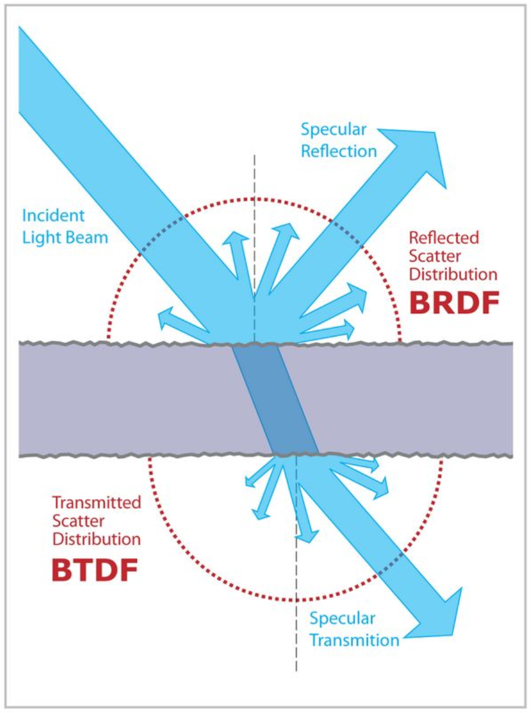

如上图所示，完整的双向分布函数大致分为两类：

- 双向散射表面**反射**分布函数【Bidirectional Surface Scattering **Reflectance** Distribution Function，BSSRDF】

​	BSSRDF 中很重要的一个部分就是**双向反射分布函数【Bidirectional Reflectance Distribution Function，BRDF】**。它描述了入射光与反射光之间的关系，同时忽略了复杂的**次表面散射【Subsurface Scattering，SSS】**行为，是简化版的 BSSRDF。而 SSS 则是用来描述**入射光进入物体表面后，经过一系列的折射从而最终射出表面的一部分光线**。

- 双向散射表面**透射**分布函数【Bidirectional Surface Scattering **Transmittance** Distribution Function，BSSTDF】

​	BSSTDF 中很重要的一个部分就是**双向透射分布函数【Bidirectional Transmittance** **Distribution Function，BTDF】**。它描述了入射光在进入物体表面后，经过一系列的折射从而最终**射出物体背面**的一部分光线。同时忽略了复杂的**次表面散射【Subsurface Scattering，SSS】**行为，是简化版的 BSSTDF。

#### 3.2.2、迪士尼原则的 BRDF

> 💡 迪士尼工作室在《SIGGRAPH2012》上进行了著名的《[Physically based shading at Disney](https://docs.qq.com/pdf/DUmNESGhzSHdMR05n)（[知乎大佬翻译版链接](https://zhuanlan.zhihu.com/p/345214905)）》演讲，并且正式提出基于迪士尼原则的 **BRDF（Disney Principled BRDF）**。由于其**高度的通用性**，在影视与游戏行业都引起了不小的轰动。于是，受到了迪士尼原则的 BRDF 的启发，Unreal 与 Unity 也陆续实现了各自的 PBS 流程。

基于迪士尼原则的 BRDF 具有以下**四条核心理念**：

- 使用**直观的参数**，而不是晦涩难懂的物理参数。

- 参数**同时具有艺术导向**，**不追求物理上的必然正确**，并且允许参数在有意义的情况下超出正常范围。

- 参数**尽可能地少**，并且参数的值阈在其合理的范围内应当为 **[0，1]**。

- 所有参数组应当尽可能地**健壮与合理**。

参数剖析：

| 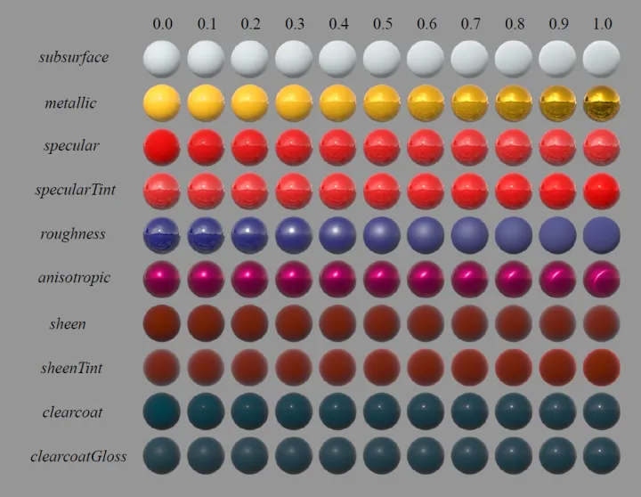 | 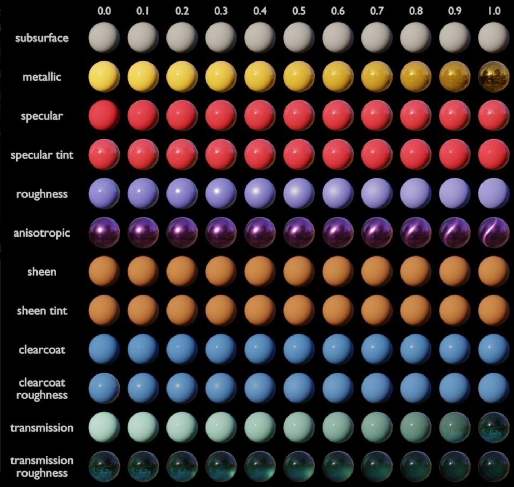 |
| ------------------------------------------------------------ | ------------------------------------------------------------ |

上图左为迪士尼工作室实现的 Disney Principled BRDF，上图右开源三维动画软件 Blender 实现的 BSDF。每一行的参数都代表了 **[0，1]** 的强度变化：

- Subsurface【次表面】：模拟光线进入物体表面后再次射出表面的能量。

- Metallic【金属度】：决定物体是否为金属介质，通常是一个**浮点值或灰度图**。**0代表非金属，1代表金属**。

- Specular【镜面反射颜色】：物体的高光反射颜色。**金属是 RGB 彩色，而非金属是灰色**。

- SpecularTint【镜面反射颜色染色】：在物体本身的镜面反射颜色上叠加一层自定义的颜色用于艺术处理。

- Roughness【粗糙度】：控制物体的粗糙程度，通常是一个**浮点值或灰度图**。

- Anisotropic【各向异性】：控制镜面反射形状的纵横比。**0代表各向同性，1代表各向异性**。

- Sheen【色泽】：一种额外的掠射分量，主要用于模拟布料颜色的光泽度。

- SheenTint【色泽染色】：在布料本身的光泽度上叠加一层自定义的颜色用于艺术处理。

- ClearCoat【清漆】：特殊用途的**第二个镜面波瓣**。通常用于模拟车漆、湿润唇膏等**薄而透明的光滑涂层**。

- ClearCoatRoughness【清漆粗糙度】：控制清漆的粗糙程度。

- Transmission【通透度】：物体表面的透光性，通常用于模拟半透明物体。

- TransmissionRoughness【通透粗糙度】：控制半透明材质表面的粗糙程度，来模拟物体内部因纯净度的不同而带来的折射率的不同。

### 3.3、BRDF 表达式解析

在**简化后的反射率方程**中得知要求解的是：
$$
f_r = k_d{{c} \over {{\pi}}} + {{DGF}\over{4(n\cdot v)(n\cdot l)}}
$$
但有时会看到上述表达式的写法是如下的：
$$
f_r = k_d f_{lambert} + k_s f_{cook-torrance}
$$
所以，可以发现整个 BRDF 包含两个部分：

- 漫反射项（DiffuseTerm）

$$
k_d * f_{lambert}
$$

- 镜面反射项（SpecularTerm）

$$
k_s * f_{cook-torrance}
$$

其中的每一项都代表一个含义：

- kd：代表**入射光被折射的比例**。

- flambert：代表**漫反射部分的颜色**。

- ks：代表**入射光被反射的比例**。

- fcook-torrance：代表**镜面反射部分的颜色**。

根据上述表达式最后可以简化出一个标准化公式：
$$
f_{cook-torrance}BRDF = {{k_d} \over {\pi}} + {{D * G * F}\over{4 * (n\cdot v) * (n\cdot l)}}
$$

### 3.4、镜面反射函数解析

在上文中了解到了 BRDF 中的镜面反射部分表达式为：
$$
k_s f_{cook-torrance} = {{D * G * F}\over{4 * (n\cdot v) * (n\cdot l)}}
$$

#### 3.4.1、D项：法线分布函数解析

> 💡 法线分布函数（Normal Distribution Function，NDF）估算了在受到表面**粗糙度**的影响下，法线朝向与半角向量**一致（重合）**的微平面的**数量（比例）**。

这是用来估算微平面的主要函数，简而言之就是**描述了微平面的法线正确朝向宏观表面法线的百分比**。如果重合的**比率高**，则认为该反射光**可见**，反之不可见。

同时，它也定义了**高光的形状**。通常使用 Epic Games 在 UE4 中所使用的【Generalized-Trowbridge-Reitz，GTR】函数，如下图所示：
$$
NDF_{GGXTR}(n,h,\alpha ) = {{\alpha^{2}}\over{\pi((n\cdot h)^{2}(\alpha^{2}- 1)+1)}^{2}}
$$

其中：

- α：表示物体表面的**粗糙度**。

- h ：表示用来与微平面法线朝向作比较用的**半角向量**，如下图所示：

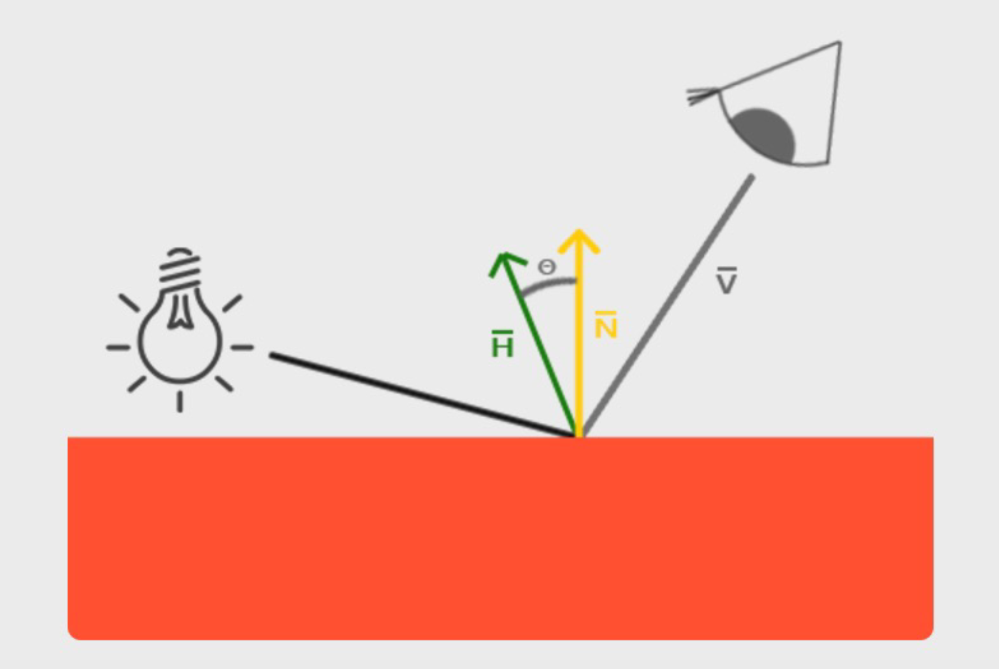

那么，如果将 **h** 作为不同粗糙度参数下，微平面法线朝向与光线方向之间的半角向量，就可以得到下图的参考效果：

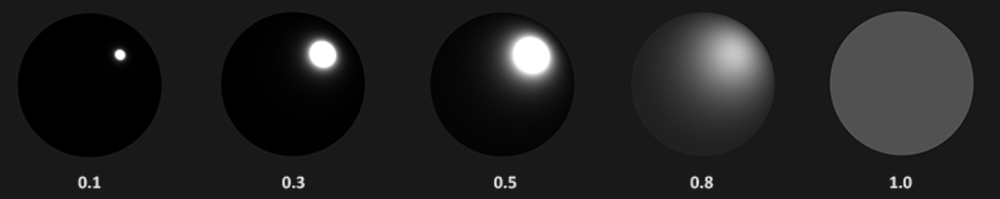

#### 3.4.2、G项：几何函数

> 💡 几何函数（Geometry Function）从统计学上**近似**求得微平面之间**相互遮蔽的比率**，而这种相互遮蔽**会损耗光线的能量**。

即对于一个指定的微表面，有多少光被相邻微表面所遮挡从而无法进入该表面，又有多少反射光被相邻微表面遮挡，无法从指定方向反射出去。

解析了由于**微平面互相遮蔽而导致的光衰减**，模拟光线在微平面之间**相互遮挡以及反弹的概率**。光线在此过程中**损失了能量**，然后才到达观察者的眼睛，如下图所示：

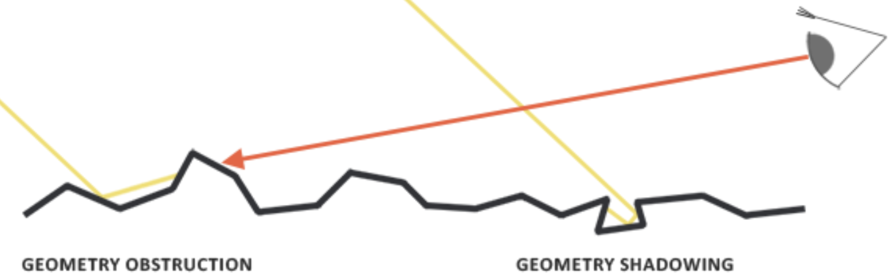

同时，这一项也**与表面的粗糙度有关**，需要**与D项配对使用**。如上图所示，具体分为**几何阴影【Geometry Shadowing，GGX1】**与**几何遮蔽【Geometry Obstruction，GGX2】**两部分。

而与 D项 类似的是，几何函数采用一个材质的粗糙度作为输入参数，计算出**粗糙度较高**的表面，微平面之间**相互遮蔽的概率就高**。

通常使用【GGX】与【Schlick-Beckmann】近似的结合体来表示，因此又被合称为**【Schlick-GGX 近似】**，表达式如下：
$$
G_{SchlickGGX}(n,v,k) = {{ n \cdot v } \over{( n \cdot v )(1-k)+k}}
$$
上述表达式中，**k是α的重映射（Remapping）**，取决于要用的是**针对直接光照还是间接光照**的几何函数，具体两种函数如下所示：
$$
K_{direct} = {({\alpha + 1})^{2} \over{8}}
$$

$$
K_{IBL} = {{\alpha }^{2} \over{2}}
$$

为了有效地估算几何部分，需要将观察方向与光线向量都考虑进去。可以使用**史密斯法【Smith's method】**将二者都纳入其中，表达式如下所示：
$$
G(n,v,l,k) = G_{sub}(n,v,k)G_{sub}(n,l,k)
$$
而且如果使用**史密斯法【Smith's method】**与**【Schlick-GGX 近似】**作为 Gsub，就可以得到不同粗糙度的视觉效果，如下图所示：

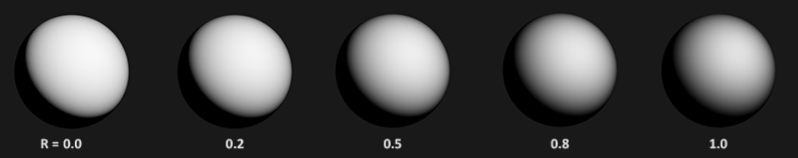

#### 3.4.3、F项：菲尼尔方程

> 💡 菲尼尔方程（Fresnel Equation）解析了**菲涅尔效应**，描述**反射的光线对比光线被折射部分所占的比率**。即最大有多少能量可以被反射。

当光线碰撞到一个表面时，菲涅尔方程会根据观察视角计算出被反射的光线所占的**百分比**。然而利用这个百分比与能量守恒的原则，可以直接求出光线被折射的部分以及剩余的能量。

这个比率被称为**反射率（F0）**，实际上指的是**镜面反射颜色【Specular Color】**。如下图所示：

仔细观察上图可以发现，菲尼尔反射的强度会**随着观察视角的变化而不同**，那么就可以得出以下两条规律：

- 当观察方向与物体表面朝向**平行时**，反射率**最弱（并不是没有，2%）**，被称为 **F0**。

- 当观察方向与物体表面朝向**垂直时**，反射率**最强**，被称为 **F90**。

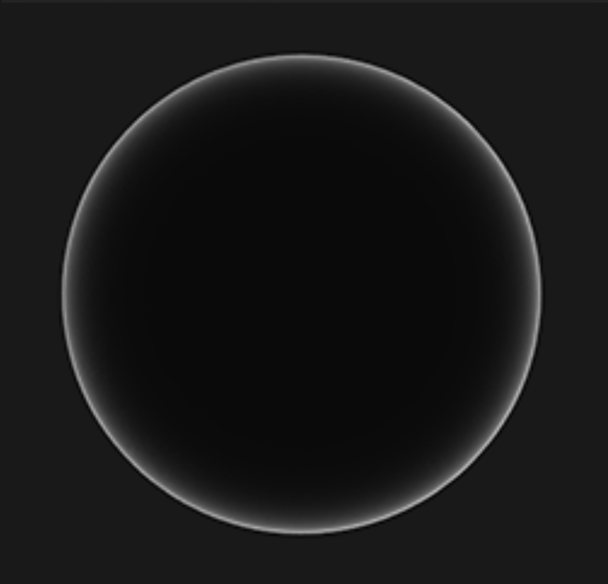

如上图所示，越是朝球面**掠射角**看去，**视线与表面法线的夹角接近90°（F90）**，此时菲涅尔反射就越强。通常使用**【Fresnel-Schlick 近似法】**求得近似解，表达式如下所示：
$$
F_{Schlick}(h,v,F_0) = F_0 + (1 - F_0)(1 - (h \cdot v))^5
$$
其中 F0 表示平面的基础反射率，利用**折射指数【Index of Refraction / Refractive Index，IOR / RI】**计算得出。

但菲尼尔方程还存在一些细微的问题：

其中一个问题是**【Fresnel-Schlick 近似法】**仅仅是对**非金属表面**有定义。但对于金属表面并不能得出正确的结果。这样就需要使用一种不同的菲涅尔方程来对金属表面进行计算，而这样做很不方便，所以就选择预计算出平面对于法线入射的结果，然后基于相应视角的**【Fresnel-Schlick 近似法】**对这个值进行插值计算。那么使用这种方法来进一步估算，就能对金属与非金属材质使用同一个公式计算了。

基础反射率可以在一些大型数据库中找到，一些常见的已经总结在下面的表格中：

|       裸土 = 0.17        |      绿草 = 0.25      |        沙漠 = 0.4         | 铜 = （0.95, 0.64, 0.54） |
| :----------------------: | :-------------------: | :-----------------------: | :-----------------------: |
|     新混凝土 = 0.55      |  海洋冰 = 0.5 ～ 0.7  |     新雪 = 0.8 ～ 0.9     | 金 = （1.00, 0.71, 0.29） |
|        水 = 0.02         | 塑料/玻璃（低）= 0.03 |     塑料（高）= 0.05      | 铝 = （0.91, 0.92, 0.92） |
| 玻璃（高）/红宝石 = 0.08 |      钻石 = 0.17      | 铁 = （0.56, 0.57, 0.58） | 银 = （0.95, 0.93, 0.88） |

通过以上参考数值可以观察到**非金属**的反射率是一个**一维数值**，而**金属**的反射率则是**三维数值**。这也解释了上文中说明的**非金属**的反射率是**单通道的灰色**，而**金属**的反射率则是**三通道的彩色**。

## 四、基于物理的美术工作流（待更新）

- PBR 衍生出两种工作流：

（一）金属工作流

（二）高光工作流

### 4.1、金属/粗糙度工作流【Metal/Rough Workflow】

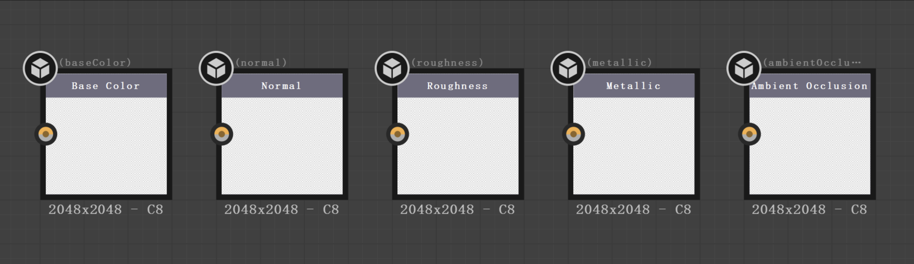

### 4.2、Paragon Workflow