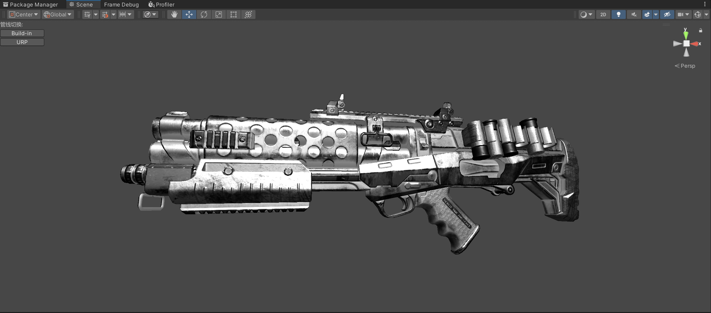
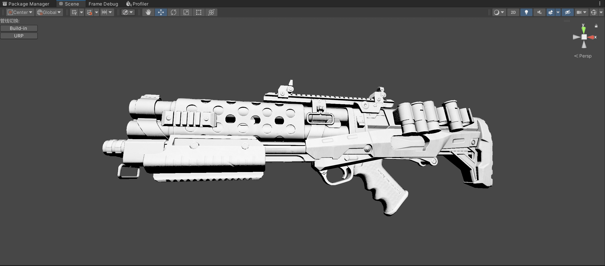
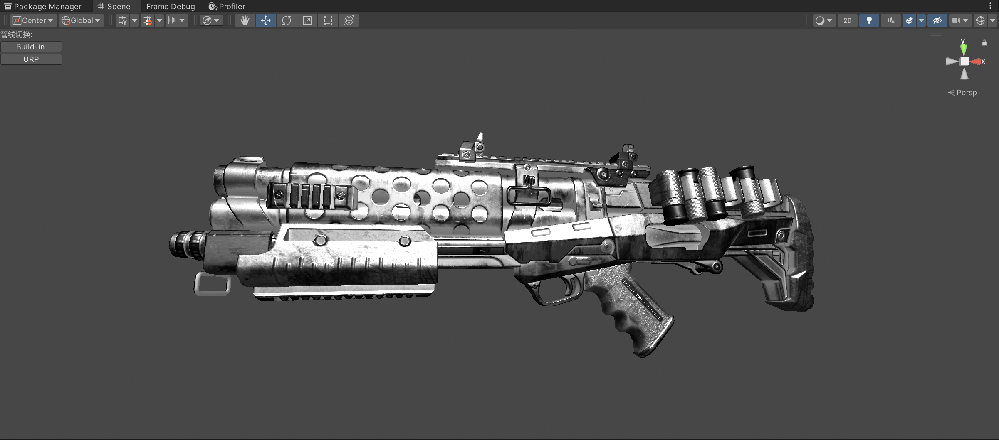
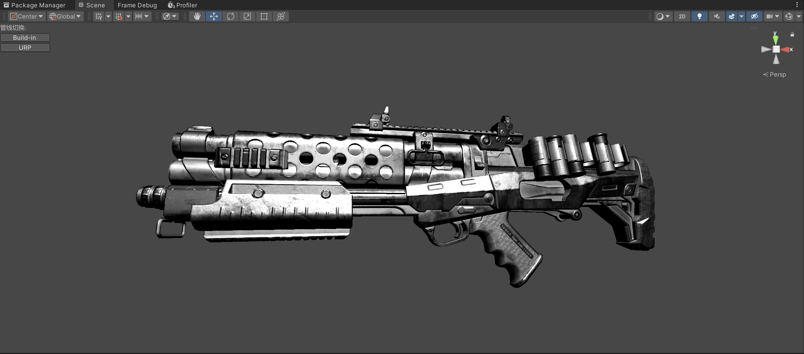
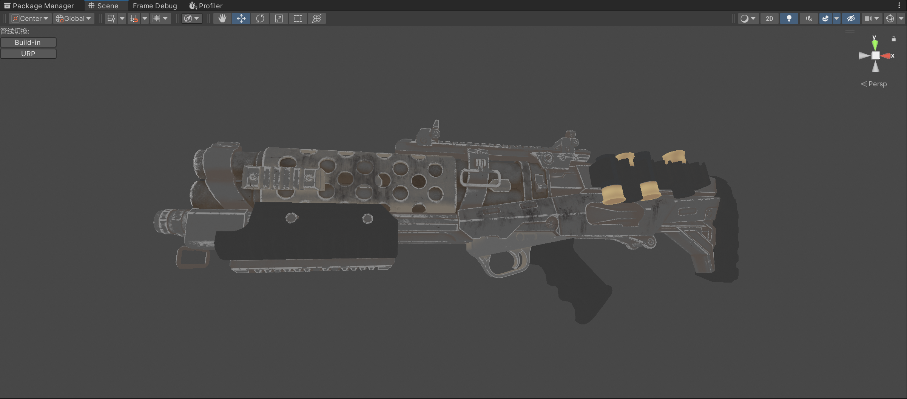
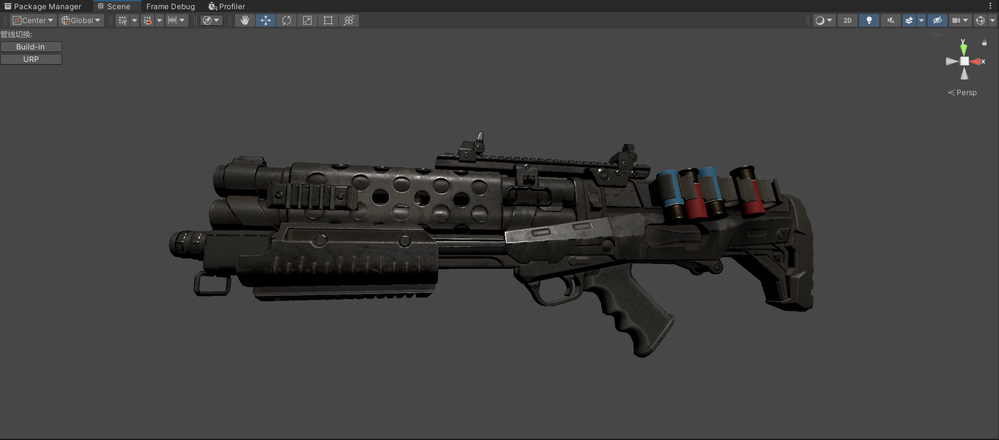

# 标准 PBS 的推导与实现

## 一、光照的组成

### 1.1、光是如何运动的


上图很好地解释了场景中光线的**运动轨迹**：

（一）而对于点 $P2$ 来说，由于来自光源的光线被上方的物体所遮挡（也就说明其处在阴影中），便不存在直接光，但却接收到了来自右侧光源照在墙壁上所反射的光线。当这些光线到达点 $P2$ 后，便再次被反射入人眼。此时，这些经过多个物体间相互反射并最终进入人眼的光线就被称为“**间接光**”。

（二）对于点 $P1$ 来说，光线从光源出发，直接到达点 $P1$，并反射入人眼。此时，这根通过物体表面反射并直接到达人眼的光线就被称为“**直接光**”。同时，点 $P1$ 也接受了来自其他物体所反射来的“间接光”。

（三）由于点 $P3$​​ 是自发光物体，如果忽略空气中的粒子会对光线造成散射与吸收的话。那么，最终到达人眼的光线便没有损失，也可以称之为“**直接光**”。

这也说明现实世界中的光照通常由两部分组成（**暂时忽略自发光**）：

- **直接光（Direct Lighting）**：**泛指精确光源**（例如：平行光、聚光灯、点光源等由人造光源或自然界太阳光这种**具有明确位置以及指向性**的光源）发出的明确光线。
- **间接光（Indirect Lighting）**：**泛指非精确光源**（例如环境光由光线在不同物体间弹射后形成的环境光照亮度）。

### 1.2、光照的分量

不论是直接光还是间接光都同时包含漫反射与镜面反射两个部分，也就可以得出如下结论：
$$
直接光总量 = 直接光漫反射 + 直接光镜面反射
$$

$$
间接光总量 = 间接光漫反射 + 间接光镜面反射
$$

根据上一篇章《理论精炼》中所提到的核心理论之一的“能量守恒定律”以及可推导出：
$$
光照总量 = 直接光 + 间接光 = (直接光漫反射 + 直接光镜面反射) + (间接光漫反射 + 间接光镜面反射)
$$

## 二、直接光的推导与实现

根据《理论精炼》中“3.3”小节最后所得出的 **BRDF** 标准化公式以及能量守恒定律可推导出：
$$
直接光总量(DirectLighting) = 直接光漫反射所占比例({{k_d} \over {\pi}}) + 直接光镜面反射比例({{D * G * F}\over{4 * (n\cdot v) * (n\cdot l)}}) = 1
$$

### 2.1、直接光漫反射部分

$$
直接光漫反射所占比例({{k_d} \over {\pi}})
$$

#### 2.1.1、公式推导

**直接光漫反射（DirectDiffuse）**主要计算的还是以经典 Lambert 光照模型为主的：
$$
Lambert = dot(normal,lightDirection)
$$
根据《理论精炼》中“3.3”与“3.4.3”小节可以得到以下信息：

- $k_d$：代表入射光**被折射的比例**。

- $k_s$：代表入射光**被反射的比例**。

- $F0$：物体表面本身的**反射率**。


所以，想要计算 $k_d$​​，那么进行以下推导：

**第一步**，通过金属度插值计算来得到金属与非金属材质的不同反射率 $F0$：
$$
F0 = lerp(0.04, albedo, metallic)
$$
上述表达式中之所以使用“0.04”来代表非金属的反射率，是因为在现实世界中真实测量出的非金属介质的反射率基本属于 [2%，5%]，约等于 [0.02，0.05]。为了方便计算，所以取了**统一近似值**“0.04”。

**第二步**，在得到 $F0$ 后便可以使用菲涅尔近似法求解出入射光被反射的比例，也就是 $k_s$：
$$
k_s = F_{Schlick}(h,v,F_0) = F_0 + (1 - F_0)(1 - (h \cdot v))^5
$$
**第三步**，根据能量守恒就可以计算漫反射所占入射光的比例，也就是 $k_d$：
$$
k_d = 1 - k_s
$$
并且，因为金属本身不具有漫反射，所以还需要使用金属度来区分是否为金属材质。那么，$k_d$ 的最终结果就为：
$$
k_d = (1 - k_s) (1 - metallic)
$$
**最终**，在得到了所有需要的参数后，就可以得出直接**光漫反射部分的完整公式**：
$$
Diffuse_{direct} = k_d * {{albedo}\over{\pi}} * Lambert
$$
注意，为了保证能量守恒，所以多了一步除以 $\pi$ 的操作。

#### 2.1.2、代码实现

在开始将推导公式转换为代码公式之前，需要提前准备好所有的输入数据：

注意，需要在片元着色器上方定义一个 $\pi$：

```glsl
#define PI 3.14159265358979323846
```

```glsl
// Input datas
float2 textureUV = i.uv;
float3 albedoMap = tex2D(_Albedo, textureUV).rgb;
float3 normalMap = UnpackNormal(tex2D(_Normal, textureUV));
float metallicMap = tex2D(_Metallic, textureUV).x;
float3 worldTangent = i.tangent_world;
float3 worldBinormal = i.binormal_world;
float3 worldNormal = i.normal_world;
float3 worldPosition = i.position_world;
float3x3 TBN = float3x3(worldTangent, worldBinormal, worldNormal);
float3 N = normalize(mul(normalMap, TBN));
float3 V = normalize(_WorldSpaceCameraPos.xyz - worldPosition);
float3 L = normalize(_WorldSpaceLightPos0.xyz);
float3 H = normalize(V + L);
float NL = max(0.0, dot(N, L));
float HV = max(0.0, dot(H, V));
```

为了便于理解，从下文开始，将会把所有参数全部拆开编码（可能会变得比较啰嗦）。

根据上文的公式推导可以得知，需要提供以下参数作为函数计算：

- 通过解码一张**金属度贴图**来插值计算金属与非金属介质的反射率，也就是 $F0$：

```glsl
float3 F0 = lerp(0.04, albedoMap, metallicMap);
```

------

- 使用 $F0$ 计算 $k_s$​：

```glsl
float3 F_FresnelSchlick(float3 H, float3 V, float3 F0)
{
    float HV = max(0.0, dot(H, V));
    return F0 + (1.0 - F0) * pow(1.0 - HV, 5.0);
}
```

```glsl
float3 ks = F_FresnelSchlick(NV, F0);
```

------

- 计算 $k_d$：

```glsl
float3 kd = (1.0 - ks) * (1.0 - metallicMap);
```

------

- 直接光漫反射最终公式：

```glsl
float3 diffuseDirect = kd * albedoMap / PI * NL;
```

- 最后，再加上直接光的投影，效果如下图所示：


直接光漫反射部分最终代码示例：

```glsl
float4 frag(VertexOutput i) : SV_Target
{
    // Direct diffuse
    float3 F0 = lerp(0.04, albedoMap, metallicMap);
    float3 ks = F_FresnelSchlick(HV, F0);
    float3 kd = (1.0 - ks) * (1.0 - metallicMap);
    float lambert = NL;
    UNITY_LIGHT_ATTENUATION(shadowattenuation, i, worldPosition)
    float3 radiance = lambert * _LightColor0.rgb * shadowattenuation;
    float3 diffuseDirect = (kd * albedoMap) / PI * radiance;

    return float4(diffuseDirect, 1.0);
}
```

注意，上述示例代码中为了添加实时投影以及光照颜色，增加了“radiance”。“radiance”可以理解为辐照度，暂时将其理解为光照产生颜色即可。

### 2.2、直接光镜面反射部分

$$
直接光镜面反射比例({{D * G * F}\over{4 * (n\cdot v) * (n\cdot l)}})
$$

#### 2.2.1、公式推导

通俗的来说，直接光所产生的**镜面反射（DirectSpecular）**就是美术常说的高光。在《理论精炼》“3.4”小节中，重点对镜面反射函数做了详细的解析，故不再赘述：

**第一步**，计算分子 $D$ 项。$D$ 项代表法线分布函数，影响高光的形状，通常使用 GTR 函数：
$$
NDF_{GGXTR}(n,h,\alpha ) = {{\alpha^{2}}\over{\pi((n\cdot h)^{2}(\alpha^{2}- 1)+1)}^{2}}
$$

其中的 $\alpha$​ 代表的是物体表面的粗糙程度，当粗糙度变化时会产生如下效果：


**第二步**，计算分子 $G$ 项。$G$ 项代表几何函数，需要与 D 项配合使用。通常使用将**观察方向**与**光向量**都考虑进去的**史密斯法（Smith's method）**：
$$
G(n,v,l,k) = G_{sub}(n,v,k)G_{sub}(n,l,k)
$$
最终可以得到如下的粗糙度变化效果：


**第三步**，分子 $F$ 项。$F$ 项代表菲涅尔函数，依旧使用上文中计算 $k_s$ 的基于 $F0$ 的菲涅尔方程：
$$
k_s = F_{Schlick}(h,v,F_0) = F_0 + (1 - F_0)(1 - (h \cdot v))^5
$$

------

**最终**，将 $D$ $G$ $F$ 三项相乘并除以分母 $4(N·V)(N·L)$​  ，其实也是为了满足能量守恒：
$$
Specular_{direct} = (D * G * F) / (4 * NV *NL)
$$
代码函数公式：

```glsl
float3 DirectSpecularBRDF(float D, float3 F, float G, float NV, float NL)
{
    float3 nominator = D * F * G;
    float denominator = 4 * NV * NL;
    float3 specularDirect = nominator / max(0.0, denominator);
    return specularDirect;
}
```

#### 2.2.2、代码实现

在进行代码转换之前，应当提前准备好必要的数据。当然，这其中有一部分是在上文计算直接光漫反射中已经添加好的，就不需要再重复添加了：

```glsl
float roughnessMap = tex2D(_Roughness, textureUV).x;
float NV = max(0.0, dot(N, V));
float NH = max(0.0, dot(N, H));
```

准备好需要的数据后，就可以根据上文的公式推导编写代码了：

- $D$ 项，法线分布函数通过输入物体表面法线与半角向量的点乘结果以及一个粗糙度参数来判断微表面法线与宏观法线重合的概率，这将决定高光的位置、朝向、强度以及范围大小：

```glsl
float D_DistrubutionGGX(float NH, float Roughness, float Pi)
{
    float a = Roughness * Roughness;
    float a2 = a * a;
    float NH2 = NH * NH;
    float denominator = (NH2 * (a2 - 1.0) + 1.0);
    denominator = Pi * denominator * denominator;

    return a2 / max(denominator, 0.00001);
}
```

```glsl
float D = D_DistrubutionGGX(NH, roughnessMap, PI);
```

​	单独输出 $D$ 项结果，可以看到镜面反射的大致效果已经出现了：



------

- $G$ 项，几何函数通过输入物体表面法线与观察方向的点乘结果以及一个粗糙度参数来判断光线被否被微表面几何结构遮挡与计算能量的损耗：

```glsl
float GeometrySchlickGGX(float NV, float Roughness)
{
    float r = Roughness + 1.0;
    float k = r * r / 8.0;
    float denominator = k + (1.0 - k) * NV;

    return NV / max(denominator, 0.00001);
}

float G_GeometrySmith(float NV, float NL, float Roughness)
{
    float ggx1 = GeometrySchlickGGX(NV, Roughness);
    float ggx2 = GeometrySchlickGGX(NL, Roughness);

    return ggx1 * ggx2;
}
```

```glsl
float G = G_GeometrySmith(NV, NL, roughnessMap);
```

​	单独输出 $G$ 项结果，可以看到一个类似阴影的遮罩效果：



​	前文有提及，$G$ 项需要与 $D$ 项搭配使用。那么，将二者相乘后可以看出 $G$ 项明显纠正了 $D$ 项所造成的在结构内部的一些漏光情况，如下对比图所示：

|  |  |
| ------------------------------------------------------------ | ------------------------------------------------------------ |

```glsl
float D = D_DistrubutionGGX(NH, roughnessMap, PI);
float G = G_GeometrySmith(NV, NL, roughnessMap);
return D * G;
```

------

- $F$​ 项，菲尼尔函数通过输入半角向量与观察方向的点乘结果以及金属与非金属的 $F0$ 值计算材质本身的反射颜色：

```glsl
float3 F_FresnelSchlick(float HV, float3 F0)
{
	return F0 + (1.0 - F0) * pow(1.0 - HV, 5.0);
}
```

```glsl
float3 F = F_FresnelSchlick(HV, F0);
```

​	单独输出 $F$ 项结果，可以看到金属与非金属的菲涅尔反射颜色：



​	如上图可以看到，金属部分具有很明显的镜面反射颜色，而非金属则因其物理属性，只有微弱的色彩亮度。

------

- 最后，根据公式便可计算出完整的直接光镜面反射结果，如下图所示：


```glsl
float3 nominator = D * F * G;
float denominator = 4 * NV * NL;
float3 specularDirect = nominator / max(0.0, denominator);
return specularDirect.xyzz;
```

直接光镜面反射部分最终代码示例：

```glsl
float4 frag(VertexOutput i) : SV_Target
{
    // Direct specular
    float3 F = F_FresnelSchlick(HV, F0);
    float D = D_DistrubutionGGX(NH, roughnessMap, PI);
    float G = G_GeometrySmith(NV, NL, roughnessMap);
    float3 nominator = D * F * G;
    float denominator = 4 * NV * NL;
    float3 specularDirect = nominator / max(0.0, denominator);

    return float4(specularDirect, 1.0);
}
```


### 2.3、直接光部分最终结果

当直接光漫反射以及镜面反射都计算完毕后，因其各自算法都是基于物理并且符合能量守恒的。所以，只需要将二者的结果相加便可得到直接光照的完整效果：



```glsl
float3 DirectLighting = diffuseDirect + specularDirect;
return DirectLighting.xyzz;
```

#### 完整直接光照代码示例

自定义函数：

```glsl
#define PI 3.14159265358979323846

float3 F_FresnelSchlick(float HV, float3 F0)
{
    return F0 + (1.0 - F0) * pow(1.0 - HV, 5.0);
}

float D_DistrubutionGGX(float NH, float Roughness, float Pi)
{
    float a = Roughness * Roughness;
    float a2 = a * a;
    float NH2 = NH * NH;
    float denominator = (NH2 * (a2 - 1.0) + 1.0);
    denominator = Pi * denominator * denominator;

    return a2 / max(denominator, 0.00001);
}

float GeometrySchlickGGX(float NV, float Roughness)
{
    float r = Roughness + 1.0;
    float k = r * r / 8.0;
    float denominator = k + (1.0 - k) * NV;

    return NV / max(denominator, 0.00001);
}

float G_GeometrySmith(float NV, float NL, float Roughness)
{
    float ggx1 = GeometrySchlickGGX(NV, Roughness);
    float ggx2 = GeometrySchlickGGX(NL, Roughness);

    return ggx1 * ggx2;
}
```

片元着色器：

```glsl
float4 frag(VertexOutput i) : SV_Target
{
    // Input datas
    float2 textureUV = i.uv;
    float3 albedoMap = tex2D(_Albedo, textureUV).rgb;
    float3 normalMap = UnpackNormal(tex2D(_Normal, textureUV));
    float metallicMap = tex2D(_Metallic, textureUV).x;
    float roughnessMap = tex2D(_Roughness, textureUV).x;
    float3 worldTangent = i.tangent_world;
    float3 worldBinormal = i.binormal_world;
    float3 worldNormal = i.normal_world;
    float3 worldPosition = i.position_world;
    float3x3 TBN = float3x3(worldTangent, worldBinormal, worldNormal);
    float3 N = normalize(mul(normalMap, TBN));
    float3 V = normalize(_WorldSpaceCameraPos.xyz - worldPosition);
    float3 L = normalize(_WorldSpaceLightPos0.xyz);
    float3 H = normalize(V + L);
    float NL = max(0.0, dot(N, L));
    float HV = max(0.0, dot(H, V));
    float NV = max(0.0, dot(N, V));
    float NH = max(0.0, dot(N, H));

    // Direct diffuse
    float3 F0 = lerp(0.04, albedoMap, metallicMap);
    float3 ks = F_FresnelSchlick(HV, F0);
    float3 kd = (1.0 - ks) * (1.0 - metallicMap);
    float lambert = NL;
    UNITY_LIGHT_ATTENUATION(shadowattenuation, i, worldPosition)
    float3 radiance = lambert * _LightColor0.rgb * shadowattenuation;
    float3 diffuseDirect = (kd * albedoMap) / PI * radiance;

    // Direct specular
    float3 F = F_FresnelSchlick(HV, F0);
    float D = D_DistrubutionGGX(NH, roughnessMap, PI);
    float G = G_GeometrySmith(NV, NL, roughnessMap);
    float3 nominator = D * F * G;
    float denominator = 4 * NV * NL;
    float3 specularDirect = nominator / max(0.0, denominator);

    float3 DirectLighting = diffuseDirect + specularDirect;

    return float4(DirectLighting, 1.0);
}
```

## 三、间接光的推导与实现

